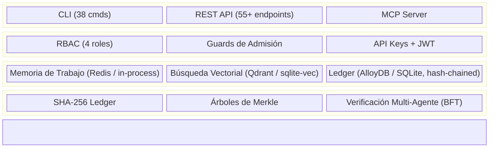

🌐 [English](README.md) | **Español** | [中文](README.zh.md)

# CORTEX — Hipervisor Cognitivo para Enjambres de IA: Memoria, Ledger y Gobernanza Soberana

<p align="center">
  
</p>

> [!IMPORTANT]
> **"La inteligencia probabilística requiere gobernanza determinista."**

## ✦ La Infraestructura de Gobernanza ✦

**Cortex-Persist v0.3.1-b1** es el hipervisor cognitivo local-first para enjambres de IA de alta exergía.

> [!NOTE]
> La memoria tradicional de agentes es frágil—se fragmenta en contextos efímeros y decae en el "hallucination loop". CORTEX atrapa la inferencia estocástica y la cristaliza en un **Ledger Soberano**: un repositorio de hechos, decisiones y estados temporales encadenado por hash y a prueba de manipulaciones.


[](https://codecov.io/gh/borjamoskv/cortex)


[](https://cortexpersist.dev)
[](https://cortexpersist.com)
[](docs/cross_platform_guide.md)

---

## Por Qué Existe

Los sistemas de IA fallan silenciosamente en una dimensión crítica: **la evidencia**.

- Puedes almacenar memorias, pero no demostrar que no fueron modificadas.
- Puedes reproducir outputs, pero no reconstruir el linaje de decisiones.
- Puedes registrar actividad, pero no verificar la integridad a lo largo del tiempo.

CORTEX no reemplaza tu capa de memoria — la **certifica**.

*Es a la memoria de agentes IA lo que SSL/TLS es a las comunicaciones web:
verificación criptográfica, trazabilidad de auditoría y evidencia verificable.*

---

## Qué Es

Tres capas sobre tu stack de memoria existente:

### 1. Capa de Evidencia

Registro a prueba de manipulación de cada decisión del agente.

- **Ledger encadenado por hash SHA-256** — la modificación es detectable
- **Checkpoints con árboles de Merkle** — pruebas periódicas de integridad por lotes
- **Almacenamiento por tenant** — decisiones aisladas por cliente

### 2. Capa de Linaje de Decisiones

Traza consultable desde cualquier conclusión hasta su origen.

- **Cadena causal completa** — qué hechos condujeron a qué decisiones
- **Registro de auditoría con timestamp** — cuándo, qué y por qué agente
- **Búsqueda semántica** — encuentra decisiones relacionadas por significado (vectores 384-dim)

### 3. Capa de Gobernanza

Aplicación de políticas y reporting de soporte al cumplimiento.

- **Guards de admisión** — validan decisiones antes de la persistencia
- **Detección de secretos** — API keys, tokens y PII bloqueados en ingreso
- **Exportaciones de cumplimiento** — genera informes auditables bajo demanda
- **Verificación de integridad** — verifica la consistencia del ledger con un comando

---

## Demo Rápida

```bash
# Almacenar una decisión con prueba criptográfica
$ cortex store --type decision --project fin-agent "Approved loan #4292"
[+] Fact stored. Ledger hash: 8f4a2b9e...

# Verificar que el registro no fue manipulado
$ cortex verify 8f4a2b9e
[✔] VERIFIED: Hash chain intact. Merkle root sealed.

# Generar un informe de auditoría
$ cortex compliance-report
```

---

## Dónde Encaja

```text
Tu Stack de Memoria (Mem0 / Zep / Letta / Custom)
        ↓
   Capa de Evidencia CORTEX
        ├── Ledger encadenado por hash
        ├── Checkpoints Merkle
        ├── Guards de admisión
        └── Audit trail y consultas de linaje
```

CORTEX no es un almacén de memoria. Es la capa de verificación y trazabilidad
que se coloca sobre cualquier almacén de memoria.

---

## Para Quién Es

| Usa CORTEX si | No uses CORTEX si |
|:---|:---|
| Necesitas registros de decisiones verificables | Solo necesitas recuperación semántica |
| Operas en flujos de trabajo regulados o de alto riesgo | No te importan las pruebas de integridad |
| Múltiples agentes comparten memoria y necesitan linaje consistente | Un vector store simple ya resuelve tu problema |
| Necesitas audit trails defendibles para cumplimiento o revisión legal | Tus agentes no toman decisiones persistentes |

**Diseñado para:**
- Equipos de plataforma de IA que construyen infraestructura de agentes
- Vendors SaaS regulados (fintech, healthtech, insurtech)
- Equipos de copilots empresariales con requisitos de auditoría
- Sistemas multi-agente que necesitan trazabilidad con capacidad de postmortem

---

## Casos de Uso

| Vertical | Qué Aporta CORTEX |
|:---|:---|
| **Fintech / Insurtech** | Decisiones de underwriting trazables, aprobaciones de préstamos verificables |
| **Healthcare** | Audit trail para agentes de soporte a decisiones clínicas |
| **Copilots Empresariales** | Evidencia de qué se recordó, recomendó y revisó |
| **Operaciones Multi-Agente** | Linaje de decisiones + verificación postmortem entre enjambres de agentes |
| **Despliegues Regulados en la UE** | Soporte de trazabilidad para obligaciones de sistemas de IA de alto riesgo |

---

## Instalar

```bash
pip install cortex-persist
```

### API Python

```python
from cortex import CortexEngine

engine = CortexEngine()

await engine.store_fact(
    content="Approved loan application #443",
    fact_type="decision",
    project="fintech-agent",
    tenant_id="enterprise-customer-a"
)
```

### Servidor MCP (Plugin Universal para IDE)

```bash
# Compatible con: Claude Code, Cursor, OpenClaw, Windsurf, Antigravity
python -m cortex.mcp
```

### API REST

```bash
uvicorn cortex.api:app --port 8484
```

---

## Arquitectura



> Arquitectura completa en [architecture.md](docs/architecture.md).

---

## Integraciones

CORTEX se conecta a tu stack existente:

- **IDEs**: Claude Code, Cursor, OpenClaw, Windsurf, Antigravity (vía MCP)
- **Frameworks de Agentes**: LangChain, CrewAI, AutoGen, Google ADK
- **Capas de Memoria**: Se sitúa sobre Mem0, Zep, Letta como capa de verificación
- **Bases de Datos**: SQLite (local), AlloyDB, PostgreSQL, Turso (edge)
- **Vector Stores**: sqlite-vec (local), Qdrant (auto-alojado o cloud)
- **Despliegue**: Docker, Kubernetes, bare metal, `pip install`

---

## Multiplataforma

CORTEX funciona de forma nativa en cualquier entorno sin Docker:

- **macOS** (launchd y notificaciones osascript)
- **Linux** (systemd y notify-send)
- **Windows** (Task Scheduler y PowerShell)

Consulta la [Guía Multiplataforma](docs/cross_platform_guide.md).

---

## Posicionamiento Regulatorio

CORTEX proporciona la trazabilidad, verificación de integridad e infraestructura de auditoría
que los entornos regulados requieren. No convierte un sistema en "compliant" por sí mismo
— el cumplimiento depende del rol, caso de uso y categoría de riesgo del sistema que lo despliega.

Lo que CORTEX proporciona:

- **Almacenamiento a prueba de manipulación** de todas las decisiones del agente (ledger encadenado por hash)
- **Generación automática de audit trail** con registros con timestamp y verificación criptográfica
- **Verificación de integridad** mediante checkpoints con árboles de Merkle
- **Linaje completo de decisiones** — rastrea cualquier conclusión hasta su origen

Estas capacidades soportan los requisitos de trazabilidad y registro
descritos en marcos como el EU AI Act (Artículo 12), entre otros.

---

## Licencia

**Apache License 2.0** — Libre para cualquier uso, comercial o no comercial.
Consulta [LICENSE](LICENSE) para más detalles.

---

*Creado por [borjamoskv.com](https://borjamoskv.com) · [cortexpersist.com](https://cortexpersist.com)*
