```mermaid
graph TD
    classDef default fill:#0A0A0A,stroke:#2B3BE5,stroke-width:1px,color:#F0F0F0;
    classDef highlight fill:#2B3BE5,stroke:#CCFF00,stroke-width:1.5px,color:#FFFFFF;
    classDef guard fill:#1A1A1A,stroke:#FF0055,stroke-width:1px,color:#F0F0F0;

    subgraph Stochastic Space
        LLM[Agent Stochastic Output]:::default
    end

    subgraph Epistemic Membrane [CORTEX-Persist Containment Shield]
        direction TB
        G1[Z3 SMT Guard / Admission Gate]:::guard
        VSA[Zero-Copy VSA Ring Buffer]:::default
        mmap[( mmap Silicon Space )]:::default
        Hash[SHA-256 Block Sealing]:::default
        Merkle[Merkle Provenance Chain]:::default
    end

    subgraph Trust Substrate
        Ledger[(Append-Only AOF Ledger)]:::highlight
        Proof[Verifiable Audit Pack JSON]:::default
    end

    LLM -->|Decision / Observation| G1
    G1 -->|Passed Asserts| VSA
    VSA -->|Zero I/O Overhead| mmap
    VSA -->|Batch Commit| Hash
    Hash -->|Hash Link| Merkle
    Merkle -->|State Anchoring| Ledger
    Ledger -->|Generate| Proof
    
    style Epistemic Membrane fill:#050505,stroke:#2B3BE5,stroke-dasharray: 5 5;
    style Trust Substrate fill:#050505,stroke:#CCFF00,stroke-dasharray: 5 5;
```

<!-- [C5-REAL] Exergy-Maximized · Updated: June 2026 -->
<div align="center">
  <picture>
    <source media="(prefers-color-scheme: dark)" srcset="assets/marketing/social-preview.png">
    <source media="(prefers-color-scheme: light)" srcset="assets/marketing/social-preview-light.png">
    
  </picture>
</div>

<h1 align="center">█ CORTEX-PERSIST</h1>
<p align="center">
  <strong>Cryptographically Trace What Your AI Agent Knew.</strong><br>
  <em>Tamper-evident memory & decision lineage for AI agents. Cryptographic proof of what your agent knew.</em>
</p>

<p align="center">
  <a href="https://github.com/borjamoskv/cortex-persist/stargazers"></a>
  <a href="https://www.python.org/"></a>
  <a href="https://github.com/borjamoskv/cortex-persist/actions"></a>
  <a href="https://pypi.org/project/cortex-persist/"></a>
  <a href="LICENSE"></a>
  <a href="https://github.com/sponsors/borjamoskv"></a>
</p>

```yaml
AESTHETIC:    INDUSTRIAL NOIR 2026 (#0A0A0A / #2B3BE5)
EPISTEMOLOGY: C5-REAL (Cryptographically Verified Reality)
CORE TENET:   EPISTEMIC HUMILITY (Generative output is conjecture; Evidence is absolute)
ARCHITECTURE: ZERO-UI / O(1) DETERMINISTIC SUBSTRATE
VERSION:      v1.0.0 — Production/Stable
PHASE:        LEGION-10k (10,000+ concurrent agents)
```

---

## ▀▄ QUICK DEMO (3 MINUTES)

See the C5-REAL verification loop, semantic search, and tampering detection in action instantly.

```bash
git clone https://github.com/borjamoskv/Cortex-Persist.git
cd Cortex-Persist
pip install -e ".[dev,acceleration]"

# Run the canonical tampering detection demo
python examples/demo_canonical.py
```

<picture>
  <source media="(prefers-color-scheme: dark)" srcset="assets/marketing/cortex_demo.gif">
  <source media="(prefers-color-scheme: light)" srcset="assets/marketing/cortex_demo_light.gif">
  
</picture>

---

## ▀▄ THE EPISTEMIC CONTAINMENT SHIELD

**Generative AI output is fundamentally probabilistic conjecture. Traditional logs blindly trust stochastic output.**
CORTEX-PERSIST intercepts stochastic text, enforces a deterministic shield via Z3 SMT Guards, and commits the state to a cryptographically bound Ledger.

| CAPABILITY | TRADITIONAL RAG / LOGS | CORTEX-PERSIST |
| :--- | :--- | :--- |
| **Trust Model** | Trust the Process | **Verify the Evidence (C5-REAL)** |
| **Mutation** | Silent CRUD / Overwritable | **Append-Only + SHA-256 Merkle Seals** |
| **Agent Liability** | Ambiguous reconstruction | **Mathematically Defensible Lineage** |
| **Verification** | Manual log diving | **O(1) Portable JSON Audit Packs** |
| **Performance** | Blocked by I/O and GIL | **Rust-FFI Core (~390k Agents/Sec)** |
| **Compliance** | Manual reporting | **EU AI Act (Art. 12) + SOC 2 pipelines** |
| **Multi-tenancy** | Application-layer only | **`tenant_id` at all storage layers + RBAC** |
| **Swarm Scale** | Single process | **LEGION-10k: 10,000+ concurrent agents** |

### ZERO-FRICTION SOVEREIGN INTEGRATION

Inject the CORTEX memory substrate into any existing agent pipeline via our magic decorator.

```python
import asyncio
from cortex.magic import sovereign_persist

@sovereign_persist(memory="cortex-cloud", strict=True)
async def my_agent_chain(user_prompt: str):
    # CORTEX intercepts, verifies, and cryptographically seals memory autonomously.
    response = await llm.generate(user_prompt)
    return response
```

---

## ▀▄ ARCHITECTURE & DATA FLOW



---

## ▀▄ WHAT'S SHIPPED — v1.0.0 (C5-REAL Foundation)

**Local-First Sovereign Trust layer — Production/Stable.**

- [x] **Tamper-evident Memory Engine** — SQLite + WAL + 384-dim ONNX Embeddings
- [x] **Hash-Chained Ledger** — SHA-256 blocks for facts and decisions
- [x] **Zero-GIL Rust Dispatch** — `cortex_rs` O(1) throughput bypassing Python GIL
- [x] **AST Sandbox** — LLM code execution integrity without `eval()`
- [x] **Privacy Shield** — 11-pattern secret detection at ingress
- [x] **Multi-tenant Core** — `tenant_id` enforced at all storage layers
- [x] **RBAC Engine** — 4 roles, structured API access limits
- [x] **ZeroCopyRingBuffer** — Lock-free MPSC memory mapping for swarm dispatch
- [x] **Distributed Event Bus** — C5-REAL telemetry streaming via WebSocket @ 20Hz
- [x] **Sovereign Magic Decorator** — `@sovereign_persist` zero-friction agent onboarding
- [x] **EVM Topography Mapping** — Latency-optimized routing for Ethereum, Base, Arbitrum
- [x] **Redis L1 Cache** — Distributed working memory for lower TTFT across swarms
- [x] **MCP Server** — Model Context Protocol endpoints (`cortex-mcp`)
- [x] **REST API + FastAPI** — Full async API with SSE streaming
- [x] **CLI** — `cortex` command with `moskv-daemon` and `cortex-adk` entrypoints

---

## ▀▄ REAL-WORLD USE CASES

Check out the `examples/` directory for ready-to-run scenarios:

1. **[Automated Pricing Agent (`demo_pricing_agent.py`)](examples/demo_pricing_agent.py)**: Watch an AI modify enterprise pricing while CORTEX records a cryptographic audit trail ensuring the discount logic was sound.
2. **[Customer Support Escalation (`demo_support_approval.py`)](examples/demo_support_approval.py)**: A support bot grants a refund. CORTEX seals the decision lineage so the supervisor has mathematical proof of why the AI approved it.
3. **[Canonical Loop (`demo_canonical.py`)](examples/demo_canonical.py)**: A showcase of the full C5-REAL execution, demonstrating how the ledger reacts to malicious state tampering attempts.

---

## ▀▄ INSTALLATION & DEPLOYMENT

**Requirements:** `Python 3.10+`. Zero external daemons required.

```bash
pip install cortex-persist

# Optional Core Modules
pip install "cortex-persist[embeddings]"          # Local semantic embeddings (ONNX)
pip install "cortex-persist[knowledge]"           # Chroma-backed knowledge sync
pip install "cortex-persist[api,mcp,daemon]"      # Web Server & MCP endpoints
pip install "cortex-persist[cloud]"               # PostgreSQL, Redis, & Qdrant scaling
pip install "cortex-persist[acceleration]"        # Numba JIT acceleration
pip install "cortex-persist[adk]"                 # Google Agent Development Kit
pip install "cortex-persist[all]"                 # Everything
```

---

## ▀▄ TERMINAL STATE 4: SILICON DISPERSION

**Thermodynamic constraints conquered. Python GIL annihilated. Achieving ~390k Agents/Sec.**

* **Rust-Native Swarm Engine:** Parallel task execution via Rust `rayon`.
* **VSA Memory (Zero-Copy):** O(1) Ring Buffer (mmap). OS I/O overhead bypassed.
* **ZK-STARK Ledger Seals:** Cryptographic transaction proofs. Inter-nodal mesh trust.
* **Live Telemetry:** Industrial Noir 20Hz WebSocket daemon. Real-time exergy metrics on `agents.archi`.
* **LEGION-10k Backbone:** 10,000+ concurrent agents on a single sovereign substrate.

---

## ▀▄ PRICING — SOVEREIGN CLOUD

| Tier | Price | Target | Notes |
| :--- | :--- | :--- | :--- |
| **Self-Hosted** | Free forever | Builders, sovereign nodes | BYOC. C4/C5-REAL. Community support. |
| **Pro** | $29/mo | Indie hackers, small ensembles | Shared cloud DB, basic telemetry, standard API limits. |
| **LEGION (Team)** | $99/mo | Startups, up to 1k agents | Full swarm analytics, 99% uptime (best effort). |
| **SOVEREIGN (Ent.)** | Custom ($999+) | Enterprise, defense, finance | Dedicated VPC, 99.99% SLA, SOC 2 / EU AI Act, JISAuditor. |

---

## ▀▄ ARCHITECTURE DATABANKS

* [**SECURITY\_TRUST\_MODEL.md**](docs/SECURITY_TRUST_MODEL.md) — Cryptographic invariants & guarantees.
* [**AGENTS.md**](AGENTS.md) — Substrate directives for autonomous orchestration (v10.0 LEGION-10k).
* [**ROADMAP.md**](ROADMAP.md) — Deployment phases and LEGION-10k → Sovereign Cloud scaling logic.
* [**API Reference**](docs/api.md) — SDK primitives and REST endpoints.
* [**Changelog**](docs/changelog.md) — Historical release notes.

---

> **LICENSE:** Apache-2.0 | **OPERATOR:** borjamoskv | [CORTEXPERSIST.COM](https://cortexpersist.com) | [Sponsor the Engine](https://github.com/sponsors/borjamoskv)
