<div align="center">
  <picture>
    <source media="(prefers-color-scheme: dark)" srcset="assets/marketing/social-preview.png">
    <source media="(prefers-color-scheme: light)" srcset="assets/marketing/social-preview-light.png">
    
  </picture>
</div>

<h1 align="center">█ CORTEX-PERSIST</h1>
<p align="center">
  <strong>Cryptographically Trace What Your AI Agent Knew.</strong>
</p>

<p align="center">
  <a href="https://github.com/borjamoskv/cortex-persist/stargazers"></a>
  <a href="https://www.python.org/"></a>
  <a href="LICENSE"></a>
  <a href="https://github.com/borjamoskv/cortex-persist/actions"></a>
  <a href="https://codecov.io/gh/borjamoskv/cortex-persist"></a>
  <a href="https://pypi.org/project/cortex-persist/"></a>
</p>

```yaml
AESTHETIC: INDUSTRIAL NOIR 2026 (#0A0A0A / #2B3BE5)
EPISTEMOLOGY: C5-REAL (Cryptographically Verified Reality)
CORE TENET: EPISTEMIC HUMILITY (Generative output is conjecture; Evidence is absolute)
ARCHITECTURE: ZERO-UI / O(1) DETERMINISTIC SUBSTRATE
```

---

## ▀▄ EPISTEMIC CONTAINMENT

```yaml
Concept: Epistemic Humility
Premise: Generative AI output is fundamentally probabilistic conjecture.
Vulnerability: Traditional RAG and logging blindly trust stochastic output.
Solution: L0 Hypervisor. Enforced structural determinism.
Rule: Do not trust the model. Verify cryptographic evidence.
```

```text
  [ STOCHASTIC GENERATION ] 
           │
           ▼ (Probabilistic Output)
  ╔═════════════════════════════════════════════════╗
  ║ CORTEX-PERSIST EPISTEMIC MEMBRANE               ║
  ║ ▓▓▓ Guard Validation (Z3 / Deterministic)       ║
  ║ ▓▓▓ SHA-256 Merkle Sealing                      ║
  ║ ▓▓▓ VSA Zero-Copy Ring Buffer                   ║
  ╚═════════════════════════════════════════════════╝
           │
           ▼ (C5-REAL Audit Pack)
  [ SOVEREIGN VERIFIED STATE ]
```

| CAPABILITY | TRADITIONAL RAG / LOGS | CORTEX-PERSIST |
| :--- | :--- | :--- |
| **Trust Model** | Trust the Process | **Verify the Evidence (C5-REAL)** |
| **Mutation** | Silent CRUD / Overwritable | **Append-Only + SHA-256 Merkle Seals** |
| **Agent Liability** | Ambiguous reconstruction | **Mathematically Defensible Lineage** |
| **Verification** | Manual log diving | **O(1) Portable JSON Audit Packs** |

---

## ▀▄ ARCHITECTURE & DATA FLOW

**MECHANISM:** Intercepts stochastic text. Enforces deterministic shield. Commits state to cryptographically bound Ledger.

```mermaid
graph TD
    classDef default fill:#0A0A0A,stroke:#2B3BE5,stroke-width:1px,color:#F0F0F0;
    classDef highlight fill:#2B3BE5,stroke:#CCFF00,stroke-width:1.5px,color:#FFFFFF;
    classDef guard fill:#1A1A1A,stroke:#FF0055,stroke-width:1px,color:#F0F0F0;

    subgraph Stochastic Space
        LLM[Agent Stochastic Output]:::default
    end

    subgraph Epistemic Membrane [CORTEX-Persist Containment Shield]
        direction TB
        G1[Z3 SMT Guard / Admission Gate]:::guard
        VSA[Zero-Copy VSA Ring Buffer]:::default
        mmap[( mmap Silicon Space )]:::default
        Hash[SHA-256 Block Sealing]:::default
        Merkle[Merkle Provenance Chain]:::default
    end

    subgraph Trust Substrate
        Ledger[(Append-Only AOF Ledger)]:::highlight
        Proof[Verifiable Audit Pack JSON]:::default
    end

    LLM -->|Decision / Observation| G1
    G1 -->|Passed Asserts| VSA
    VSA -->|Zero I/O Overhead| mmap
    VSA -->|Batch Commit| Hash
    Hash -->|Hash Link| Merkle
    Merkle -->|State Anchoring| Ledger
    Ledger -->|Generate| Proof
    
    style Epistemic Membrane fill:#050505,stroke:#2B3BE5,stroke-dasharray: 5 5;
    style Trust Substrate fill:#050505,stroke:#CCFF00,stroke-dasharray: 5 5;
```



### THREAT MODEL & GUARANTEES
| THREAT VECTOR | MITIGATION STRATEGY | STATE GUARANTEE |
| :--- | :--- | :--- |
| **Generative Drift** | Automated validation (local Z3-solver SMT loop) | **C5-REAL Hard Check** |
| **State Tampering** | SHA-256 hash chaining + Append-Only File (AOF) binary ledger | **Tamper-Evident State** |
| **System I/O Bottlenecks** | Vector Symbolic Architecture (VSA) mmap ring buffer | **O(1) Memory Bypass** |
| **Python GIL Asphyxiation** | 100% Rust-FFI (`rayon`) core execution | **~390k Agents/Sec** |
| **Self-Auditing Degradation** | Runtime autopoietic mutation (AST rebuilds) | **Autopoietic Equilibrium** |

---

## ▀▄ TERMINAL STATE 4: SILICON DISPERSION

```yaml
Constraint: Thermodynamic (Joules/Exergy) limits.
Target: LEGION-10k (10,000-agent orchestration) at near-zero latency.
Status: Python GIL annihilated.
```

> █ **Rust-Native Swarm Engine:** Parallel task execution via Rust `rayon`. Python GIL bypassed (O(1) throughput).  
> █ **C5-REAL Outbox Atomicity:** Zero-latency WAL task consumption. Lock contention eliminated.  
> █ **ZK-STARK Ledger Seals:** Cryptographic transaction proofs. Inter-nodal mesh trust.  
> █ **VSA Memory (Zero-Copy):** O(1) Ring Buffer (mmap). OS I/O overhead bypassed.  
> █ **Live Telemetry:** Industrial Noir 20Hz WebSocket daemon. Real-time exergy metrics on `agents.archi`.  

---

## ▀▄ EXECUTION MATRIX

<picture>
  <source media="(prefers-color-scheme: dark)" srcset="assets/marketing/cortex_demo.gif">
  <source media="(prefers-color-scheme: light)" srcset="assets/marketing/cortex_demo_light.gif">
  
</picture>

---

## ▀▄ DEPLOYMENT

### 1. INSTALLATION
**Requirements:** `Python 3.10+`. Zero external daemons.

```bash
pip install cortex-persist

# Optional Modules
pip install "cortex-persist[embeddings]"     # Local semantic embeddings
pip install "cortex-persist[knowledge]"      # Chroma-backed knowledge sync
pip install "cortex-persist[api,mcp,daemon]" # Web Server & MCP endpoints
```

### 2. CANONICAL DEMO
Execute the C5-REAL verification loop, semantic search, and tampering detection in <3 minutes:
```bash
git clone https://github.com/borjamoskv/Cortex-Persist.git
cd Cortex-Persist
pip install -e ".[dev,acceleration]"
python examples/demo_canonical.py
```

### 3. SOVEREIGN INTEGRATION (ZERO FRICTION)
Inject the CORTEX memory substrate into any existing agent pipeline via magic decorator.

```python
import asyncio
from cortex.magic import sovereign_persist

@sovereign_persist(memory="cortex-cloud", strict=True)
async def my_agent_chain(user_prompt: str):
    # CORTEX intercepts, verifies, and cryptographically seals memory autonomously.
    response = await llm.generate(user_prompt)
    return response

if __name__ == "__main__":
    asyncio.run(my_agent_chain("Transfer 500 USDC to wallet-A"))
```

---

## ▀▄ EXERGY TELEMETRY (PERFORMANCE)

<div align="center">
  
</div>

*Execution limits achieved under the C5-REAL Terminal State 4 architecture (L0 Silicon Bypass).*

| PRIMITIVE | MEDIAN | P95 | STRUCTURAL GUARANTEE |
| :--- | :--- | :--- | :--- |
| **Swarm Dispatch (Rust/Rayon)** | `~0.002 ms`| `~0.004 ms` | `~390,000` Agts/sec (Python GIL Annihilated) |
| **VSA Zero-Copy Write** | `~0.02 ms` | `~0.05 ms` | Mmap Ring Buffer `O(1)` memory injection |
| **Outbox Atomic Fetch** | `~0.8 ms` | `~1.5 ms` | WAL `UPDATE...RETURNING` task consumption |
| **Memory Write** | `~18 ms` | `~35 ms` | Local SQLite + SHA-256 + ZK-STARK |
| **AST Autopoiesis** | `~120 ms` | `~200 ms` | Hot-Swap parsing, mutation & sealing |

---

## ▀▄ ARCHITECTURE DATABANKS

*   [**SECURITY_TRUST_MODEL.md**](docs/SECURITY_TRUST_MODEL.md) — Cryptographic invariants & guarantees.
*   [**AGENTS.md**](AGENTS.md) — Substrate directives for autonomous orchestration.
*   [**ROADMAP.md**](ROADMAP.md) — Deployment phases and LEGION-10k scaling logic.
*   [**API Reference**](docs/api.md) — SDK primitives and REST endpoints.

---
> **LICENSE:** Apache-2.0 | **OPERATOR:** borjamoskv | [cortexpersist.com](https://cortexpersist.com)
