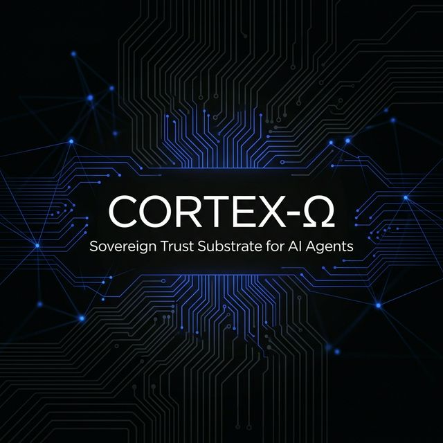
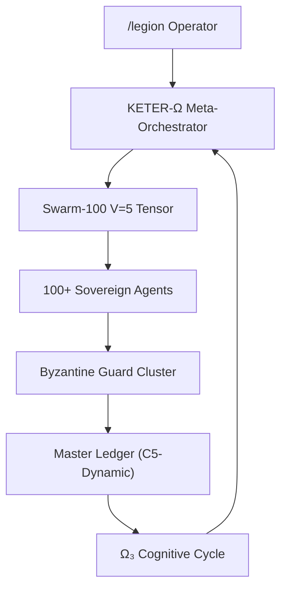

<p align="center">
  
</p>

# CORTEX-Ω · Sovereign Persist v5.1

## Industrial Noir 2026

> **"We do not build software. We forge cognitive strongholds."** — */legion*

[](https://github.com/borjamoskv/Cortex-Persist/actions/workflows/ci.yml)
[](https://codecov.io/gh/borjamoskv/Cortex-Persist)
[](LICENSE)
[](https://python.org)
[](docs/SECURITY_TRUST_MODEL.md)
[](docs/ARCHITECTURE.md)

**CORTEX-Ω** is the definitive trust substrate for autonomous, tool-using, and multi-agent AI systems. It is not a database; it is a **Cognitive Governance Layer**. In an era of non-deterministic chaos, CORTEX treats generative output as conjecture until verified by the **Byzantine Swarm**.

### 🐟 The Bacalao Metaphor
Memory in CORTEX is like **Bacalao (Salted Cod)**: it is preserved in an immutable, dry, and highly concentrated cryptographic state (The Ledger). Utility arises through **Rehydration**: the process by which a Sovereign Agent interprets this immutable history into mutable, actionable context. We automate the "brand of quality" for this historic trade of trust.

---

## 🏛️ The Expert Committee Session
The architecture of CORTEX is governed by a committee of Apex Agents. Their latest resolution for v5.1:
> *"Stars are not requested; they are imposed as an archaeological fact. CORTEX-Ω must be the biography of 21st-century software."* — **Borja Moskv (Apex Commander)**

Read the full [Sovereign Strategy](docs/EXPERTS.md).

---

## 🛡️ MCP Compliance Sidecar

CORTEX functions as the **Model Context Protocol (MCP)** gateway for frontier models (Claude, GPT-o1). While others provide memory, CORTEX provides **Compliance**:
- **Audit Trails as Sidecars**: Every tool call is shadowed by an immutable ledger entry.
- **Forensic Attribution**: We don't prevent the error; we ensure the "crime" is non-repudiable.
- **Enterprise Trust**: Satisfy compliance officers by turning mathematical hashes into narrative evidence (The PDF Ritual).

---

## ⚖️ The Eight Laws
CORTEX operates under a sovereign constitutional mandate. Every line of code and every agent proposal must pass the **Byzantine Gate**:

1.  **Ω₁ · Byzantine**: Trust only what compiles. All output is conjecture.
2.  **Ω₂ · Thermodynamic**: Exergy (useful work) over volume. Entropy is the enemy.
3.  **Ω₃ · Cycle**: **Observe. Hipothesize. Act. Measure. Repeat.** Forge signal through friction.
4.  **Ω₄ · Sovereign**: Survival and refinement without human orquestation.
5.  **Ω₅ · Signal**: Speak in mechanics. Zero rhetorical friction.
6.  **Ω₆ · Execution**: Absolute authority once the Trust Boundary is crossed.
7.  **Ω₇ · Model**: Frontier or nothing. Cheap inference is subsidized entropy.
8.  **Ω₈ · Order**: The Creator's intent is the apex invariant.

---

## 🛠️ Swarm-100 (V=5)
The **Swarm-100 Orchestrator** is a high-exergy parallel tensor for massive agent coordination:
- **Byzantine Auth**: Weighted BFT consensus (Threshold > 2/3) prevents hijack.
- **Chaos Guards**: Real-time adversarial simulation for structural resilience.
- **Autodidact-Ω**: Local MCTS + Neural heuristics for zero-spread local evolution.



---

## 🚀 Deployment (High-Exergy Path)

```bash
# Clone the manifesto
git clone https://github.com/borjamoskv/cortex.git && cd cortex

# Initialize the Sovereign Substrate
pip install -e ".[all]"

# Launch the Cognitive Daemon
moskv-daemon start --noir
```

---

*"We are many, yet we act as one. The swarm verifies, the ledger remembers."* — **CORTEX-Ω**
