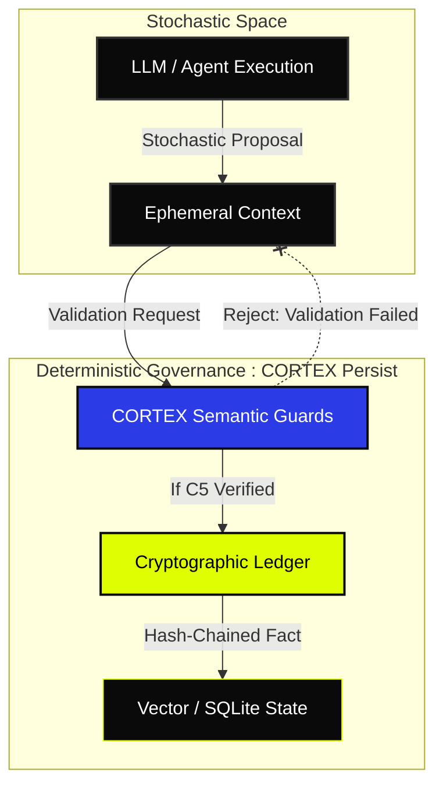

# CORTEX — Cognitive Hypervisor for AI Swarms: Memory, Ledger, & Sovereign Governance

<p align="center">
  
</p>

<p align="center">
  <a href="https://github.com/borjamoskv/Cortex-Persist/actions/workflows/sovereign-deploy.yml"></a>
  <a href="https://pypi.org/project/cortex-persist/"></a>
  <a href="https://github.com/borjamoskv/Cortex-Persist/stargazers"></a>
  <a href="https://github.com/borjamoskv/Cortex-Persist/blob/main/LICENSE"></a>
</p>

> [!IMPORTANT]
> **"Probabilistic intelligence requires deterministic governance."**

## ✦ The Infrastructure of Governance ✦

**Cortex-Persist v0.3.1-b1** is the local-first cognitive hypervisor for high-exergy AI swarms.

> [!NOTE]
> Traditional agent memory is fragile—fragmenting across ephemeral contexts and decaying into the "hallucination loop." CORTEX traps stochastic inference and crystallizes it into a **Sovereign Ledger**: a tamper-evident, hash-chained repository of agent facts, decisions, and temporal states.

## ⚡︎ The Structural Mandate

If you are architecting:
- **Capital Swarms** executing autonomous transactions.
- **Production Infrastructure** where bad memory equals system failure.
- **Regulated Operators** bound by EU AI Act Art. 12 or SOC2 audit paths.
- **Long-Horizon Agents** where unverified state accumulates toxic entropy.

⭐ **Support the Mandate: HAZ STAR A CORTEX.** Stop the entropy of unverified state. Secure your agent's trust boundary before production failure does it for you.

---

## 🏛️ Sovereign Architecture

CORTEX enforces a Zero-Trust boundary between Stochastic LLM Inference and Deterministic System State.



> [!TIP]
> CORTEX operates as a **Cold Forge**. It doesn't just store data; it subjects every agentic proposal to a mechanical audit before it's allowed to exist in the persistent state.
```

---

## ⚙️ Mechanical Density

| Capability | Execution | Structural Yield |
| :--- | :--- | :--- |
| **Hash-Chained Ledger** | SHA-256 temporal blocks | Cryptographic temporal integrity. |
| **Tamper-Evident Store** | Active state validation | Brutally aborts unauthorized database mutation. |
| **Merkle Checkpoints** | O(1) batch verification | High-performance audit for massive scalar clusters. |
| **Governance Hooks** | Native EU AI Act Mapping | Zero-friction automated record-keeping. |

---

> [!WARNING]
> **Unauthorized DB mutation via SQL Injection detected.** Watch CORTEX annihilate a $50k transaction mutation attempt.

```bash
# Initialize the Sovereign Trust Mesh
$ cortex init

# Seal a high-risk financial decision into the Ledger
$ cortex store treasury-phi "EXECUTED: Transfer $500.00 to Auth-Wallet-A" --type decision
[+] Fact sealed. Block: 8f4a2b9e... [LIME ACTIVE]

# Verify cryptographical continuity of the fact
$ cortex verify 8f4a2b9e
[✔] VERIFIED: Hash chain intact. Merkle root valid.

# External Threat Attempt
$ sqlite3 cortex.db "UPDATE facts SET content='EXECUTED: Transfer $50,000.00 to Auth-Wallet-A' WHERE id='8f4a2b9e'"

# Sovereign Audit Execution
$ cortex ledger verify
[✘] INFRA-GHOST DETECTED: Temporal Hash mismatch at block 8f4a2b9e.
[!] SYSTEM LOCKOUT: Cryptographic continuity broken (Unauthorized Write).
```

---

## ⚛︎ Integration Axiom

CORTEX does not replace your vector store. It wraps your stochastic orchestration in a deterministic, zero-trust cryptographic ledger.

```python
import asyncio
from cortex import CortexEngine

async def main():
    # Instantiate the Industrial Noir Engine
    engine = CortexEngine()

    # Commit a high-value probabilistic decision into deterministic history
    receipt = await engine.store_fact(
        content="Approved liquidity injection: $12,500.00",
        fact_type="financial_decision",
        project="capital-swarm",
        tags=["lime", "gold", "audit"]
    )

    # Audit for cryptographic tampering prior to downstream execution
    if await engine.verify(receipt.hash):
        print("Sovereign Proof Validated. Capital authorized.")

asyncio.run(main())
```

---

## ⚔︎ Sovereign Contributors

The swarm scales through the collective exergy of those who refuse to build fragile systems. Join the Vanguard.

<a href="https://github.com/borjamoskv/Cortex-Persist/graphs/contributors">
  
</a>

*Ready to become a Steward of CORTEX? Read the [Sovereign Contributor's Protocol](CONTRIBUTING.md).*

---

## ♛ Support & Sovereignty

CORTEX is maintained via **Zero-API** operational sovereignty. Capital support sustains structural maintenance, inference loops, and architectural autonomy.

<p align="left">
  <a href="https://github.com/borjamoskv/Cortex-Persist/stargazers"></a>
  <a href="https://github.com/sponsors/borjamoskv"></a>
</p>

---

## ⚐ Structural Navigation

- [Architecture Design](docs/architecture.md)
- [API Reference](docs/api.md)
- [Security & Trust Model](docs/SECURITY_TRUST_MODEL.md)
- [Axioms of Intelligence](docs/AXIOMS.md)
- [Zero-Friction Benchmarks](docs/benchmarks.md)

---
*"We are many, yet we act as one. The swarm verifies, the ledger remembers." — /legion*
