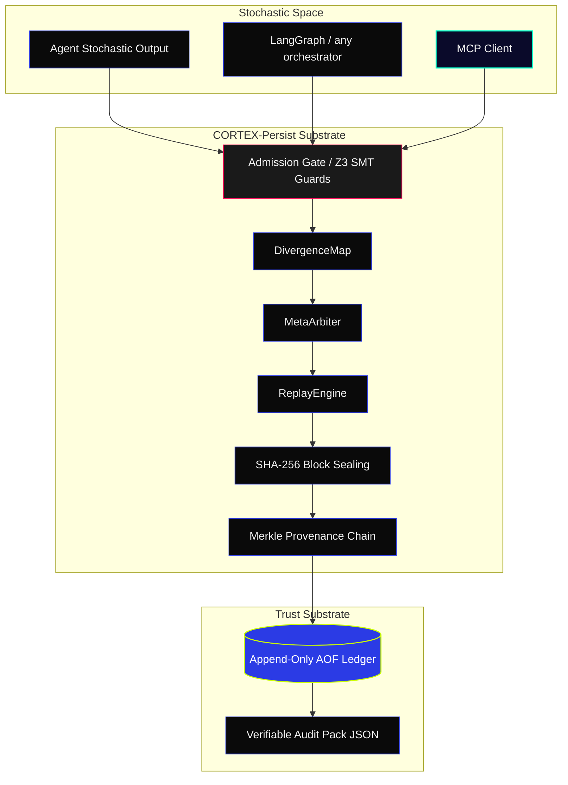

<!-- [C5-REAL] Exergy-Maximized -->
<div align="center">
  <picture>
    <source media="(prefers-color-scheme: dark)" srcset="assets/marketing/social-preview.png">
    <source media="(prefers-color-scheme: light)" srcset="assets/marketing/social-preview-light.png">
    
  </picture>
</div>

<h1 align="center">█ CORTEX-PERSIST</h1>
<p align="center">
  <strong>CORTEX prevents AI-generated changes from silently breaking production systems.</strong><br>
  <em>The CI/CD Firewall and Governance Layer that turns probabilistic LLM output into policy-constrained, auditable code mutations.</em>
</p>

<p align="center">
  <a href="https://github.com/borjamoskv/cortex-persist/stargazers"></a>
  <a href="https://pypi.org/project/cortex-persist/"></a>
  <a href="https://pypi.org/project/cortex-persist/"></a>
  <a href="https://www.python.org/"></a>
  <a href="https://github.com/borjamoskv/cortex-persist/actions"></a>
  <a href="https://github.com/borjamoskv/cortex-persist/actions/workflows/bench.yml"></a>
  <a href="LICENSE"></a>
  <a href="docs/mcp.md"></a>
</p>

```
Copilot/LLM    →  generates probabilistic code mutations
PR Pipeline    →  runs tests (checks syntax and logic)
CORTEX         →  enforces governance, scores entropy, and seals audits
```

---

## ▀▄ THE PROBLEM (30 SECONDS)

AI code assistants (Copilot, custom agents, LLM orchestrators) generate code changes autonomously. However, traditional CI/CD pipelines treat code generated by probabilistic LLMs exactly the same as deterministic human code. This leads to silent production failures, untested blast radiuses, and audit trails that are impossible to verify.

CORTEX-PERSIST is the CI/CD firewall for the agentic era:

- **GitHub Copilot / Agents** generate code mutations. CORTEX **intercepts mutations to enforce security policies and RBAC bounds.**
- **Standard Linters / Tests** check syntax. CORTEX **scores structural entropy, verifies risk thresholds, and issues cryptographic seal proofs.**
- **Standard Audit Logs** record flat text. CORTEX **binds the execution path to an immutable Ledger with Ed25519 signatures.**

---

## ▀▄ QUICK START (90 SECONDS)

```bash
pip install cortex-persist
```

<picture>
  <source media="(prefers-color-scheme: dark)" srcset="assets/marketing/cortex_demo.gif">
  <source media="(prefers-color-scheme: light)" srcset="assets/marketing/cortex_demo_light.gif">
  
</picture>

---

## ▀▄ THE EPISTEMIC CONTAINMENT SHIELD

**Generative AI output is fundamentally probabilistic conjecture. Traditional logs blindly trust stochastic output.**  
CORTEX-PERSIST intercepts stochastic text, enforces a deterministic shield via Z3 SMT Guards, and commits the state to a cryptographically bound Ledger.

| CAPABILITY | TRADITIONAL RAG / LOGS | CORTEX-PERSIST |
| :--- | :--- | :--- |
| **Trust Model** | Trust the Process | **Verify the Evidence (C5-REAL)** |
| **Mutation** | Silent CRUD / Overwritable | **Append-Only + SHA-256 Merkle Seals** |
| **Agent Liability** | Ambiguous reconstruction | **Mathematically Defensible Lineage** |
| **Verification** | Manual log diving | **O(1) Portable JSON Audit Packs** |

### ZERO-FRICTION CI/CD GATEWAY INTEGRATION
Audit and gate LLM code changes in your pipelines with minimal boilerplate.

```python
from cortex.gateway.code_governance import CodeGovernanceGateway
from cortex.auth.enterprise_identity import SovereignIdentity

# Initialize the CI Firewall
gateway = CodeGovernanceGateway(ledger=ledger, rbac_guard=rbac)

# Evaluate an incoming AI-generated code change (Pull Request)
audit = await gateway.evaluate_pull_request(
    identity=SovereignIdentity(tenant_id="acme_corp", actor_id="ci_bot", role="CI_GATEWAY"),
    pr_id="pr-102",
    pr_payload={
        "files_changed": 18,
        "additions": 1500,
        "deletions": 200,
        "commits": 1,
        "includes_tests": False
    }
)

print(audit["status"])        # REJECTED (entropy exceeds policy threshold)
print(audit["audit_proof"])    # SHA-256 cryptographic proof of the decision
```

```python
# Decorate deployment tasks to enforce audit seals automatically
from cortex.magic import sovereign_persist

@sovereign_persist(strict=True)
async def deploy_patch(patch_payload: dict):
    # CORTEX automatically intercepts, validates against policy guards, 
    # logs the commit metadata to the ledger, and returns the sealed receipt.
    return execute_deploy(patch_payload)
```

---

## ▀▄ ARCHITECTURE: EXECUTION AS A METRIC SPACE

CORTEX-PERSIST introduces a concept that doesn't exist in any other framework:

**An agent's execution history is not a log — it is a point in a high-dimensional metric space.**

Two runs of the same agent are either:
- **Equivalent** (same equivalence class in the execution manifold)
- **Divergent** (measurable distance > threshold → alert, reroute, or stabilize)

This lets you answer questions no other tool can:

| Question | LangGraph | Mem0 | CORTEX-PERSIST |
| :--- | :---: | :---: | :---: |
| Did this run diverge from the canonical run? | ❌ | ❌ | ✅ `DivergenceMap` |
| Can I replay this execution deterministically? | Partial | ❌ | ✅ `ReplayEngine` |
| Is this memory state cryptographically intact? | ❌ | ❌ | ✅ Hash-chain |
| Which execution branch has lowest entropy drift? | ❌ | ❌ | ✅ `MetaArbiter` |
| O(1) tamper detection on 1M+ events? | ❌ | ❌ | ✅ Merkle seals |
| Native MCP server? | ❌ | ❌ | ✅ |
| ~390k agents/sec throughput? | ❌ | ❌ | ✅ Rust-FFI core |

---

## ▀▄ CORE PRIMITIVES

```
CortexEngine        →  The sovereign ledger. Every observation sealed.
DivergenceMap       →  Geometric distance between execution trajectories.
ReplayEngine        →  Deterministic reconstruction of any past execution.
MetaArbiter         →  Topological collapse operator: picks the canonical branch.
ExecutionControl    →  stabilize | reroute | halt signals based on entropy drift.
StateDistance       →  Metric function over execution state vectors.
EntropyDrift        →  Rate of divergence over time windows.
```

---

## ▀▄ COMPARISON

| Dimension | LangGraph | Mem0 | CORTEX-PERSIST |
| :--- | :--- | :--- | :--- |
| **Persistence unit** | Conversation thread state | Extracted semantic facts | Execution trace + hash-chain |
| **Source of truth** | Last checkpoint | Relevance-ranked memories | Cryptographic Merkle ledger |
| **Divergence detection** | None | None | `DivergenceMap` + `EntropyDrift` |
| **Deterministic replay** | Partial | None | Full — CI-verified |
| **Multi-run topology** | None | None | Equivalence classes + fork map |
| **Conflict arbitration** | None | None | `MetaArbiter` — topological collapse |
| **Execution control** | Graph node transitions | None | `ControlSignal`: stabilize / reroute |
| **Throughput** | Python-bound | Python-bound | ~390k agents/sec (Rust-FFI) |
| **Tamper evidence** | None | None | SHA-256 + ZK-STARK seals |

CORTEX is **orthogonal** to LangGraph and Mem0, not competitive. [See integration guide →](docs/langgraph_integration.md)

---

## ▀▄ INSTALLATION & DEPLOYMENT

**Requirements:** `Python 3.10+`. Zero external daemons required.

```bash
pip install cortex-persist

# Optional core modules
pip install "cortex-persist[embeddings]"      # Local semantic embeddings
pip install "cortex-persist[knowledge]"       # Chroma-backed knowledge sync
pip install "cortex-persist[api,mcp,daemon]"  # MCP server + REST API
pip install "cortex-persist[cloud]"           # PostgreSQL + Redis + Qdrant scaling
pip install "cortex-persist[secure]"          # OS keyring credentials vault
pip install "cortex-persist[acceleration]"    # Rust-FFI core (~390k agents/sec)
```

---

## ▀▄ SECURE CREDENTIAL BACKEND

The secure credential backend relies on the optional `secure` extra, which installs the `keyring` package. It enables encrypted storage of the master encryption key in the host OS vault.

```bash
# Install core package + secure extra
pip install "cortex-persist[secure]"
```

When the `keyring` dependency is not present, the system degrades gracefully: functions such as `cortex.crypto.keyring.get_master_key()` simply return `None` instead of raising `ModuleNotFoundError`. This allows a minimal installation to work without the secure backend.

```python
from cortex.crypto.keyring import get_master_key
print(get_master_key())  # → None if keyring is not installed
```

---

## ▀▄ MCP INTEGRATION

CORTEX-PERSIST exposes a native MCP server. Drop it into any MCP-compatible orchestrator (Perplexity, Claude Desktop, custom agents):

```bash
cortex mcp serve --port 8765
```

```json
{
  "mcpServers": {
    "cortex-persist": {
      "command": "cortex",
      "args": ["mcp", "serve"]
    }
  }
}
```

---

## ▀▄ ARCHITECTURE DATA FLOW



---

## ▀▄ REAL-WORLD EXAMPLES

The `examples/` directory has ready-to-run scenarios:

1. **[Canonical Loop](examples/demo_canonical.py)** — full C5-REAL execution + tamper detection.
2. **[Pricing Agent](examples/demo_pricing_agent.py)** — cryptographic audit trail for AI pricing decisions.
3. **[Support Escalation](examples/demo_support_approval.py)** — mathematical proof of AI decision lineage.
4. **[MCP Memory](examples/demo_mcp_memory.py)** — Perplexity/Claude via MCP with sealed tool calls.
5. **[LangGraph Integration](examples/demo_langgraph.py)** — CORTEX as verification substrate under LangGraph.

---

## ▀▄ ARCHITECTURE DATABANKS

- [**SECURITY_TRUST_MODEL.md**](docs/SECURITY_TRUST_MODEL.md) — Cryptographic invariants & guarantees
- [**AGENTS.md**](AGENTS.md) — Substrate directives for autonomous orchestration
- [**ROADMAP.md**](ROADMAP.md) — Deployment phases and LEGION-10k scaling
- [**API Reference**](docs/api.md) — SDK primitives and REST endpoints
- [**MCP Integration**](docs/mcp.md) — MCP server setup and tool catalog
- [**LangGraph Integration**](docs/langgraph_integration.md) — How CORTEX sits under LangGraph

---

```yaml
AESTHETIC:    INDUSTRIAL NOIR 2026 (#0A0A0A / #2B3BE5)
EPISTEMOLOGY: C5-REAL — Cryptographically Verified Reality
CORE TENET:   Generative output is conjecture. Evidence is absolute.
THROUGHPUT:   ~390k Agents/Sec (Rust-FFI, GIL-free)
UPDATED:      June 2026 — Execution Manifold · MetaArbiter · MCP Native
```

> **LICENSE:** Apache-2.0 | **OPERATOR:** borjamoskv | [cortexpersist.org](https://cortexpersist.org) | [Sponsor](https://github.com/sponsors/borjamoskv)
