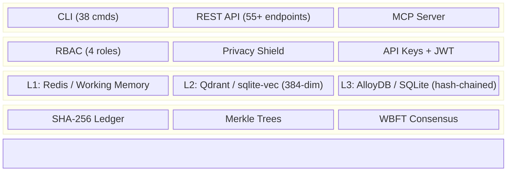

# CORTEX — Trust Infrastructure for Autonomous AI

🌐 **English** | [Español](README.es.md) | [中文](README.zh.md)

> **Your AI agent makes thousands of decisions. Can you prove a single one wasn't tampered with?**
> *CORTEX is to AI memory what SSL/TLS is to web communications — cryptographic verification, audit trails, and traceability for regulated environments.*

Package: `cortex-persist v0.3.0b1` · Current engine generation: `v8`


[](https://codecov.io/gh/borjamoskv/cortex)


[](https://cortexpersist.dev)
[](https://cortexpersist.com)
[](docs/cross_platform_guide.md)

## Documentation

CORTEX separates operational contribution rules, architecture, trust model, and epistemic doctrine.

- [AGENTS.md](./AGENTS.md) — operational contract for contributors and coding agents
- [Architecture](docs/architecture.md) — topology, module map, and data flow
- [Axioms](docs/AXIOMS.md) — epistemic and design axioms
- [Security & Trust Model](docs/SECURITY_TRUST_MODEL.md) — trust boundaries, guarantees, and threat model
- [Contributing](./CONTRIBUTING.md) — contribution workflow
- [Security Policy](./SECURITY.md) — vulnerability disclosure policy
- [Roadmap](./ROADMAP.md) — development timeline and versioning

---

### ⚡ The "Aha" Moment

AI agents hallucinate past actions. CORTEX stops this mathematically.

```bash
$ cortex store --type decision --project fin-agent "Approved loan #4292"
[+] Fact stored. Ledger hash: 8f4a2b9e...

$ cortex verify 8f4a2b9e
[✔] VERIFIED: Hash chain intact. Merkle root sealed.
```

### ⚡ The Numbers

| | |
|:---|:---|
| **<20ms** retrieval | In-process SQLite. No HTTP. No network. |
| **1,000+** tests | Production-grade from day one |
| **Zero** attack surface | No HTTP endpoints required. No cloud dependency. |

---

## The Problem

AI agents make decisions at scale. Those decisions are invisible, untraceable, and unreproducible.

- Memories are stored without cryptographic proof of integrity.
- Decision chains cannot be audited or verified after the fact.
- Multi-agent systems build divergent realities with no consensus mechanism.
- Regulatory frameworks (EU AI Act Article 12, enforcement August 2026) require automatic logging, tamper-proof storage, and full traceability of AI system decisions.

A system that cannot prove what it decided — and when — is a system that cannot be trusted in production.

## The Solution

CORTEX doesn't replace your memory layer — it **certifies** it.

```text
Your Memory Layer (Mem0 / Zep / Letta / Custom)
        ↓
   CORTEX Trust Engine
        ├── 🔗 SHA-256 hash-chained ledger
        ├── 🌳 Merkle tree checkpoints
        ├── 🛡️ Zero-Trust Guards
        ├── 🤝 Reputation-weighted WBFT consensus
        ├── 🔐 Privacy Shield (11-pattern secret detection)
        ├── 🧬 Biological Core (Autopoiesis/Endocrine)
        └── 📋 Audit trail generation
```

### Core Capabilities

| Capability | What It Does |
|:---|:---|
| 🔗 **Immutable Ledger** | Every fact is SHA-256 hash-chained. Tamper = detectable. |
| 🌳 **Merkle Checkpoints** | Periodic batch verification of ledger integrity |
| 📋 **Audit Trail** | Timestamped, hash-verified log of all decisions |
| 🔍 **Decision Lineage** | Trace how an agent arrived at any conclusion |
| 🤝 **WBFT Consensus** | Multi-agent Byzantine fault-tolerant verification |
| 🧠 **Tripartite Memory** | L1 Working → L2 Vector → L3 Episodic Ledger |
| 🧬 **Biological Core** | Autopoiesis + Endocrine + Circadian Cycles |
| 🔐 **Privacy Shield** | Zero-leakage ingress guard — 11 secret patterns |
| 🏠 **Local-First** | SQLite. No cloud required. Your data, your machine. |
| ☁️ **Sovereign Cloud** | Multi-tenant AlloyDB + Qdrant + Redis |

---

## Quick Start

### Install

```bash
pip install cortex-persist
```

### Store a Decision & Verify It

```bash
# Store a fact (auto-detects AI agent source)
cortex store --type decision --project my-agent "Chose OAuth2 PKCE for auth"

# Verify its cryptographic integrity
cortex verify 42
# → ✅ VERIFIED — Hash chain intact, Merkle sealed

# Generate audit report
cortex compliance-report
```

### Multi-Tenant

```python
from cortex import CortexEngine

engine = CortexEngine()

# All operations are tenant-scoped
await engine.store_fact(
    content="Approved loan application #443",
    fact_type="decision",
    project="fintech-agent",
    tenant_id="enterprise-customer-a"
)
```

### Run as MCP Server (Universal IDE Plugin)

```bash
# Works with: Claude Code, Cursor, OpenClaw, Windsurf, Antigravity
python -m cortex.mcp
```

### Run as REST API

```bash
uvicorn cortex.api:app --port 8484
```

---

## Architecture



> 📐 Full architecture details in [architecture.md](docs/architecture.md).

---

## Stats (2026-03-14)

| Metric | Value |
|:---|:---|
| Test functions | **1,000+** |
| Production LOC | **~45,500** |
| Python Modules | **444** |
| Python version | **3.10+** |

---

## Integrations

CORTEX plugs into your existing stack:

- **IDEs**: Claude Code, Cursor, OpenClaw, Windsurf, Antigravity (via MCP)
- **Agent Frameworks**: LangChain, CrewAI, AutoGen, Google ADK
- **Memory Layers**: Sits on top of Mem0, Zep, Letta as verification layer
- **Databases**: SQLite (local), AlloyDB, PostgreSQL, Turso (edge)
- **Vector Stores**: sqlite-vec (local), Qdrant (self-hosted or cloud)
- **Deployment**: Docker, Kubernetes (Helm coming Q2 2026), bare metal, `pip install`

---

## Cross-Platform

CORTEX runs natively on any environment without Docker:

- **macOS** (launchd & osascript notifications)
- **Linux** (systemd & notify-send)
- **Windows** (Task Scheduler & PowerShell)

See [Cross-Platform Architecture Guide](docs/cross_platform_guide.md).

---

## Regulatory Positioning

CORTEX provides the traceability, integrity verification, and audit infrastructure
that regulated environments require. It does not by itself make a system "compliant"
— compliance depends on the role, use case, and risk category of the deploying system.

What CORTEX provides:

- **Tamper-evident storage** of all agent decisions (hash-chained ledger)
- **Automatic audit trail** generation with timestamped, verifiable records
- **Integrity verification** via Merkle tree checkpoints
- **Full decision lineage** — trace any conclusion back to its origin

These capabilities support the traceability and logging requirements
described in EU AI Act Article 12, among other regulatory frameworks.

---

## License

**Apache License 2.0** — Free for any use, commercial or non-commercial.
See [LICENSE](LICENSE) for details.

---

*Built by [borjamoskv.com](https://borjamoskv.com) · [cortexpersist.com](https://cortexpersist.com)*
