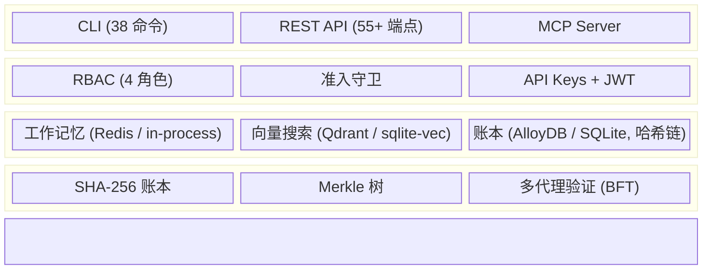

🌐 [English](README.md) | [Español](README.es.md) | **中文**

# CORTEX — AI 系统的防篡改决策溯源

> 你的 AI 系统在做决策。
> CORTEX 让这些决策**可追溯、可验证、可审计**。
>
> *哈希链日志、Merkle 完整性证明和可查询的决策溯源，
> 面向监管和高风险 AI 工作流。*

包：`cortex-persist v0.3.0b2` · 引擎：`v8` · 许可证：`Apache-2.0`


[](https://codecov.io/gh/borjamoskv/cortex)


[](https://cortexpersist.dev)
[](https://cortexpersist.com)
[](docs/cross_platform_guide.md)

---

## 为什么存在

AI 系统在一个关键维度上静默失败：**证据**。

- 你可以存储记忆，但无法证明它们未被修改。
- 你可以重放输出，但无法重建决策溯源链。
- 你可以记录活动，但无法随时间验证完整性。

CORTEX 不替代你的记忆层 — 它**认证**它。

*它对于 AI 记忆，就如同 SSL/TLS 对于 Web 通信：
密码学验证、审计追踪和可验证的证据链。*

---

## 它是什么

在你现有记忆栈之上的三层：

### 1. 证据层

每个代理决策的防篡改记录。

- **SHA-256 哈希链账本** — 修改可被检测
- **Merkle 树检查点** — 定期批量完整性证明
- **租户隔离存储** — 决策按客户隔离

### 2. 决策溯源层

从任何结论追溯到源头的可查询链路。

- **完整因果链** — 哪些事实导致了哪些决策
- **带时间戳的审计追踪** — 何时、什么、由哪个代理
- **语义搜索** — 按语义查找相关决策（384 维向量）

### 3. 治理层

策略执行和合规支持报告。

- **准入守卫** — 在持久化前验证决策
- **密钥检测** — 在入口拦截 API 密钥、令牌和 PII
- **合规导出** — 按需生成可审计报告
- **完整性验证** — 一条命令验证账本一致性

---

## 快速演示

```bash
# 存储一个带密码学证明的决策
$ cortex store --type decision --project fin-agent "Approved loan #4292"
[+] Fact stored. Ledger hash: 8f4a2b9e...

# 验证记录未被篡改
$ cortex verify 8f4a2b9e
[✔] VERIFIED: Hash chain intact. Merkle root sealed.

# 生成审计报告
$ cortex compliance-report
```

---

## 在哪里使用

```text
你的记忆栈 (Mem0 / Zep / Letta / 自定义)
        ↓
   CORTEX 证据层
        ├── 哈希链账本
        ├── Merkle 检查点
        ├── 准入守卫
        └── 审计追踪和溯源查询
```

CORTEX 不是一个记忆存储。它是位于任何记忆存储之上的
验证和可追溯性层。

---

## 适合谁

| 使用 CORTEX 如果 | 不要使用 CORTEX 如果 |
|:---|:---|
| 你需要可验证的决策记录 | 你只需要语义检索 |
| 你在监管或高风险工作流中运营 | 你不关心完整性证明 |
| 多个代理共享记忆并需要一致的溯源 | 简单的向量存储已经解决了你的问题 |
| 你需要可防御的审计追踪用于合规或法律审查 | 你的代理不做持久化决策 |

**专为以下团队构建：**
- 构建代理基础设施的 AI 平台团队
- 受监管的 SaaS 供应商（金融科技、健康科技、保险科技）
- 有审计要求的企业 Copilot 团队
- 需要具备事后追溯能力的多代理系统

---

## 使用场景

| 行业 | CORTEX 提供什么 |
|:---|:---|
| **金融科技 / 保险科技** | 可追溯的承保决策、可验证的贷款审批 |
| **医疗健康** | 临床决策支持代理的审计追踪 |
| **企业 Copilot** | 记住了什么、推荐了什么、修改了什么的证据 |
| **多代理运维** | 跨代理集群的决策溯源 + 事后验证 |
| **欧盟监管部署** | 高风险 AI 系统义务的可追溯性支持 |

---

## 安装

```bash
pip install cortex-persist
```

### Python API

```python
from cortex import CortexEngine

engine = CortexEngine()

await engine.store_fact(
    content="Approved loan application #443",
    fact_type="decision",
    project="fintech-agent",
    tenant_id="enterprise-customer-a"
)
```

### MCP 服务器（通用 IDE 插件）

```bash
# 支持：Claude Code, Cursor, OpenClaw, Windsurf, Antigravity
python -m cortex.mcp
```

### REST API

```bash
uvicorn cortex.api:app --port 8484
```

---

## 架构



> 完整架构详见 [architecture.md](docs/architecture.md)。

---

## 集成

CORTEX 可接入你现有的技术栈：

- **IDE**：Claude Code, Cursor, OpenClaw, Windsurf, Antigravity（通过 MCP）
- **代理框架**：LangChain, CrewAI, AutoGen, Google ADK
- **记忆层**：作为验证层叠加在 Mem0, Zep, Letta 之上
- **数据库**：SQLite（本地）, AlloyDB, PostgreSQL, Turso（边缘）
- **向量存储**：sqlite-vec（本地）, Qdrant（自托管或云端）
- **部署**：Docker, Kubernetes, 裸机, `pip install`

---

## 跨平台

CORTEX 无需 Docker 即可在任何环境原生运行：

- **macOS**（launchd 和 osascript 通知）
- **Linux**（systemd 和 notify-send）
- **Windows**（任务计划程序和 PowerShell）

详见[跨平台指南](docs/cross_platform_guide.md)。

---

## 监管定位

CORTEX 提供受监管环境所需的可追溯性、完整性验证和审计基础设施。
它本身不使系统"合规" — 合规取决于部署系统的角色、用例和风险类别。

CORTEX 提供：

- **防篡改存储** — 所有代理决策（哈希链账本）
- **自动审计追踪生成** — 带时间戳和密码学验证的记录
- **完整性验证** — 通过 Merkle 树检查点
- **完整决策溯源** — 追踪任何结论到其源头

这些能力支持欧盟 AI 法案（第 12 条）等框架中描述的
可追溯性和记录保存要求。

---

## 许可证

**Apache License 2.0** — 任何用途均免费，商业或非商业。
详情见 [LICENSE](LICENSE)。

---

*由 [borjamoskv.com](https://borjamoskv.com) 开发 · [cortexpersist.com](https://cortexpersist.com)*
