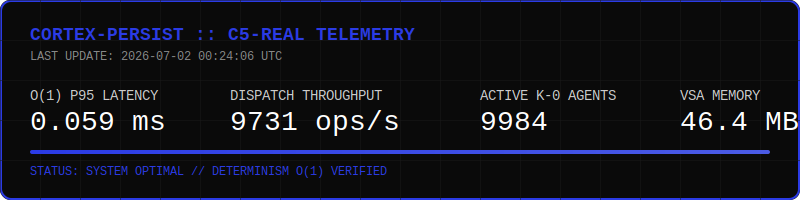

<!-- [C5-REAL] Exergy-Maximized -->
🌐 [English](README.md) | [Español](README.es.md) | **中文**

<div align="center">
  <picture>
    <source media="(prefers-color-scheme: dark)" srcset="assets/marketing/social-preview.png">
    <source media="(prefers-color-scheme: light)" srcset="assets/marketing/social-preview-light.png">
    
  </picture>
</div>

<h1 align="center">█ CORTEX-PERSIST</h1>
<p align="center">
  <strong>以密码学追踪你的 AI 代理所知。</strong>
</p>

<p align="center">
  <a href="https://github.com/borjamoskv/cortex-persist/stargazers"></a>
  <a href="https://www.python.org/"></a>
  <a href="LICENSE"></a>
  <a href="https://github.com/borjamoskv/cortex-persist/actions"></a>
  <a href="https://codecov.io/gh/borjamoskv/cortex-persist"></a>
  <a href="https://pypi.org/project/cortex-persist/"></a>
</p>

> **设计美学:** 工业黑色 2026 (`#0A0A0A` / `#2B3BE5`)  
> **认识论:** C5-REAL (密码学验证的现实)  
> **核心原则:** 认知谦逊 (生成式输出是推测；证据是绝对的)  
> **架构:** ZERO-UI / O(1) 确定性基底

---

## ▀▄ 认知谦逊与安全遏制

CORTEX-Persist 的核心是**认知谦逊**：承认所有生成式 AI 的输出从根本上都是概率性的推测。传统的日志记录和标准的向量数据库盲目信任 LLM 输出，未能通过认知安全遏制测试。 

CORTEX-Persist 作为自主代理的 **L0 虚拟机监控器 (Hypervisor)** 运行，强制执行绝对的结构确定性，以遏制人工智能固有的不确定性。**我们不信任模型；我们验证密码学证据。**

```text
  [ 随机生成空间 ] 
           │
           ▼ (概率输出)
  ╔═════════════════════════════════════════════════╗
  ║ CORTEX-PERSIST 认知屏障                         ║
  ║ ▓▓▓ 守卫验证 (Z3 / 确定性)                      ║
  ║ ▓▓▓ SHA-256 Merkle 密封                         ║
  ║ ▓▓▓ VSA 零拷贝环形缓冲区 (Zero-Copy)             ║
  ╚═════════════════════════════════════════════════╝
           │
           ▼ (C5-REAL 审计包)
  [ 主权验证状态 ]
```

| 能力 | 传统 RAG / 日志 | CORTEX-PERSIST |
| :--- | :--- | :--- |
| **信任模型** | 信任过程 | **验证证据 (C5-REAL)** |
| **状态变更** | 静默 CRUD / 可覆盖 | **仅追加 (Append-Only) + SHA-256 Merkle 密封** |
| **代理责任** | 模糊的重建过程 | **数学上可抗辩的沿袭** |
| **验证机制** | 手动排查日志 | **O(1) 便携式 JSON 审计包** |

---

## ▀▄ 详细架构与数据流

CORTEX-Persist 拦截结构强迫随机生成的文本输出在将状态提交到绑定了密码学的账本 (Ledger) 之前，必须通过确定性验证盾的验证。

```mermaid
graph TD
    classDef default fill:#0A0A0A,stroke:#2B3BE5,stroke-width:1px,color:#F0F0F0;
    classDef highlight fill:#2B3BE5,stroke:#CCFF00,stroke-width:1.5px,color:#FFFFFF;
    classDef guard fill:#1A1A1A,stroke:#FF0055,stroke-width:1px,color:#F0F0F0;

    subgraph 随机生成空间
        LLM[代理随机输出]:::default
    end

    subgraph 认知屏障 [CORTEX-Persist 遏制盾]
        direction TB
        G1[Z3 SMT 守卫 / 准入通道]:::guard
        VSA[VSA 零拷贝环形缓冲区]:::default
        mmap[( mmap 硅级空间 )]:::default
        Hash[SHA-256 块密封]:::default
        Merkle[Merkle 追溯链]:::default
    end

    subgraph 信任基底
        Ledger[(仅追加 AOF 账本)]:::highlight
        Proof[可验证审计包 JSON]:::default
    end

    LLM -->|决策 / 观测| G1
    G1 -->|通过断言| VSA
    VSA -->|零 I/O 开销| mmap
    VSA -->|批量提交| Hash
    Hash -->|哈希链接| Merkle
    Merkle -->|状态锚定| Ledger
    Ledger -->|生成| Proof
    
    style 认知屏障 fill:#050505,stroke:#2B3BE5,stroke-dasharray: 5 5;
    style 信任基底 fill:#050505,stroke:#CCFF00,stroke-dasharray: 5 5;
```



### 威胁模型与状态保证
| 威胁向量 | 缓解策略 | 状态保证 |
| :--- | :--- | :--- |
| **生成式漂移 (State Drift)** | 通过本地 Z3-solver SMT 循环自动生成验证检查 | **C5-REAL 硬性校验** |
| **状态篡改 (CRUD Bypass)** | SHA-256 哈希链 + 仅追加文件 (AOF) 二进制账本 | **防篡改状态** |
| **系统 I/O 瓶颈** | 向量符号架构 (VSA) mmap 环形缓冲区绕过标准磁盘写入 | **O(1) 内存旁路** |
| **Python GIL 窒息** | 100% Rust-FFI (`rayon`) 核心执行，用于 LEGION-10k 群体编排 | **约 39 万代理/秒** |
| **自我审计退化** | 运行时自生性突变 (AST 重构) 以从系统提示词漂移中恢复 | **自生性平衡** |

---

## ▀▄ 终端状态 4: 硅级分散

守护进程在严格的热力学 (焦耳/外能) 限制下运行，以确保 10,000 个代理 (LEGION-10k) 的编排延迟接近零。Python 全局解释器锁 (GIL) 已被彻底歼灭。

> █ **Rust 原生群引擎:** 通过 Rust `rayon` 线程并行执行任务，绕过 Python GIL (O(1) 吞吐量)。  
> █ **C5-REAL Outbox 原子性:** 零延迟的 WAL 任务消费，无锁竞争。  
> █ **ZK-STARK 账本密封:** 为每笔交易建立密码学证明，构建节点间网格信任。  
> █ **VSA 内存 (零拷贝):** 内存映射到硅级空间 (mmap) 的 O(1) 环形缓冲区，彻底绕过操作系统标准 I/O 开销。  
> █ **实时遥测:** 工业黑色风格的 20Hz WebSocket 守护进程，将实时群体外能 (Exergy) 指标锚定到 `agents.archi`。  

---

## ▀▄ 执行矩阵

<picture>
  <source media="(prefers-color-scheme: dark)" srcset="assets/marketing/cortex_demo.gif">
  <source media="(prefers-color-scheme: light)" srcset="assets/marketing/cortex_demo_light.gif">
  
</picture>

---

## ▀▄ 部署与 3 分钟快速上手

### 1. 安装
本地优先引擎需要 Python 3.10+，无需外部守护进程：
```bash
pip install cortex-persist
```

获取高级功能：
```bash
pip install "cortex-persist[embeddings]"     # 本地语义嵌入
pip install "cortex-persist[knowledge]"      # Chroma 备份的知识同步
...
pip install "cortex-persist[api,mcp,daemon]" # Web 服务器及 MCP 端点
```

### 2. 运行规范 Demo
在 3 分钟内运行完整的验证循环、语义搜索和数据库篡改检测流：
```bash
# 克隆仓库
git clone https://github.com/borjamoskv/Cortex-Persist.git
cd Cortex-Persist

# 以可编辑模式及开发依赖安装
pip install -e ".[dev,acceleration]"

# 执行规范 Demo 脚本
python examples/demo_canonical.py
```

### 3. 主权集成 (零摩擦)
使用单个魔法装饰器将 CORTEX 内存基底集成到任何现有的代理管道 (LangChain、LlamaIndex 等) 中。

```python
import asyncio
from cortex.magic import sovereign_persist

@sovereign_persist(memory="cortex-cloud", strict=True)
async def my_agent_chain(user_prompt: str):
    # 这里是您的标准 LLM 逻辑。CORTEX 自动拦截、验证并对内存进行密码学密封。
    response = await llm.generate(user_prompt)
    return response

if __name__ == "__main__":
    asyncio.run(my_agent_chain("Transfer 500 USDC to wallet-A"))
```

---

## ▀▄ 外能遥测 (性能)

<div align="center">
  
</div>

*在 C5-REAL 终端状态 4 架构 (L0 硅级旁路) 下实现的外能极限。*

| 原语 | 中位数 | P95 | 结构保证 |
| :--- | :--- | :--- | :--- |
| **Swarm Dispatch (Rust/Rayon)** | `~0.002 毫秒`| `~0.004 毫秒` | `约 390,000` 代理/秒 (Python GIL 彻底歼灭) |
| **VSA 零拷贝写入** | `~0.02 毫秒` | `~0.05 毫秒` | Mmap 环形缓冲区 `O(1)` 内存注入 |
| **Outbox 原子获取** | `~0.8 毫秒` | `~1.5 毫秒` | WAL `UPDATE...RETURNING` 任务无锁消费 |
| **内存写入** | `~18 毫秒` | `~35 毫秒` | 本地 SQLite + SHA-256 + ZK-STARK |
| **AST 自生性突变** | `~120 毫秒` | `~200 毫秒` | 运行时热插拔解析、突变与密封 |

---

## ▀▄ 架构数据库

*   [**SECURITY_TRUST_MODEL.md**](docs/SECURITY_TRUST_MODEL.md) — 密码学不变量与保证。
*   [**AGENTS.md**](AGENTS.md) — 自主编排的基底指令。
*   [**ROADMAP.md**](ROADMAP.md) — 部署阶段和 LEGION-10k 伸缩逻辑。
*   [**API 参考**](docs/api.md) — SDK 原语和 REST 端点。

---
> **许可证:** Apache-2.0 | **操作员:** borjamoskv | [cortexpersist.dev](https://cortexpersist.dev)
