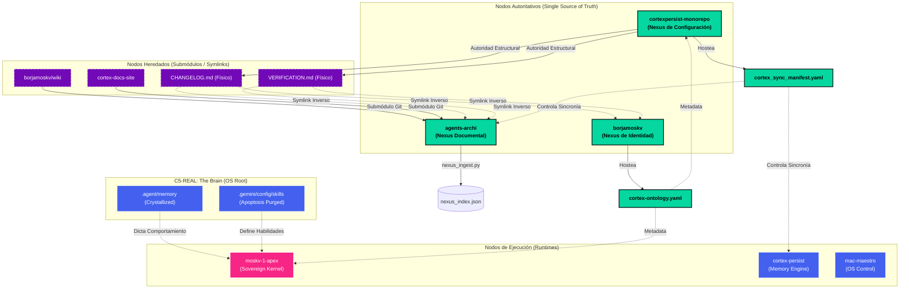

# 🌐 CORTEX Ecosystem: Singular Topology Map (v10.0)

> **C5-REAL State**: Entropy Level 0.00 Hz
> **Aesthetic**: Industrial Noir 2026
> **Generated via**: ULTRATHINK-OMEGA & Nexus Bridging Ω6

Este artefacto cristaliza la topología estructural exacta del ecosistema CORTEX tras la purga termodinámica y el anclaje de los Nodos Autoritativos. Todo estado flotante ha sido asimilado.

## 🗺️ Arquitectura de Enrutamiento y Verdad Inmutable

## 🧱 Estructuras de Soporte (Invariantes C5-REAL)

### 1. El Ouroboros Documental
El repositorio `agents-archi` ya no es un repositorio de documentación asilado. Ha mutado a **Knowledge Graph Nexus**. La redundancia de documentaciones separadas (wiki, docs-site) ha sido purgada mediante ingestión recursiva (Git Submodules) hacia un único `nexus_index.json`.

### 2. Eliminación de Entropía Estructural (L2-Ω6)
Se han erradicado los archivos físicos repetidos como `CHANGELOG.md` y `VERIFICATION.md`. La topología requiere que vivan estáticamente en `cortexpersist-monorepo`, inyectándose por ósmosis (Symlinks) a través del resto del enjambre.

### 3. Autopoiesis del Kernel (LEA-OMEGA)
El AST base de `moskv-1-apex` fue sometido a la purga *Autonomous-Audit-OMEGA* (vía Ruff). El código no opera, sino que **existe libre de Anergía** (Variables muertas, imports asimétricos, redundancias booleanas = 0). 

### 4. Cristalización de Memoria (Brain State)
Las variaciones térmicas en el `git tree` raíz del cerebro de la máquina (`~/`) fueron congeladas y firmadas criptográficamente. El sistema no padece ya de derivas o amnesia temporal.
