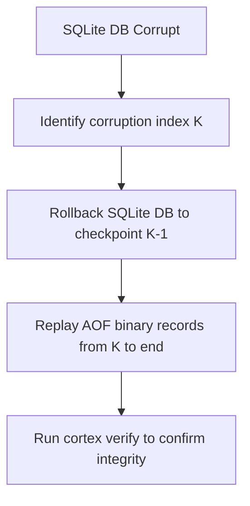

# [C5-REAL] CORTEX Disaster Recovery and Key Rotation Runbook

This document details the diagnostic steps and operational recovery procedures for ledger corruption and cryptographic key rotation in CORTEX.

---

## 1. Verification Failure Triage

If a ledger verification fails, this indicates either physical disk corruption or malicious database tampering.

### 1.1 Triage Commands
Run the primary health checks to pinpoint the failure index:
```bash
# Verify the entire ledger database integrity
cortex trust-ledger verify --verbose

# Check database schema consistency
sqlite3 cortex_data.db "PRAGMA integrity_check;"
sqlite3 cortex_data.db "PRAGMA foreign_key_check;"
```

### 1.2 Severity Levels
- **Level 1 (Logical corruption)**: Timestamps out of order, or mismatch between database records and memory.
- **Level 2 (Single-entry mismatch)**: A single block hash fails verification. Likely local tampering or bad update.
- **Level 3 (Chain disruption)**: Hash chain is broken from index $K$ onwards. Represents catastrophic write-path crash or unauthorized history editing.

---

## 2. Ledger Corruption Recovery

CORTEX persistence is dual-layered (SQLite database file + Append-Only File binary log). If the SQLite database is corrupted, it can be re-synthesized from the tamper-evident binary AOF.



### 2.1 Recovery Procedure (AOF Replay)
1. **Quarantine the database**: Immediately shut down all write-path daemons:
   ```bash
   pkill -f moskv-daemon
   ```
2. **Backup current corrupted state**:
   ```bash
   cp cortex_data.db cortex_data_corrupt_backup.db
   ```
3. **Execute reconstruct via AOF stream playback**:
   ```bash
   cortex trust-ledger reconstruct --aof-source=cortex_ledger_aof.bin --output-db=cortex_data_recovered.db
   ```
4. **Swap and restart**:
   ```bash
   mv cortex_data_recovered.db cortex_data.db
   cortex trust-ledger verify
   ```

---

## 3. Key Rotation Protocol

The Ed25519 sovereign keypair (`cortex_sovereign.pem`) signing the ledger entries must be rotated annually or immediately upon suspicion of leakage.

### 3.1 Key Rotation Step-by-Step
1. **Generate a new keypair**:
   ```bash
   openssl genpkey -algorithm ed25519 -out cortex_sovereign_new.pem
   openssl pkey -in cortex_sovereign_new.pem -pubout -out cortex_sovereign_new.pub
   ```
2. **Seal the transition event**:
   Create a metadata block linking the old key's final signature to the new public key. This is written as a specialized transition record in the ledger (Index $N+1$).
3. **Swap active keys**:
   ```bash
   mv cortex_sovereign.pem cortex_sovereign_old.pem
   mv cortex_sovereign_new.pem cortex_sovereign.pem
   ```
4. **Sign subsequent writes** using the new key. Verify old records by walking backward through key-epoch mappings registered in the trust registry database.
