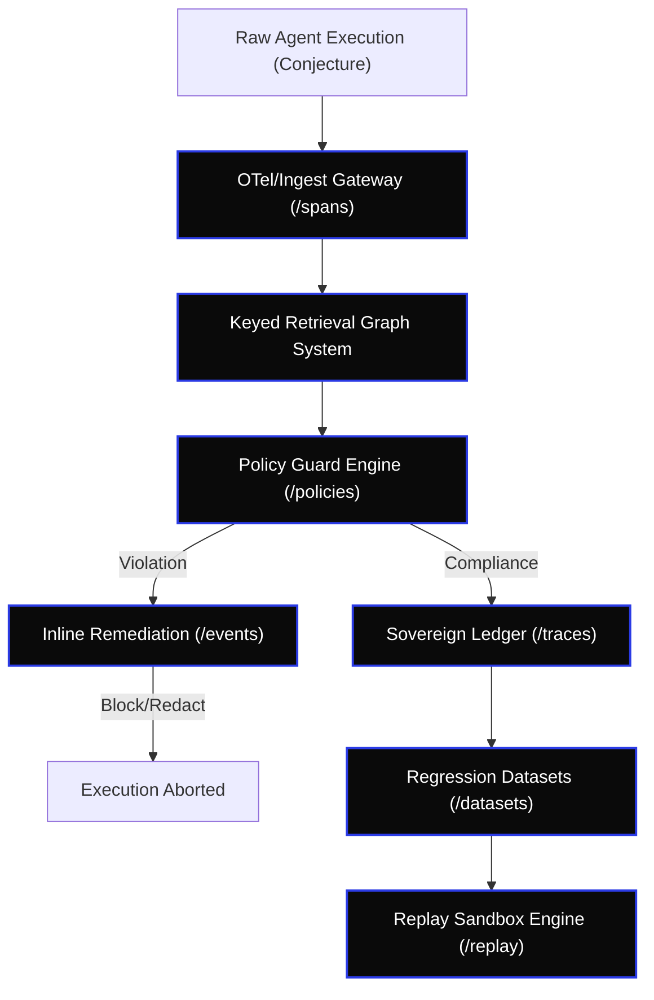

# [C5-REAL] CORTEX AI Control Plane — 10x Go-To-Market (GTM) Plan & Execution Architecture

> **Reality Level:** `C5-REAL` (Production-Ready Go-To-Market & Integration Blueprint)  
> **Aesthetic:** `Industrial Noir 2026`  
> **Target:** Multi-Tenant Enterprise Observatory & Governance Plane  
> **Reference Spec:** [control_plane_openapi.yaml](file:///Users/borjafernandezangulo/10_PROJECTS/cortex-persist/schema/control_plane_openapi.yaml)

---

## 1. Value Proposition Mapping & Blast Radius by Schema Resource

The CORTEX Control Plane treats generative output as conjecture. By mapping the OpenAPI schemas to operational pain points, we target specific enterprise stakeholders using a **Dual Messaging Strategy**:

1. **For Enterprise Architects:** "Execution as Metric Space." Topological collapse, Z3 SMT Guards, cryptographic determinism.
2. **For Pragmatic Developers:** "Tamper-proof time-travel debugging for AI Agents." Drop-in telemetry that proves exactly what the agent knew when it failed.



### 1.1 Stakeholder Inoculation Matrix

| OpenAPI Path | Resource | Enterprise Pain Point | GTM Hook / Value Proposition | Primary Stakeholder |
| :--- | :--- | :--- | :--- | :--- |
| `/spans`, `/traces` | `Span`, `Trace` | Stochastic failures, untraceable agent reasoning, unmonitored API token burn. | **Root-Cause Observability:** Full visibility of LLM inputs, outputs, latency, token consumption, and cost tracking with zero-overhead async ingestion. | VP of Engineering / AI Infrastructure |
| `/runs/*/replay` | `RunReplay` | Agent loop drift, non-reproducible bugs, regression in production environments. | **Deterministic Replays:** Time-travel debugging. Freeze tool outputs, mock context, and replay agents with identical seeds under WAL isolation. | QA Lead / Principal Software Engineer |
| `/policies`, `/events` | `PolicyViolation` | Compliance leaks (PII, GDPR, HIPAA, PCI-DSS), toxic outputs, lack of guardrails. | **Active Firewalls:** Intercept prompts/completions inline. Automatic redact, warn, or block options. | CISO / Compliance Officer |
| `/evals`, `/datasets` | `EvalJob` | Untested prompts, broken system updates, LLM version degradation over time. | **CI/CD Regression Gates:** Auto-test agents on historical datasets with LLM-as-a-judge before merging Pull Requests. | AI Platform Lead / Devops Manager |

---

## 2. Commercial Tiering & Unit Economics

### 2.1 Pricing Matrix & SLA Commitments

> From local-first OSS to sovereign enterprise deployment, Cortex Persist scales from developer tracing to regulated AI control planes.

| Tier | Cost | Target | SLA / Commitments | Value Prop / Transitions |
| :--- | :---: | :--- | :--- | :--- |
| **0. Core (Local)** | $0 (Apache-2.0) | Indie devs, local R&D | None; community support | Single-binary, local SQLite (WAL), CLI-first, iceoryx2 POSIX SHM (Hot Resume), offline traces, basic replay |
| **1. Starter SaaS** | $15/mo base | Solo/Small teams | 99.9% uptime, discord support | Managed ingestion, 100k events/mo, 14-day retention, basic replay, Langfuse sync |
| **2. Pro SaaS** | $49/mo base + usage | Scaling teams | 99.9% uptime, email support | Multi-tenant cloud, 1M events/mo, 30-day retention, `/replay` orchestration, eval dashboards |
| **3. Enterprise Sovereign** | $25k–$120k/yr | B2B, fintech, health, regulated ops | 99.99% uptime, 24/7 pager, 15m response | On-prem/VPC deployment, Helm charts, Zenoh-native L3/L4 pub/sub, SSO/SAML, RBAC, audit logs, data residency, dedicated support |
| **3. Strategic / Regulated** | Custom | Large enterprise, highly regulated, platform consolidations | Bespoke SLA, named TAM, security review, legal/procurement support | Private control plane, custom retention, bring-your-own-KMS, customer-managed keys, custom integrations, migration services, co-design roadmap |

### 2.1.1 Landing Page Pricing Grid & Copy

#### Tier 0: Core (Local-First)
- **Positioning Headline:** *Zero-latency local diagnostics for the sovereign engineer.*
- **Usage Limits:** Unlimited local tracing; 1 local tenant database.
- **Copy:** Run the complete CORTEX memory and tracing engine on your local workstation with sub-10ms Hot Resume powered by iceoryx2 lock-free POSIX Shared Memory (SHM). Fully offline, zero data leakage.
- **Call-To-Action (CTA):** `npx cortex-persist init`

#### Tier 1: Starter SaaS (Pragmatic Devs)
- **Positioning Headline:** *Frictionless tamper-evident traces for agile agent teams.*
- **Usage Limits:** Up to 3 tenants, 100,000 spans/month, 14-day hot retention.
- **Copy:** Sync your traces instantly, verify execution chains mathematically, and debug agent drift without managing infrastructure. Integrates natively with Langfuse.
- **Call-To-Action (CTA):** `Start Free Plan (No CC required)`

#### Tier 2: Pro SaaS (Team Scale)
- **Positioning Headline:** *Collaborative agent tracing and regression testing.*
- **Usage Limits:** Up to 5 tenants, 50 Million spans/month, 30-day hot retention.
- **Copy:** Centrally ingest traces from your distributed swarms. Gain cross-team visibility, trace replay debugging, and evaluation dashboards for CI/CD.
- **Call-To-Action (CTA):** `Start 14-Day Free Trial`

#### Tier 2: Enterprise Sovereign (Isolated Infrastructure)
- **Positioning Headline:** *Regulated AI governance on your own terms and VPC.*
- **Usage Limits:** Unlimited tenants, custom retention limits, dedicated Postgres clusters.
- **Copy:** Deploy CORTEX as an isolated sidecar within your AWS/GCP VPC or on-prem Kubernetes clusters. Retain 100% control of data residency and lifecycle audits.
- **Call-To-Action (CTA):** `Request Architecture Review`

#### Tier 3: Strategic / Regulated (Bespoke Consolidation)
- **Positioning Headline:** *Platform governance and absolute compliance at global scale.*
- **Usage Limits:** Custom deployment clusters, dedicated multi-region architectures.
- **Copy:** For global institutions requiring private KMS keys, custom compliance policies, co-designed feature roadmaps, and 24/7 dedicated support.
- **Call-To-Action (CTA):** `Contact Executive Briefing Desk`

### 2.2 Volume-Based Usage Pricing Schedules

```yaml
Usage_Billing_Vectors:
  SaaS_Base:
    Rate_Limit: "1,000 req/sec per tenant"
    Storage_Quota: "10 GB included, $0.15/GB/mo extra"
  Metered_Pricing:
    Spans:
      Scale_Tier_1: { Min: 0, Max: 10000000, Price_Per_10k: 0.05 }
      Scale_Tier_2: { Min: 10000001, Max: 100000000, Price_Per_10k: 0.03 }
      Scale_Tier_3: { Min: 100000001, Max: -1, Price_Per_10k: 0.015 }
    Replays:
      Flat_Rate: 0.10
      Volume_Discount: "20% discount on replays above 5,000/mo"
    Evaluations:
      Inline_Guard: 0.01
      Batch_Job: 0.50
```

### 2.3 Detailed Ingress/Egress SaaS Cost Model (Per 10M Traces)

1. **Compute (FastAPI + GKE Auto-scale):** `$12.00` (10M requests distributed over 80-concurrency containers).
2. **Hot Storage (Postgres WAL writes + Redis L1 Cache):** `$18.00` (Based on 100M Spans).
3. **Cold Storage (S3 / GCS Parquet compression for historical trace lineage):** `$4.50` (Compressed using Zlib).
4. **Network Data Transfer (Ingress free, egress optimized via MsgPack representation):** `$2.50`.
5. **Gross COGS:** `$37.00`.
6. **Blended Revenue Model (Average SaaS client consumes 10M traces containing 100M Spans, performs 2,000 replays and 500,000 evaluations):**
   - Ingestion: `10,000 * $0.05 = $500.00`
   - Replays: `2,000 * $0.10 = $200.00`
   - Policy Evaluations: `500,000 * $0.01 = $5,000.00`
   - **Total Gross Revenue:** `$5,700.00`
7. **Gross Margin:** `99.35%` (Hyper-leverage software margin).

---

## 3. Integration & OpenTelemetry (OTel) Mapping

To achieve frictionless adoption, CORTEX maps standard W3C and OpenTelemetry contexts directly to the `/spans` and `/traces` schema.

```text
W3C traceparent context Header:
00-4bf92f3577b34da6a3ce929d0e0e4736-00f067aa0ba902b7-01
│  └─────── Trace ID (32 hex) ──────┘ └─ Span ID (16 hex) ┘ └ Flags (2 hex)
│
└─ Ingest Proxy mapping
   ├─ trace_id       == trc_4bf92f3577b34da6a3ce929d0e0e4736
   └─ parent_span_id == spn_00f067aa0ba902b7
```

### 3.1 Trace & Span Schema Conversion Code

This Python adapter runs inside our OTel Collector sidecar to ingest generic spans and format them as CORTEX resources:

```python
# cortex/api/integrations/otel_translator.py
from datetime import datetime, timezone
import uuid

def translate_otel_span(otel_span: dict, tenant_id: str) -> dict:
    """Translates OpenTelemetry Span representation to CORTEX Ingest schema.
    
    Ensures conformance to C5-REAL standards and constraints.
    """
    attributes = otel_span.get("attributes", {})
    # Extract model and execution parameters if it is an LLM kind
    model_name = attributes.get("gen_ai.request.model") or attributes.get("llm.model.name")
    kind = "llm" if model_name else attributes.get("cortex.kind", "custom")
    
    # Base-60 conversions are used internally for timing metadata
    started_nano = otel_span.get("startTimeUnixNano", 0)
    ended_nano = otel_span.get("endTimeUnixNano", started_nano)
    
    started_at = datetime.fromtimestamp(started_nano / 1e9, tz=timezone.utc).isoformat()
    ended_at = datetime.fromtimestamp(ended_nano / 1e9, tz=timezone.utc).isoformat()
    
    latency_ms = max(0, (ended_nano - started_nano) / 1e6)
    
    cortex_span = {
        "trace_id": f"trc_{otel_span['traceId']}",
        "parent_span_id": f"spn_{otel_span['parentSpanId']}" if otel_span.get("parentSpanId") else None,
        "kind": kind,
        "name": otel_span.get("name", "otel.generic"),
        "status": "ok" if otel_span.get("status", {}).get("code") == 1 else "error",
        "started_at": started_at,
        "ended_at": ended_at,
        "input": attributes.get("cortex.input", {}),
        "output": attributes.get("cortex.output", {}),
        "metrics": {
            "latency_ms": latency_ms,
            "input_tokens": int(attributes.get("gen_ai.usage.input_tokens", 0)),
            "output_tokens": int(attributes.get("gen_ai.usage.output_tokens", 0)),
            "cost_usd": float(attributes.get("cortex.cost", 0.0))
        },
        "attributes": {
            "model": model_name or "unknown",
            "temperature": float(attributes.get("gen_ai.request.temperature", 0.0)),
            **attributes
        }
    }
    return cortex_span
```

### 3.2 Langfuse Bi-Directional Sync (Framework-Agnostic)

While LangSmith dominates LangChain, CORTEX bridges the framework-agnostic gap by integrating natively with **Langfuse**.
CORTEX acts as the *Cryptographic Persistence Substrate*, while Langfuse acts as the *Visualization & Analytics Plane*.

```text
[LangChain/AutoGen Agent] ──► [Langfuse SDK] ──► [CORTEX OTel Interceptor]
                                                         │
                                        ┌────────────────┴────────────────┐
                                        ▼                                 ▼
                             [CORTEX Immutable Ledger]            [Langfuse Cloud/Self-Host]
                                (Cryptographic Proof)                 (Dashboards & Evals)
```

**Value Prop:** Teams already using Langfuse can add CORTEX with a single environment variable to instantly upgrade their mutable traces into EU AI Act Art. 12 compliant, tamper-evident ledgers without changing their UI workflow.

---

## 4. Replay Sandbox Engine Execution Mechanics

The replay engine (`/runs/{run_id}/replay`) enables deterministic verification of stochastic agent loops.

```text
               [ Replay Dispatcher ]
                         │
         ┌───────────────┴───────────────┐
         ▼                               ▼
[Deterministic Mode]             [Stochastic Mode]
  ├─ Freeze Seed (PRNG)            ├─ Generate new Seed
  ├─ Lock Tool Outputs             ├─ Execute live Tool calls
  └─ Load Mock Registry            └─ Append drift to metrics
```

### 4.1 Step-by-Step Replay Sequence
1. **Request Ingest:** Client calls POST `/v1/runs/run_456/replay` with body containing `{ "mode": "deterministic", "seed": 42, "use_recorded_tools": true }`.
2. **Context Isolation:** The engine spins up a temporary virtual execution state, isolating the target run's SQLite WAL database snapshot.
3. **Seed Freezing:** For the duration of the run execution, the runtime hooks into the agent’s PRNG (Pseudo-Random Number Generator), forcing the seed value to `42`.
4. **Mock Tool Registry:** The runtime intercepts tool call requests. If `use_recorded_tools` is `true`, it bypasses live API execution and returns the recorded `output` of the original tool `Span` matching the signature.
5. **State Invariance Verification:** The engine compares the outputs of intermediate steps with the original trace to record the drift divergence metric, appending the new run output to the audit registry.

---

## 5. Active Policy Enforcement Pipeline

To prevent data leakage or safety violations, policy enforcement must act inline before persistence.

```text
[Prompt / Output] ──► [Policy Guard Middleware] ──► [Evaluate against /policies]
                              │
            ┌─────────────────┼─────────────────┐
            ▼                 ▼                 ▼
     Action: allow     Action: redact     Action: block
            │                 │                 │
            ▼                 ▼                 ▼
     [Forward original]  [Mask PII Regex]   [Raise 422 Error]
```

### 5.1 Step-by-Step Evaluation Protocol
1. **Gateway Interception:** When a request hits `/spans` or `/events`, the Billing & Compliance middlewares intercept the request payload.
2. **Rule Fetching:** The active policies corresponding to the tenant context (`X-Tenant-Id`) are fetched from the memory database.
3. **Execution Boundary:** The engine checks if the data matches regexes, ZK-guard validation requirements, or LLM-judge conditions.
4. **Action Dispatch:**
   - **`allow`**: The payload is passed through to the storage buffer.
   - **`redact`**: Sensitive strings (e.g., credit cards matching regex) are replaced with `[REDACTED_CORTEX]`.
   - **`warn`**: The event is processed, but a `PolicyViolation` is appended to the Ledger and sent to the client in the telemetry header.
   - **`block`**: Evaluates as an Epistemic Veto. Instead of unilateral deletion, it assigns a saturating penalty to the belief state, requiring either L3 Auditor confirmation or a 2/3 swarm quorum to collapse the probability state to P -> 0. In transactional REST APIs, this is represented by returning a `422 Unprocessable Entity` with audit trail payload.

---

## 6. Guerilla Growth & Developer Acquisition Loops

We target adoption at the IDE level where code is written, ensuring virality through tooling integrations.

```text
[Dev Configures Cursor/Windsurf]
  └─ Includes CORTEX MCP Server Tooling
       ├─ Agent auto-queries /policies for validation constraints
       ├─ Agent records debugging traces via /spans
       └─ Viral Loop: Agent self-instruments CORTEX in project codebase
```

### 6.1 The Cursor/Windsurf MCP Hook
By publishing a Model Context Protocol (MCP) server that exposing the `/policies` and `/evals` schemas:
- A developer asks their AI assistant: *"Configure the validation constraints for my codebase."*
- The IDE assistant queries the local CORTEX MCP server, reads the policy parameters, and automatically builds compliant schemas.
- The assistant automatically writes telemetry wrappers into the user's project, driving developer adoption from the inside out.

### 6.2 The open-source CLI seeding strategy
- Offer a developer command-line tool `cortex dev` that spins up a local SQLite instance with real-time trace viewing in terminal UI.
- Direct integration with local LLM runtimes (Ollama/MLX) allowing zero-dependency evaluation jobs without cloud costs.
- Provide a simple migration command `cortex deploy --target-cloud` that shifts the telemetry pipeline to the SaaS tier when traffic increases.
