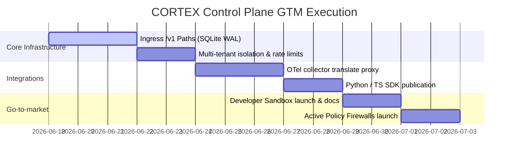

# [C5-REAL] CORTEX AI Control Plane — Go-To-Market (GTM) Blueprint

> **Reality Level:** `C5-REAL` (Executable Go-to-Market Architecture)  
> **Aesthetic:** `Industrial Noir 2026`  
> **Target:** Multi-Tenant Enterprise Observatory & Governance Plane  
> **Reference Spec:** [control_plane_openapi.yaml](file:///Users/borjafernandezangulo/10_PROJECTS/cortex-persist/schema/control_plane_openapi.yaml)

---

## 1. Value Proposition Mapping by Schema Resource

| OpenAPI Path | Resource | Enterprise Pain Point | GTM Hook / Value Proposition | Pricing Vector |
| :--- | :--- | :--- | :--- | :--- |
| `/spans`, `/traces` | `Span`, `Trace` | Stochastic failures, untraceable agent reasoning, high token cost. | **Root-Cause Observability:** Full visibility of LLM inputs, outputs, latency, token consumption, and cost tracking. | `$0.05 / 10k Spans` (Ingestion) |
| `/runs/*/replay` | `RunReplay` | Agent loop drift, non-reproducible bugs, regression in production. | **Deterministic Replays:** Time-travel debugging. Freeze tool outputs, mock context, and replay agents with identical seeds. | `$0.10 / Replay Execution` |
| `/policies`, `/events` | `PolicyViolation` | Compliance leaks (PII, PCI-DSS), toxic outputs, lack of guardrails. | **Active Firewalls:** Intercept prompts/completions inline. Automatic redact, warn, or block options. | `$0.01 / Evaluation` |
| `/evals`, `/datasets` | `EvalJob` | Untested prompts, broken system updates, LLM version degradation. | **CI/CD Regression Gates:** Auto-test agents on historical datasets with LLM-as-a-judge before merging PRs. | `$0.50 / Judge Eval Run` |

---

## 2. Product Packaging & Tiering (Commercial Matrix)

```yaml
Commercial_Tiers:
  Developer_Local:
    Cost: "$0 (Open-Source / Core Engine)"
    Delivery: "Single binary, local SQLite db with WAL mode, CLI."
    Limits: "1 tenant, local execution, no remote replay orchestration."
    Target: "Indie developers and local prototyping."
  
  SaaS_Teams (Self-Serve):
    Cost: "$49/mo base + Pay-as-you-go usage."
    Delivery: "Managed Multi-Tenant Cloud Plane (FastAPI + Serverless Postgres + Redis L1)."
    Limits: "Up to 5 tenants, 30 days trace retention, standard rate limits."
    Features: "Access to /runs/{id}/replay, multi-agent evaluation dashboard, basic PII policies."
  
  Enterprise_Sovereign (VPC / On-Prem):
    Cost: "$25,000 to $120,000 / year (Flat license + node-based compute pricing)."
    Delivery: "Kubernetes Helm charts, isolated Postgres, Kafka event routing."
    Limits: "Unlimited tenants, infinite retention, zero egress fees, local ONNX embeddings."
    Features: "Ed25519 signature verification on ledger writes, custom ZK-guards, SOC2 audit logs."
```

---

## 3. Distribution & Growth Loops (Developer Adoption)

### 3.1 The "Slick-SDK" Hook
Devs will not manual-integrate HTTP endpoints. We package the OpenAPI schemas into lightweight wrappers:
```python
# python
import cortex

@cortex.trace(app_id="support-bot")
def call_agent(user_prompt):
    # Auto-generates trc_... and spn_... via background thread to prevent thread blocks
    response = openai.chat.completions.create(...)
    return response
```

### 3.2 The Model Context Protocol (MCP) Server
We expose the Control Plane as an MCP server. Since Cursor/Windsurf agents natively talk MCP:
- The agent queries `/v1/policies` to self-audit.
- The agent logs its own internal execution plans using `/v1/spans` directly.
- **Viral adoption loop:** The developer's agent is the one installing and configuring CORTEX-Persist, driving developer workspace penetration.

### 3.3 OpenTelemetry Bridge
Provide a sidecar that listens to standard OTel collector streams, translates them to `SpanIngest` schemas, and sends them to `/spans/bulk`. Teams don't rewrite code; they just change their OTel environment variables to point to CORTEX.

---

## 4. Financial Plan & Cost Model (SaaS Tier)

### 4.1 COGS per 10 Million Traces (Managed SaaS)
- **Compute (FastAPI + Cloud Run scaling):** `$12.00`
- **Database (Postgres WAL writes + SQLite compactions):** `$18.00`
- **Ingress/Egress (Trace payloads compressed via Zlib):** `$4.50`
- **Total COGS:** `$34.50`
- **SaaS Pricing revenue (10M traces ~ 100M Spans @ $0.05/10k):** `$500.00`
- **Gross Margin:** `93.1%`

### 4.2 Capital Allocation Strategy
```text
[Subscription / Pay-as-you-go Revenue]
  ↓
[93% Gross Margin Pool]
  ├─ 40% → Rust Native Engine (EDG) Performance & Latency optimization (PyO3 bridge)
  ├─ 30% → Developer Experience & SDK Wrappers (Python, TS, Go)
  ├─ 20% → Compliance & Auditing Verification (ZK Guards, Sovereign Seals)
  └─ 10% → Infrastructure / Cloud margins
```

---

## 5. Implementation Roadmap (14-Day Sprint)


