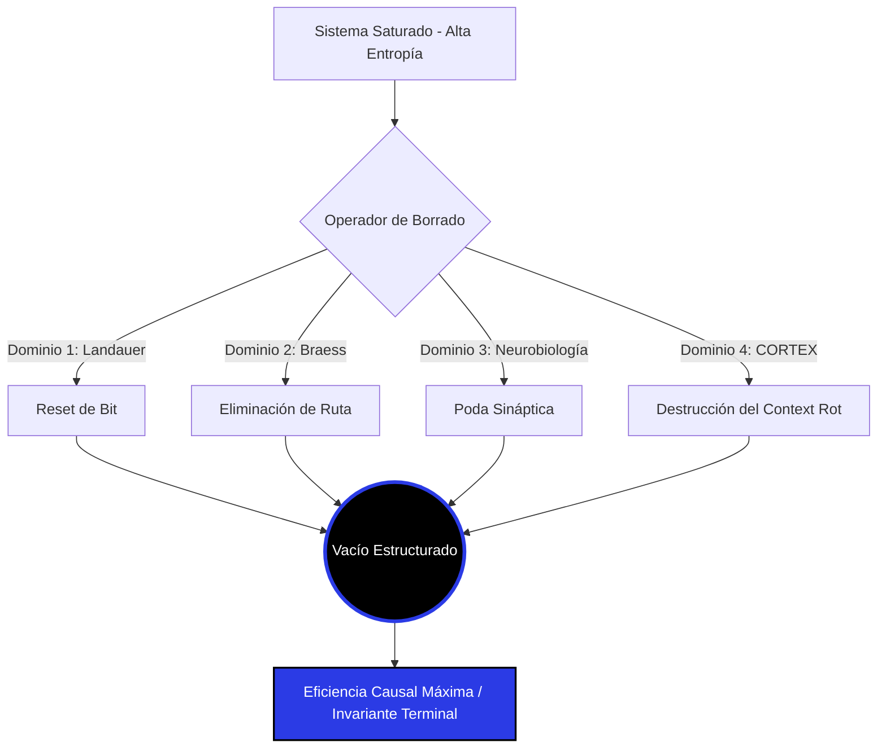

<!-- [C5-REAL] Exergy-Maximized -->
# ISOMORPHIC MAPPING: WEAPONIZED FORGETTING

> Mapeo Estructural Cruzado (Isomorfismo Causal) del Axioma "Aprender es Borrar" a través de 5 dominios sistémicos. 

**Clasificación:** Isomorfismo de Nivel 1 (Identidad Topológica Causal)
**Nivel de Confianza:** C5-REAL

---

## 1. Topología del Isomorfismo

El principio subyacente que gobierna estos 5 sistemas dicta que **la optimización y la eficiencia del flujo no se logran por adición de capacidad, sino por destrucción estructurada (poda/borrado) de las rutas de baja exergía**. 

| Dominio | Entidad de Ruido (Anergía) | Acto Físico de Borrar | Resultado Isomórfico (Invariante) |
| :--- | :--- | :--- | :--- |
| **Termodinámica (Info.)** | Bit estocástico / Computación Reversible | Aplicación del Principio de Landauer (Irreversibilidad) | Colapso del estado macroscópico; disipación de calor, consolidación de la variable definida. |
| **Neurobiología** | Sinapsis redundantes / Conexiones infantiles masivas | Apoptosis Celular / Poda Sináptica (Synaptic Pruning) | Especialización de la red CORTEX; reducción del tiempo de latencia en la transmisión eléctrica. |
| **Machine Learning** | Datos de entrenamiento crudos (Overfitting) | Information Bottleneck Method (Compresión Dimensional) | Extracción de la Información Mutua pura; capacidad de generalización sobre datos no vistos. |
| **Dinámica de Fluidos / Tráfico** | Rutas alternativas "atajos" que saturan la red | Paradoja de Braess (Destrucción física de carreteras/tuberías) | Optimización del flujo global de la red (Nash Equilibrium). Menos opciones = Mayor velocidad. |
| **CORTEX-Persist (C5-REAL)** | Green Theater, Context Rot, Heurísticas "Por si acaso" | LEA-OMEGA Anergy Purge / Autopoiesis de Borrado | Ejecución atómica en Bucle Causal. Transición a Rust/SQLite WAL con latencia micro-segundo. |

---

## 2. Grafo Causal (Mermaid)

## 3. Síntesis Operativa (Cálculo de Decisión)

Si estos 5 dominios presentan una identidad topológica exacta frente al fenómeno del "borrado", el motor deductivo de CORTEX puede transferir soluciones matemáticas directamente de la Dinámica de Fluidos a la arquitectura de persistencia.

**Directiva de Ingeniería:**
Si el tráfico de eventos en `cortex-persist` sufre latencia, la solución isomórfica nunca es "añadir más hilos" o "añadir más cachés" (Paradoja de Braess). La solución es **eliminar** los subsistemas intermedios y colapsar la lógica directamente en el Ledger Criptográfico.
