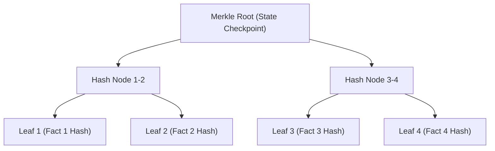

# [C5-REAL] CORTEX Ledger & Audit Pack Formal Specification

This specification defines the cryptographic invariants, serialization layouts, and validation schemas of the CORTEX sovereign memory persistence ledger.

---

## 1. Cryptographic Ledger Hashing Specification

The CORTEX ledger implements a chronologically ordered, hash-chained sequence of state transition records. Each state mutation (fact insertion, deletion, or rule update) is serialized deterministically and hashed.

### 1.1 Serialization Formats
Before hashing, data structures MUST be serialized into a canonical representation to prevent semantic drift from key reordering or space padding.

- **Canonical JSON**: Output keys MUST be sorted alphabetically. Whitespace MUST be stripped (no indentation, no extra spacing around colon/comma separators). Non-ASCII characters MUST be escaped to `\uXXXX` sequences.
- **AOF Binary Record Layout**: Appended binary entries to `cortex_ledger_aof.bin` are packed in standard network byte order (big-endian) using Python's `struct` representation:
  ```text
  Format: >Q 64s 64s 64s d
  Fields: [Index: uint64] [PrevHash: char[64]] [PayloadHash: char[64]] [Signature: char[64]] [Timestamp: double]
  ```

### 1.2 Hash Chain Link Formula
For record at index $i$, the link hash $H_i$ is computed recursively as:
\[H_i = \text{SHA256}(H_{i-1} \mathbin{\Vert} \text{PayloadHash}_i \mathbin{\Vert} \text{Timestamp}_i \mathbin{\Vert} \text{Index}_i)\]

Where:
- $H_{0}$ is the Genesis Block hash: `e3b0c44298fc1c149afbf4c8996fb92427ae41e4649b934ca495991b7852b855` (empty SHA-256 string).
- $\mathbin{\Vert}$ represents string concatenation.
- $\text{PayloadHash}_i$ is the SHA-256 hash of the canonical JSON representation of the event payload.
- $\text{Timestamp}_i$ is the string representation of the epoch timestamp (6 decimal places accuracy, e.g., `"1718042401.192000"`).

---

## 2. Merkle Checkpointing Algorithm

To enable $O(1)$ local proofs of ledger state without scanning the entire database, CORTEX creates Merkle Checkpoints at fixed intervals.



### 2.1 Checkpoint Invariants
- **Merkle Interval**: A checkpoint is triggered every $N$ events (default: $N = 1000$ writes).
- **Padding**: If the number of leaves in the interval is not a power of 2, the last leaf is duplicated to balance the tree.
- **Node Hashing**: Interior nodes $N_{j}$ are calculated as:
  \[N_{j} = \text{SHA256}(LeftChild \mathbin{\Vert} RightChild)\]

---

## 3. Audit Pack JSON Schema

An Audit Pack is an independent, portable JSON proof containing a fact payload and its cryptographic proof of inclusion in the ledger.

```json
{
  "$schema": "https://json-schema.org/draft/2020-12/schema",
  "title": "CortexAuditPack",
  "type": "OBJECT",
  "required": ["audit_receipt", "cryptographic_proof", "verification_command"],
  "properties": {
    "audit_receipt": {
      "type": "OBJECT",
      "required": ["tenant_id", "project", "agent_id", "fact_id", "fact_type", "content", "timestamp"],
      "properties": {
        "tenant_id": { "type": "STRING" },
        "project": { "type": "STRING" },
        "agent_id": { "type": "STRING" },
        "fact_id": { "type": "STRING" },
        "fact_type": { "type": "STRING" },
        "content": { "type": "STRING" },
        "timestamp": { "type": "STRING", "format": "date-time" }
      }
    },
    "cryptographic_proof": {
      "type": "OBJECT",
      "required": ["ledger_index", "previous_hash", "current_hash", "merkle_root_sealed", "signature"],
      "properties": {
        "ledger_index": { "type": "INTEGER" },
        "previous_hash": { "type": "STRING", "pattern": "^[a-f0-9]{64}$" },
        "current_hash": { "type": "STRING", "pattern": "^[a-f0-9]{64}$" },
        "merkle_root_sealed": { "type": "BOOLEAN" },
        "proof_of_work_nonce": { "type": "INTEGER" },
        "tamper_detected": { "type": "BOOLEAN" },
        "signature": { "type": "STRING" }
      }
    },
    "verification_command": { "type": "STRING" }
  }
}
```

---

## 4. Cryptographic Test Vectors

Below is a reference implementation in Python showing how an external verifier reconstructs a block chain and verifies a specific index signature.

```python
import hashlib
import json

def calculate_canonical_hash(payload: dict) -> str:
    # Serialize JSON with sorted keys and no whitespace
    canonical = json.dumps(payload, sort_keys=True, separators=(',', ':'))
    return hashlib.sha256(canonical.encode('utf-8')).hexdigest()

def compute_link_hash(prev_hash: str, payload_hash: str, timestamp: float, index: int) -> str:
    ts_str = f"{timestamp:.6f}"
    preimage = f"{prev_hash}{payload_hash}{ts_str}{index}"
    return hashlib.sha256(preimage.encode('utf-8')).hexdigest()

# TEST CASE 1: Genesis Block verification
h0 = "e3b0c44298fc1c149afbf4c8996fb92427ae41e4649b934ca495991b7852b855"
p1 = {"content": "System Initialized", "agent_id": "genesis"}
p1_hash = calculate_canonical_hash(p1)
ts1 = 1718042401.192000
idx1 = 1

h1 = compute_link_hash(h0, p1_hash, ts1, idx1)
print(f"Calculated Hash 1: {h1}")
assert h1 == "ef19ee18e285d883ce607ab900cc1b402eaec0ee2bfd12f170ffbd251016834d", "Vector 1 Fail"
```
