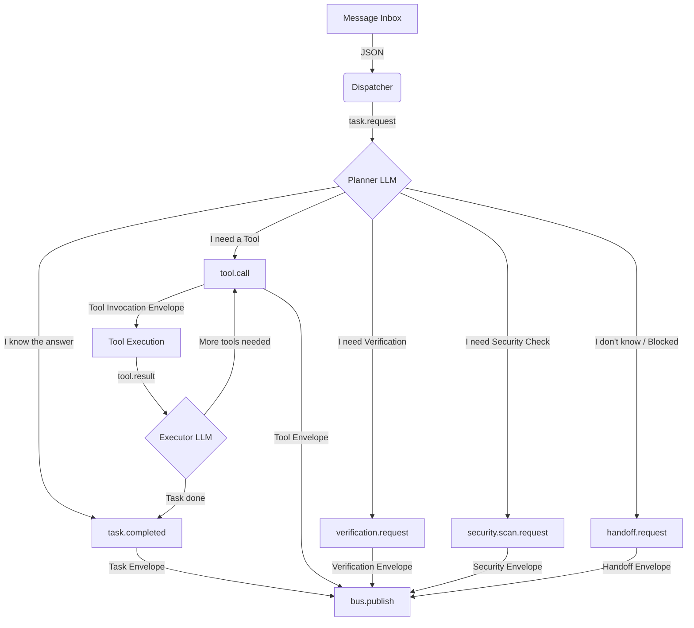

# OMEGA PRIME Runtime Flow

> "El LLM nunca publica estado final arbitrario sin pasar por estructuras tipadas."

This document defines the strict, verifiable execution flow for `OmegaPrimeAgent`, demonstrating the first Sovereign stochastic agent operating strictly within the deterministic bus.

## 1. The Core Pipeline

The stochastic execution of the LLM is tightly bounded by a parser/guard pipeline:

## 2. Epistemic Circuit Breaking (Handoff)

Omega Prime is not a "god agent". It is an orchestrator. If the distance between the current state and the goal state (Causal Gap) cannot be reduced using available tools, Omega Prime **must** yield via `handoff.request` rather than hallucinating a continuation.

## 3. The Envelope Rule

No raw string output is ever placed on the bus. Every decision out of the LLM is caught, parsed by Pydantic models defined in `cortex/agents/contracts.py`, and serialized into a typed `AgentMessage`.

If the LLM outputs invalid JSON or a structure that fails the Pydantic validator, the pipeline intercepts it, logs a metric, and retries up to `max_retries` before transitioning the task to `task.failed` and placing the message in the Dead Letter Queue.

## 4. Continuity (Causation IDs)

Every message emitted by Omega Prime includes a `causation_id` pointing to the `message_id` that triggered it (e.g., the `message_id` of the `task.request`). This ensures the Swarm maintains a traceable Directed Acyclic Graph (DAG) of causality, satisfying Axiom Ω₁₁.

## 5. Retry and Escalation Semantics

- **Transient Errors** (e.g., tool timeout, rate limits): Backoff and retry 3 times.
- **Validation Errors** (e.g., LLM produced bad JSON): Inject error back into LLM context, retry 2 times. Call `handoff` if continues failing.
- **Permanent Errors** (e.g., tool missing): Fast-fail, emit `task.failed`.
