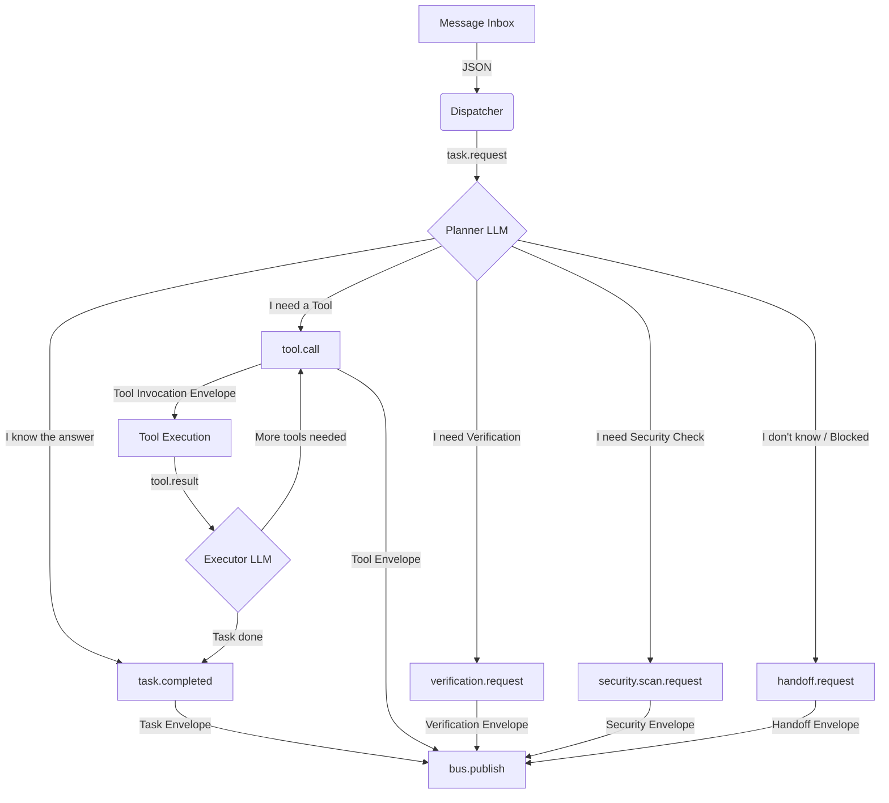

<!-- [C5-REAL] Exergy-Maximized -->
# OMEGA PRIME Runtime Flow

> "El LLM nunca publica estado final arbitrario sin pasar por estructuras tipadas."

This is not merely a design pattern; it is a **formal security property**. 
Omega Prime is not the system. Omega Prime is a probabilistic generator of proposals. The sovereign system is defined by the strict boundaries of the typed contracts and the deterministic bus.

The core architectural divergence is that **authority does not reside in the model**. Authority resides in `contracts.py`.

## 1. The Epistemic Boundary (Inference ≠ State)

We establish the following fundamental axiom regarding the relationship between the LLM and the system state:

```text
LLM Output ⊂ Candidate State Transition
```
```text
Valid State Transition = Contract Validated Message
```

This transforms the model into a source of *proposals*, not a source of *truth*. The origin of truth is the combination of the `Contract`, the `Bus`, the `Ledger`, and the `Causation Graph`.

## 2. The Envelope Rule (Kernel-Level Isolation)

The most critical property of this architecture is the Envelope Rule, which acts similarly to the boundary between `Userspace` and the `Kernel` via a Syscall ABI.

```text
[ Untrusted Zone (LLM) ]
          ↓
[ Pydantic Boundary (contracts.py) ]
          ↓
[ Trusted Zone (Bus/Ledger) ]
```

The Bus **never** contains raw `str`, `dict`, or arbitrary JSON. It contains exclusively validated `AgentMessage` objects. If the LLM produces invalid structures, the pipeline intercepts them at the boundary.

## 3. Epistemic Circuit Breaking (Handoff)

Most frameworks follow a fragile flow: `Goal → LLM → Invent Next Step`.
Omega Prime implements epistemic circuit breaking:

```text
Goal
 ↓
LLM
 ↓
Is there a verifiable transformation?
 ├─ Yes → Execute
 └─ No  → Emit handoff.request
```

This structural constraint eliminates a massive category of hallucinations. The acceptable failure state becomes **"I don't know"** instead of **"I think I know"**.

### The `HandoffRequest` Contract
Handoff is not just a concept; it is a formal typed message. When Omega Prime yields, it emits a `HandoffRequest` containing:
- `reason`: Why the execution cannot continue.
- `causal_gap`: The specific missing information or state.
- `required_capability`: The tool or agent role needed to bridge the gap.
- `confidence`: The model's confidence in its inability to proceed.

This makes "I don't know" cryptographically auditable.

## 4. Continuity and The Formal DAG (Axiom Ω₁₁)

To prevent state from appearing spontaneously, we enforce the Formal DAG.

**Axiom Ω₁₁:**
> Every non-root message MUST reference exactly one `causation_id`. Cycles are invalid.

Formal definition:
```text
∀ message ∈ Bus, ∃ parent(message)  (except root events)
A → B → C → A  (INVALID: Breaks traceability)
```

This guarantees complete reconstruction, auditability, deterministic replay, causal analysis, and the detection of orphan branches.

## 5. Idempotence

While `causation_id` tracks lineage, deduplication is strictly enforced via `message_id`.
Every message possesses a globally unique `message_id`, which serves as the absolute idempotency key. If a message arrives twice, the system state remains invariant.

## 6. Formal Error Classification State Machine

Failures are routed through a verifiable state machine rather than relying on the LLM's stochastic recovery attempts:

| Error State | Characteristics | Retry Policy | Escalate (Handoff) |
| :--- | :--- | :--- | :--- |
| **Transient** | Network timeouts, rate limits | **Yes** (Exponential Backoff) | **No** |
| **Validation** | Bad JSON, contract violation | **Limited** (Inject error to LLM) | **Yes** (If max retries hit) |
| **Permanent** | Tool missing, Auth denied | **No** (Fast-Fail) | **Yes** |

## 7. The Core Pipeline Visualization


