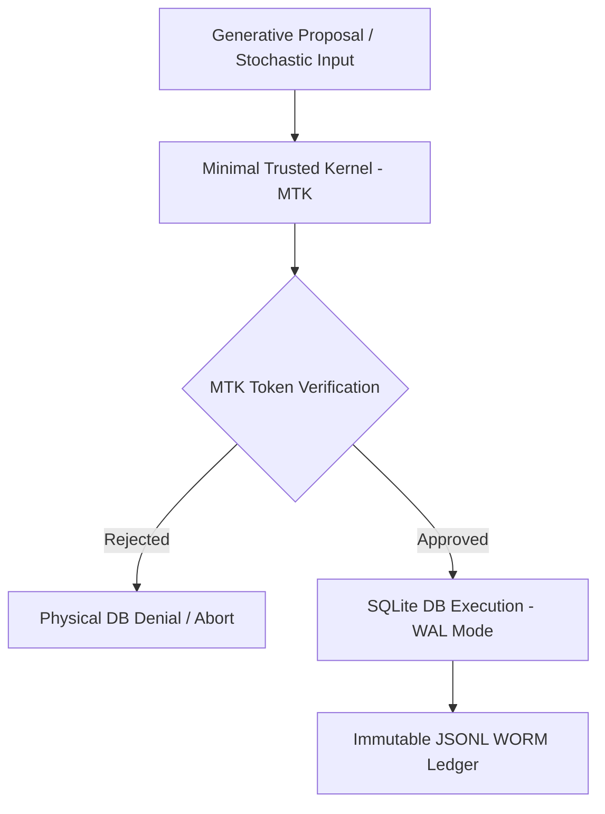

# CORTEX Persistent Architecture & System Topology

**Author: Borja Moskv (borjamoskv)**  
**Status: Verified C5-REAL | Date: 2026-06-22**

---

## 1. Executive Summary

CORTEX is a distributed trust firewall and causal execution kernel designed to govern autonomous agent operations. Rather than acting as a passive knowledge store, CORTEX models all interactions as transitions within an **Epistemic Dependency Graph (EDG)**, enforcing strict validation boundaries, cryptographic ledger auditability, and deterministic concurrency control.



---

## 2. Core Architectural Pillars

### 2.1 The Minimal Trusted Kernel (MTK)
All state mutations are routed through the Minimal Trusted Kernel (`mtk_core.py` and `mtk_sqlite_authorizer.py`). 
* **Physical DB Rejection:** SQLite hooks intercept database operations via `mtk_authorizer_callback`. Mutations without an active ephemeral cryptographic token (Ed25519 signed closure) in the execution thread's context are immediately blocked with `SQLITE_DENY`.
* **Zero SAGA Complexities:** Atomicity is handled by SQLite WAL transactions. SAGA logical rollback cascades are completely deprecated.

### 2.2 Epistemic Dependency Graph (EDG) & Causal Scheduling
CORTEX tracks facts as nodes in an EDG. 
* **Taint Propagation:** Every fact ingested from an unverified or stochastic source is flagged with a taint metadata tag. If a tainted node is modified, CORTEX traverses the EDG in \(O(N)\) time to compute the blast radius and invalidate dependent chains.
* **Causal Scheduler:** Restores deterministic order across concurrent agents by enforcing Lamport timestamps and logical clocks.

### 2.3 Cryptographic Audit Ledger (WORM)
The `EnterpriseAuditLedger` acts as a forensic audit log.
* **Merkle Batching:** Periodically batches audit events and computes Merkle trees using the native Rust library (`cortex_core_rs`).
* **ZK Sovereign Seals:** The batch root is signed via a local Ed25519 private key (`audit_sovereign.pem`).
* **Concurrency Lock:** Cross-process writing is protected via a non-blocking `AsyncFileLock` using UNIX `fcntl` file locks to prevent multi-process JSONL corruption.

---

## 3. The Python / Rust Byzantine Boundary

To maximize developer velocity while maintaining low-latency execution:
* **Python Layer:** Handles high-level orchestration, FastAPI HTTP routes, CLI command parsing, and daemon lifecycle management.
* **Rust Layer (`cortex_core_rs` via PyO3):** Manages low-level cryptographic functions, high-speed Merkle tree computations, and concurrent lock-free graph traversals to bypass the Python GIL.

---

## 4. Key Database & Concurrency Invariants

To avoid transactional deadlocks and hash chain bifurcations:
* **WAL Mode & Busy Timeout:** Every SQLite connection must execute the following battery:
  ```sql
  PRAGMA journal_mode=WAL;
  PRAGMA synchronous=NORMAL;
  PRAGMA busy_timeout=30000;
  ```
* **Tenant Isolation:** All reads and writes must include a `tenant_id` scope. Cross-tenant reads are treated as **P0 security incidents**.
* **CLI Sandbox Isolation:** Any CLI command writing to the database for demo/testing purposes (e.g. `latticework daemon --real`) MUST use an isolated database located at `/tmp/cortex_test_*.db`.

---

## 5. Repository Structure & Symlinks

> [!WARNING]
> The `cortex/` directory uses symlinks referencing `legacy_research/` to share legacy packages.
> NEVER edit files via a symlink path directly. Always resolve the path to the origin (e.g., `legacy_research/<module>/`) to avoid Git path resolution corruption or CI anomalies.

### Key Symlinks Map
* `cortex/pipeline` $\rightarrow$ `legacy_research/pipeline`
* `cortex/semantic` $\rightarrow$ `legacy_research/semantic`
* `cortex/audit/ledger.py` $\rightarrow$ `cortex/storage/ledger.py`
