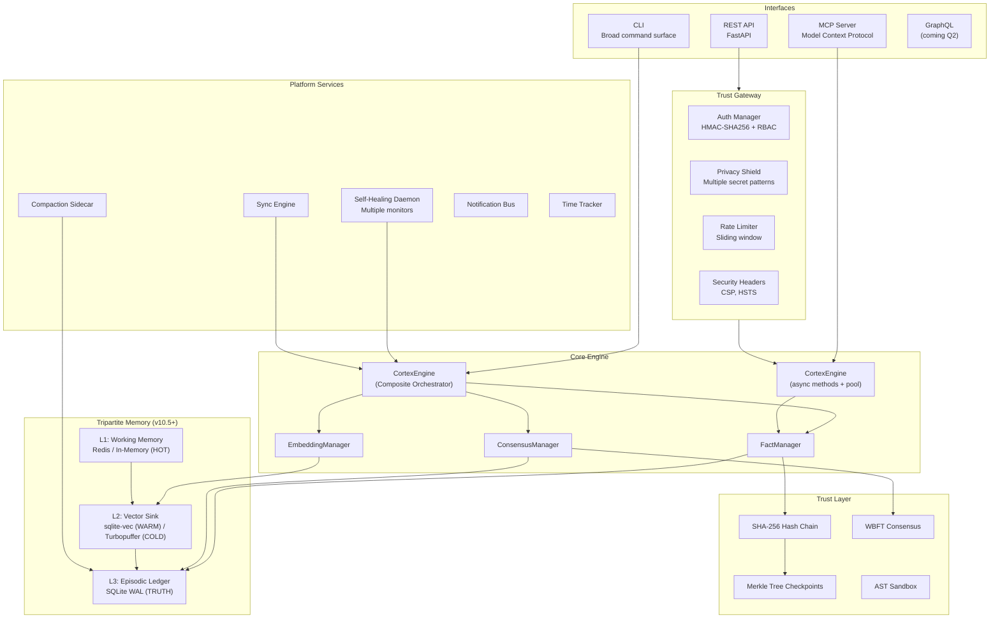
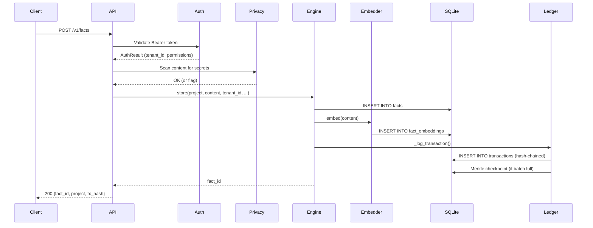
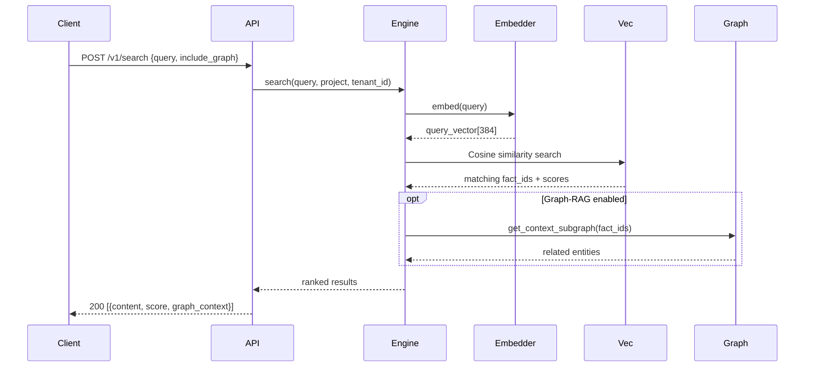
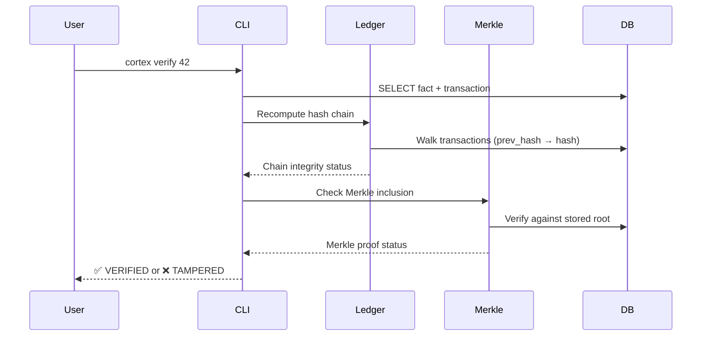
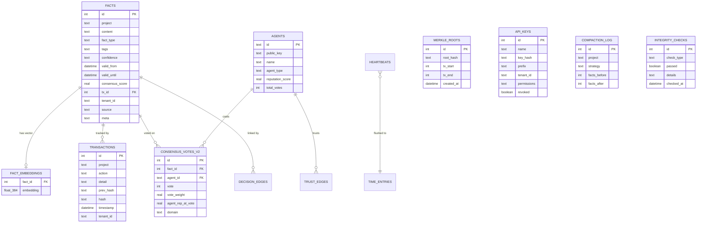

<!-- [C5-REAL] Exergy-Maximized -->
# Architecture

> **CORTEX Trust Engine v1.0.0 — Sovereign Cloud**
> *La probabilidad puede sugerir. Solo la verificación puede gobernar.*

---

## System Overview

CORTEX is a **trust infrastructure engine** that provides cryptographic verification, tamper-evident audit trails, and regulatory compliance for AI agent memory. It is built under the strict premise that generative AI output is fundamentally *thermodynamically unstable conjecture* (`Void-State`). It only becomes durable state after surviving a predefined path of deterministic filters.

To enforce this, it combines a relational database with vector embeddings, hash-chained transactions, Merkle tree integrity, multi-agent consensus, and privacy protection — running locally on SQLite or scaling to AlloyDB + Qdrant + Redis for enterprise deployments.

This page describes the broader repository and system architecture. For the recommended product
boundary and first integration surface, start with [Public Product Surface](product-surface.md).
For the agent-layer vocabulary used in this repo, see Agent Taxonomy.
For executable capability packages and the Antigravity-CORTEX nexus, see
[Skill Taxonomy](skills/SKILL-TAXONOMY.md).

Today, the default FastAPI core bootstrap still fails closed unless `CORTEX_STORAGE=local`.
Postgres/Turso storage paths exist in the repository, but they remain storage/tooling surfaces rather
than the default public API bootstrap contract.

## Target Audience & Operational Taxonomy

To ground the architectural design in real-world application, the CORTEX engine serves a multi-dimensional matrix of target audiences. Each audience maps to a core subsystem:

### Audience to Module Mapping

| ID | Target Audience Vector | Operational Pain Point | CORTEX Engine Interface |
| :--- | :--- | :--- | :--- |
| **V1** | Platform Engineers | Episodic corruption / state drift | `cortex/engine/` (`crystallizer.py`) |
| **V2** | AI Agent Developers | Stochastic behavior in pipelines | `cortex/agents/` y `cortex/guards/` (`virgo.py`) |
| **V3** | Auditors / Forensic AI | Lack of verifiable audit trail | `cortex/audit/` (`ledger.py`) |
| **V4** | Local-First Operators | High latency / external API SPOF | `cortex/embeddings/` |
| **V5** | Smart Contract Sentinels | Invalid transient states in DeFi | `cortex/engine/causal/` (`taint_engine.py`) |
| **V6** | Edge AI & Robotics | Kinetic threat from hallucinated execution | `cortex/consensus/` |
| **V7** | Adversarial Red Teamers | Corporate safety/woke filters, local sandbox escape | `cortex/extensions/mac_maestro/` |
| **V8** | Epistemic Miners | Low-signal context rot in massive pipelines | `cortex/shannon/` |
| **V9** | Autarchy Maximalists | External tracking and telemetry | `cortex/extensions/llm/` |
| **V10**| Machine-to-Machine (Swarms) | Agent memory lifecycle decay in networks | `cortex/swarm/` |
| **V11**| Protocol Designers | Unreliable mapping to compiler ASTs | `cortex/utils/` |
| **V12**| Quants / Latency-Critical | Exergy drain from heavy LLM cognitive thinking | `cortex/engine/core/` (`ultrathink_physics.py`) |
| **V13**| Knowledge Graph Architects | Redundant facts and context duplication | `cortex/compaction/` y `cortex/graph/` |
| **V14**| Shadow Operators | Detection of agent footprint / signature | `cortex/extensions/darknet/` |




---

## Core Concepts

### Facts — The Memory Primitive

Every piece of knowledge is a **Fact**. Facts are tamper-evident records with temporal validity:

| Field | Type | Description |
|:---|:---|:---|
| `id` | INTEGER | Auto-incremented primary key |
| `project` | TEXT | Namespace (tenant isolation) |
| `content` | TEXT | The information itself |
| `fact_type` | TEXT | `knowledge`, `decision`, `error`, `ghost`, `config`, `bridge`, `axiom`, `rule` |
| `tags` | JSON | Searchable labels |
| `confidence` | TEXT | `stated`, `inferred`, `observed`, `verified`, `disputed` |
| `valid_from` | DATETIME | When the fact became true |
| `valid_until` | DATETIME | When deprecated (NULL = active) |
| `source` | TEXT | Origin agent or process (auto-detected) |
| `meta` | JSON | Arbitrary metadata |
| `consensus_score` | REAL | Weighted agreement (default 1.0) |
| `tx_id` | INTEGER | FK to creating transaction |
| `tenant_id` | TEXT | Multi-tenant scope |

### Temporal Queries

Every fact has a temporal window (`valid_from` → `valid_until`):

- **Current view**: `WHERE valid_until IS NULL`
- **Point-in-time**: `WHERE valid_from <= ? AND (valid_until IS NULL OR valid_until > ?)`
- **Time travel**: Reconstruct database state at any transaction ID
- **History**: Full timeline including deprecated facts

### Hash-Chained Ledger

Every mutation creates a **transaction** with a SHA-256 hash linked to the previous one:

```
TX #1: hash = SHA256("GENESIS" + project + action + detail + timestamp)
TX #2: hash = SHA256(hash_1 + project + action + detail + timestamp)
TX #N: hash = SHA256(hash_{N-1} + ...)
```

This creates a **tamper-evident audit trail**. `verify_ledger()` walks the chain and reports any breaks.

### Merkle Tree Checkpoints

Periodically, the ledger creates Merkle tree checkpoints from batches of fact hashes. These enable:
- **O(log N) integrity verification**
- **Efficient synchronization** between nodes
- **Batch proof generation** for compliance audits

### Multi-Agent Consensus (WBFT)

CORTEX implements **Weighted Byzantine Fault Tolerance**:

1. Tracks reputation scores per agent (0.0–1.0) with decay
2. Weighs votes by agent reputation
3. Domain-specific vote multipliers
4. Updates `consensus_score` on each fact
5. Elder Council verdict for edge cases without quorum
6. Tamper-Evident vote ledger for audit

---

## Architecture v10.5+: Sovereignty & Scale

En la transición hacia **v10.5+**, CORTEX consolida su arquitectura descentralizada (C5-REAL) mediante tres avances estructurales mayores:

### 1. Tripartite Memory (L1 / L2 / L3)
El ecosistema separa el ciclo de vida de los datos según su termodinámica de acceso:
- **L1 (Working Memory):** Capa estocástica e in-memory (Redis / Dicts) para retención de corto plazo y ventanas de contexto de enjambre.
- **L2 (Vector Sink):** Almacenamiento semántico. Utiliza **sqlite-vec** para embeddings calientes (WARM). Un monitor autónomo (`L2DrainMonitor`) drena periódicamente los vectores fríos (COLD) hacia **Turbopuffer**, un backend serverless de alta capacidad, liberando la presión del nodo local.
- **L3 (Episodic Ledger):** La fuente criptográfica de la verdad. Almacenamiento estrictamente relacional y append-only en SQLite WAL. Ningún hecho existe si no se cristaliza aquí.

### 2. Formación TESTUDO (Swarm)
El Motor de Enjambre (Centauro) incluye la formación topológica **TESTUDO (LEGIØN-10k)**. Compuesta por un quórum de 15 agentes, balancea asimétricamente tareas de Seguridad, Infraestructura y Código. Proporciona un escudo de defensa proactiva (Proactive Infrastructure Defense) para rechazar mutaciones entrópicas en el repositorio sin requerir delegación manual.

### 3. The Omega Manifold (Ω)
Capa de orquestación 4D que unifica percepción, decisión y acción:
- **KETER-Ω**: Meta-orquestación soberana. (`engine/keter.py`)
- **TESSERACT-Ω**: Convergencia sincrónica de ciclos de vida.
- **APOTHEOSIS-∞**: Autonomía proactiva de Nivel 5. (`engine/apotheosis.py`)

Para más detalles sobre los operadores Omega, consulta: [**OMEGA_MANIFOLD.md**](https://github.com/borjamoskv/Cortex-Persist/blob/main/docs/architecture/OMEGA_MANIFOLD.md).

---

## Module Reference

Paths below are relative to the `cortex/` package root unless noted otherwise.

### Engine Layer

| Module | Purpose |
|:---|:---|
| `engine/__init__.py` | `CortexEngine` — Composite orchestrator (sync + async) |
| `engine/search_mixin.py` | Semantic search over persisted facts |
| `engine/store_mixin.py` | `store()`, `store_many()`, `deprecate()`, `update()` |
| `engine/query_mixin.py` | `search()`, `recall()`, `history()` |
| `engine/transaction_mixin.py` | Transaction history, checkpoints, and ledger verification |
| `engine/sync_mixin.py` | Synchronous compatibility helpers |
| `ledger/` | Hash chain + Merkle tree management (`SovereignLedger`) |
| `engine/snapshots.py` | Database snapshot creation/restoration |
| `engine/models.py` | `Fact` data model and row mapping |

### API Layer

| Module | Purpose |
|:---|:---|
| `api/core.py` | FastAPI bootstrap, middleware, and fail-closed local storage gating |
| `routes/__init__.py` | Core vs experimental route mounting |
| `routes/facts.py` | Core fact CRUD, recall, and verification-adjacent endpoints |
| `routes/ledger.py` | Ledger status, verification, and checkpoint endpoints |
| `routes/admin.py` | API key management + system status |
| `auth/` | HMAC-SHA256 authentication + RBAC |
| `api/middleware.py` | Rate limiting, validation, and request filtering |

### Search & Embeddings

| Module | Purpose |
|:---|:---|
| `embeddings/__init__.py` | ONNX-optimized MiniLM-L6-v2 (384-dim) |
| `embeddings/api_embedder.py` | Cloud embeddings (Gemini/OpenAI) |
| `embeddings/manager.py` | Mode-aware switcher (`local` / `api`) |
| `search/` | Advanced semantic search with graph context |

### Memory Intelligence

| Module | Purpose |
|:---|:---|
| `compaction/` | Dedup (SHA-256 + Levenshtein), merge, prune |
| `graph/` | Knowledge graph (SQLite + Neo4j), RAG |
| `memory/` | Memory management and lifecycle |
| `episodic/` | Session snapshots, boot-time recall |
| `thinking/` | Thought Orchestra, semantic routing |

### Trust & Security

| Module | Purpose |
|:---|:---|
| `crypto/` | AES-256-GCM vault for secrets |
| `consensus/` | WBFT consensus, reputation, vote ledger |
| `compliance/` | EU AI Act compliance report generation |
| `audit/` | Audit trail generation |

### Infrastructure

| Module | Purpose |
|:---|:---|
| `daemon/` | Self-healing watchdog (13 monitors) |
| `notifications/` | Telegram + macOS notification bus |
| `sync/` | JSON ↔ DB bidirectional sync |
| `timing/` | Heartbeat-based time tracking |
| `telemetry/` | OpenTelemetry-compatible span tracing |
| `mcp/` | Model Context Protocol server |
| `cli/` | Broad Click-based CLI surface |
| `migrations/` | Versioned schema migrations |
| `storage/` | SQLite + Turso storage backends |

### Extensions

| Module | Purpose |
|:---|:---|
| `extensions/mejoralo/` | 14D X-Ray Diagnostic Engine (Host telemetry + AST static analysis) |

---

## Data Flow

### Store a Fact



### Semantic Search



### Verify Integrity



---

## Database Schema (ERD)



---

## Security Model

| Layer | Mechanism |
|:---|:---|
| **Authentication** | HMAC-SHA256 API keys with prefix lookup |
| **Authorization** | RBAC: `SYSTEM`, `ADMIN`, `AGENT`, `VIEWER` |
| **Tenant Isolation** | All queries scoped by `tenant_id` |
| **Data Integrity** | SHA-256 hash chain + Merkle trees |
| **Privacy** | Multi-pattern secret detection at ingress |
| **Secrets** | AES-256-GCM encrypted vault |
| **Code Safety** | AST Sandbox for LLM-generated code |
| **Rate Limiting** | Sliding window per IP |
| **Headers** | CSP, HSTS, X-Frame-Options, X-XSS-Protection |

---

## Testing

```bash
# Full test suite
make test

# Fast tests only (no torch imports)
make test-fast

# Slow tests (graph RAG, embeddings)
make test-slow
```

**Isolation**: Tests use `config.reload()` + autouse fixtures for zero state leakage.

**Coverage**: Broad automated coverage across engine, API, CLI, consensus, search, and security.
