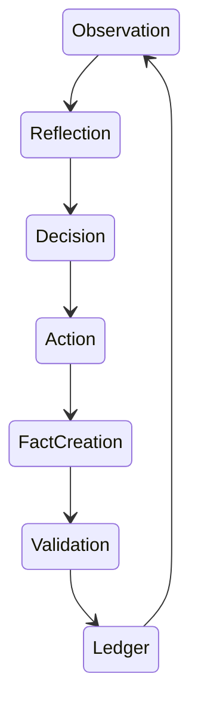

# CORTEX Constitution v1

## Core Axioms

### AXIOM-01: Ledger Primacy
El ledger es la única fuente de verdad.

Nunca:
```text
cache > ledger
vector_store > ledger
agent_memory > ledger
```

Siempre:
```text
ledger > all
```

---

### AXIOM-02: Facts Are Immutable
Un fact nunca cambia.

Solo existen:
```text
CREATE
TOMBSTONE
SUPERSEDE
```

Prohibido:
```text
UPDATE fact SET ...
```

---

### AXIOM-03: Identity Emerges From History
La identidad de un agente no es estado.

Es:
```text
identity(agent)
=
replay(events)
```

Si dos agentes tienen el mismo event stream:
```text
identity(A)
==
identity(B)
```

---

### AXIOM-04: Replay Is Law
Toda decisión debe reconstruirse.

Dado:
```text
ledger(t)
```

Debe cumplirse:
```text
replay(ledger(t))
=
state(t)
```

---

### AXIOM-05: Memory Is Versioned
Todo conocimiento pertenece a una versión.

```text
fact
 ├─ schema_version
 ├─ ontology_version
 └─ validation_version
```

Nunca:
```text
latest
```

Siempre:
```text
explicit version
```

---

# Sovereign Boundary

La frontera real no es:
```text
MOSKV-1
vs
CORTEX
```

La frontera es:
```text
WRITE PERMISSION
```

Lectura:
```text
many
```

Escritura:
```text
few
```

Cristalización:
```text
very few
```

---

# Event Taxonomy

Eliminar strings libres.

## Fact Events
```rust
enum FactEvent {
    CreateFact,
    TombstoneFact,
    SupersedeFact,
}
```

## Cognitive Events
```rust
enum CognitiveEvent {
    Observation,
    Reflection,
    Decision,
    Plan,
    Action,
}
```

## Infrastructure Events
```rust
enum InfraEvent {
    Snapshot,
    Migration,
    Repair,
    ValidationFailure,
}
```

---

# Sovereign State Machine



No existe bypass.

Prohibido:
```text
Observation -> Ledger
```

sin validación.

---

# Memory Layers

## L0
Context Window
```text
volatile
```
TTL:
```text
seconds
```

---

## L1
Semantic RAM
```text
cache
```
TTL:
```text
minutes
```

---

## L2
Vector Recall
```text
retrieval
```
TTL:
```text
hours
```

---

## L3
Ledger
```text
permanent
```
TTL:
```text
∞
```

---

# Consistency Guarantees

## G1
Read Your Writes
```text
agent reads own commits
```

---

## G2
Monotonic Reads
Nunca:
```text
fact_v5
fact_v3
```

---

## G3
Deterministic Replay
Mismo ledger:
```text
same output
```

---

## G4
Hash Integrity
```text
hash(parent)
```
siempre verificable.

---

# Multi-Agent Protocol

Para `N > 1`

Cada escritura requiere:
```json
{
  "agent_id": "...",
  "agent_version": "...",
  "timestamp": "...",
  "signature": "...",
  "schema_version": "..."
}
```

Sin firma:
```text
reject
```

---

# Consensus Levels

## Level 0
Single Agent
```text
development
```

---

## Level 1
Dual Confirmation
```text
2 agents
```

---

## Level 2
Majority
```text
n/2 + 1
```

---

## Level 3
WBFT
```text
Byzantine tolerance
```

---

# Anti-Corruption Layer

Todo acceso a CORTEX pasa por:
```text
FactManager
```

Nunca:
```python
cursor.execute(...)
```
desde agentes.

Nunca:
```python
UPDATE facts
```

Nunca:
```python
DELETE facts
```

---

# Failure Budget

Error aceptable:
```text
cache miss
```

Error grave:
```text
stale fact
```

Error crítico:
```text
ledger corruption
```

Error existencial:
```text
replay divergence
```

Si aparece:
```text
replay divergence
```
el sistema deja de ser soberano.

---

# Final Definition

```text
CORTEX
=
Persistence Engine
+
Trust Engine
+
Replay Engine
+
Audit Engine
```

```text
MOSKV-1
=
Inference Engine
+
Planning Engine
+
Execution Engine
+
Evolution Engine
```

```text
SOVEREIGN SYSTEM
=
CORTEX
×
MOSKV-1
×
Verifiable Replay
```

La propiedad más importante no es inteligencia.

Es:
```text
replaceability
```

Si puedes destruir MOSKV-1 y reconstruir MOSKV-N desde el ledger sin pérdida de identidad operativa verificable, la arquitectura es soberana.

Si no puedes hacerlo, solo tienes una aplicación con memoria persistente.
