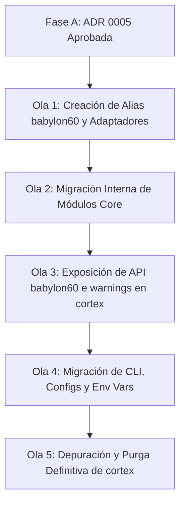

# Auditoría de Dependencias y Acoplamiento del Namespace BABYLON-60

Bajo el protocolo **LEGIØN-1 (Formación ORACLE)**, se consolida la auditoría de dependencias sobre la nomenclatura física y lógica `CORTEX` en el ecosistema.

---

## 📊 Métricas de Acoplamiento Global

| Métrica | Recuento | Tipo de Impacto | Severidad de Migración |
| :--- | :---: | :--- | :---: |
| **Imports de Python** | **4.702** | Acoplamiento lógico en dependencias internas | **MÁXIMA** (Fase C) |
| **Referencias a Bases de Datos** | **417** | Cadenas de conexión, archivos SQLite y esquemas | **ALTA** (Fase E/Ola 2) |
| **Variables de Entorno (`CORTEX_*`)** | **246** | Configuración, secretos y Flags del Kernel | **ALTA** (Ola 4) |
| **Firmas de Trazabilidad (`CORTEX-TAINT`)** | **124** | Firmas de procedencia en la base de datos | **CRÍTICA** (No migrar) |
| **Referencias en Configuración** | **57** | `pyproject.toml`, `Cargo.toml`, `package.json` | **MEDIA** (Ola 4) |

---

## 🧬 Análisis Fractal de Dependencias

### 1. Variables de Entorno (`CORTEX_*`)
Se han localizado **246 variables de entorno únicas** que configuran el runtime. 
* *Riesgo:* La alteración directa e inmediata de estas variables rompería la compatibilidad de despliegues.
* *Variables Core Identificadas:*
  - `CORTEX_DB_PATH`
  - `CORTEX_LOG_LEVEL`
  - `CORTEX_C5_REAL_MODE`
  - `CORTEX_EXPERIMENTAL_EXTENSIONS`
  - `CORTEX_STRICT_EXTENSIONS`
* *Acción de Mitigación:* Mantener la lectura de estas variables pero introducir de forma progresiva las variables corporativas `MOSKV_*` o genéricas `RUNTIME_*`, priorizando estas últimas si están definidas.

### 2. Imports y Dependencias Lógicas (4.702 occurrences)
El namespace `cortex` está acoplado en prácticamente todos los archivos Python del proyecto.
* *Ejemplo:* `from cortex.memory.resonance import ResonanceEngine`
* *Estrategia de Mitigación (Ola 1 & Fase B):* 
  Crear un paquete puente `babylon60` que contenga adaptadores de tipo alias, permitiendo:
  `import babylon60` sin romper los imports históricos de `cortex`.

### 3. Rust Crates y Configuración de Workspace Rust (`Cargo.toml`)
Se localizan dependencias en el workspace Rust `c5_workspace`:
* `c5_workspace/crates/cortex_rs` (15 referencias en Cargo.toml)
* `c5_workspace/crates/cortex_wasm` (5 referencias)
* `c5_workspace/crates/cortex_replay` (9 referencias)
* *Estrategia:* En Rust, se mantendrán las crates internas intactas hasta la Fase D. Los bindings de FFI de Python (`cortex_rs`) se exportarán bajo un modulo de compatibilidad.

### 4. Taint Causal (`CORTEX-TAINT`)
El motor de causalidad firma cada hecho persistido usando la cabecera `CORTEX-TAINT`.
* *Estructura:* `taint:{agent_id}:{session_id}:{timestamp_iso8601}:{sha3_256_of_payload}`
* *Resolución:* Conforme a la directiva de la **ADR 0005**, **no se alterará** esta firma para mantener la trazabilidad histórica de los ledgers ya creados. En versiones mayores (`v2.0` o `Schema V2`), se adoptará un formato de versionado neutro como `TAINT-V1` o `MOSKV-TAINT`.

---

## 🗺️ Hoja de Ruta de Transición (Ola 1 a Ola 5)

### Estimación de Esfuerzo Técnico
* **Complejidad:** Alta (debido al volumen de imports y FFI de Rust).
* **Riesgo:** Controlado (gracias a la coexistencia de namespaces).
* **Duración Estimada:** 3-4 semanas de coexistencia y testing continuado en CI.
