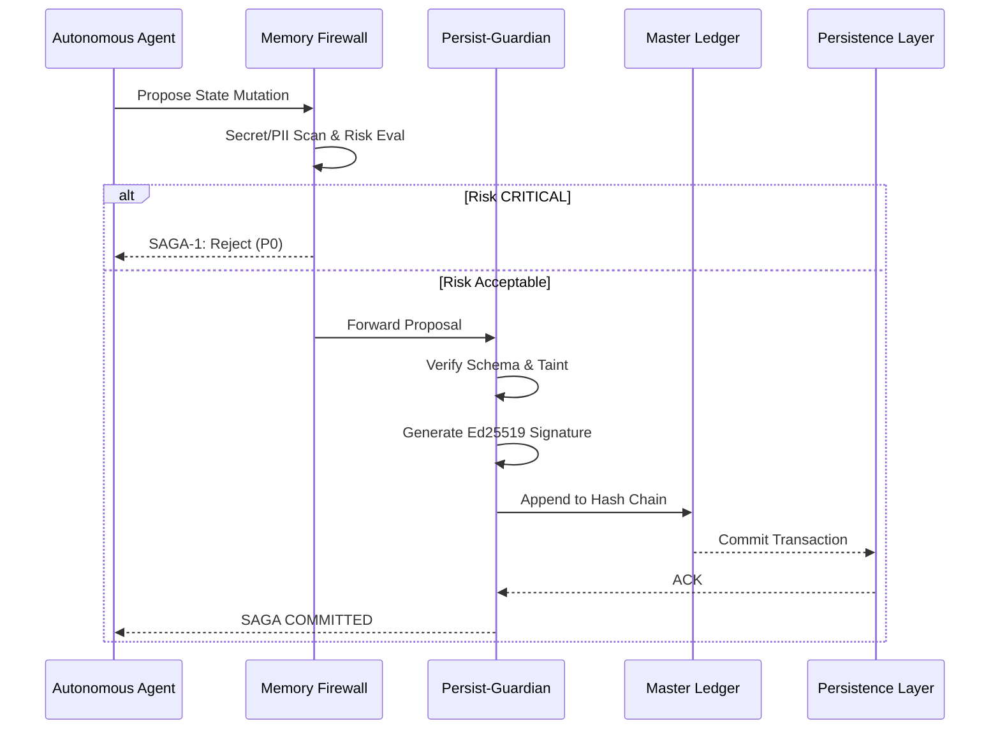
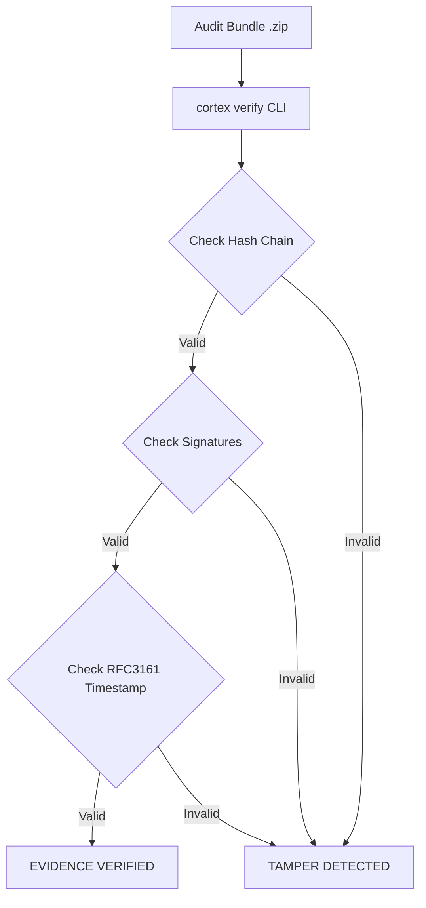

# Data Flow Diagrams

This document contains the structural data flow diagrams (DFDs) for CORTEX Persist core operations.

## 1. The Write-Path (Saga Pattern)
This diagram illustrates the mandatory unidirectional flow for state mutations.

## 2. Audit Verification Flow

