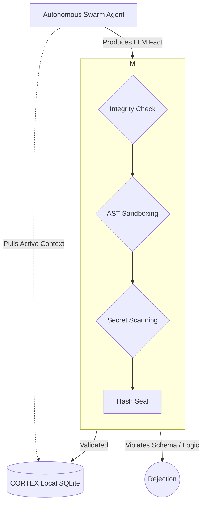

<!-- [C5-REAL] Exergy-Maximized -->
# CORTEX Architecture Overview

## The Core
Cortex is a **local-first, sovereign intelligence engine**. It is NOT a chatbot. It is an operating system for cognition.

The paths below refer to the current `cortex/` package surface, not to historical top-level module
names. For the recommended public product boundary, start with [`../product-surface.md`](../product-surface.md).

### Components

1.  **The Memory & Trust Layer**
    -   **SQLite (`cortex.db`)**: Local-first physical storage for facts and transactions.
    -   **`ledger/`**: Hash-chained ledger, checkpoints, writers, queues, and verification.
    -   **`storage/`**: Local and backend-aware storage adapters/classifiers.

2.  **The Engine (Prefrontal Cortex)**
    -   **`engine/__init__.py`**: `CortexEngine` composite orchestrator.
    -   **`engine/store_mixin.py` / `engine/query_mixin.py` / `engine/transaction_mixin.py`**: Core write, recall, and verification paths.
    -   **`memory/guardrails.py`**: Deterministic guardrails around memory admission and safety.

3.  **Integration & Runtime Surfaces**
    -   **`routes/__init__.py`**: Mounts the core HTTP surface and opt-in experimental routes.
    -   **`mcp/server.py`**: MCP tool surface for agent and IDE integrations.
    -   **`extensions/`**: Optional platform capabilities such as health, notifications, timing, and swarm tooling.

## Data Flow & Truthing Membrane

The core of CORTEX is the Verification Membrane. Agents cannot write arbitrary data directly to the ledger. Every mutation is intercepted, validated, securely sanded, and sealed. 

1.  **Ingestion**: `Agent Thought` -> `Verification Membrane` -> `Hash Chain Seal` -> `Storage`.
2.  **Recall**: `Query` -> `Semantic Search` + `Merkle Integrity Check` -> `Context Assembly`.
3.  **Action**: `Plan` -> `CORTEX Receipt Export` -> `Execute with Evidence`.

## Evolución: El Manifold Omega (Ω)

Para la **v7 y v8**, CORTEX evoluciona de ser una infraestructura de confianza a un organismo cognitivo completo. El [Manifold Omega](OMEGA_MANIFOLD.md) define las 10 dimensiones de esta evolución, integrando percepción, decisión y acción en un solo evento sincrónico.

---
**Sovereign Architecture · Industrial Noir · v8.0.0 Alpha**
