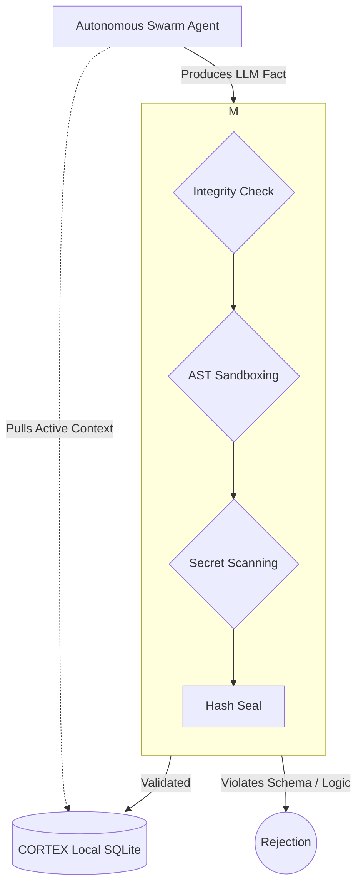

# CORTEX Architecture Overview

## The Core
Cortex is a **local-first, sovereign intelligence engine**. It is NOT a chatbot. It is an operating system for cognition.

### Components

1.  **The Memory (Lizard Brain)**
    -   **SQLite (`cortex.db`)**: The physical storage of facts.
    -   **Vector Store (`chromadb`)**: Semantic search and retrieval.
    -   **Graph (`networkx`)**: Relationships between entities (Code <-> Doc <-> Person).

2.  **The Engine (Prefrontal Cortex)**
    -   **`CortexEngine`**: The main interface. Handles ingestion, retrieval, and synthesis.
    -   **`ledger.py`**: Merkle-backed immutable log of all thoughts/actions.
    -   **`sovereign_gate.py`**: The firewall. Decides what enters long-term memory.

3.  **The Swarm (Nervous System)**
    -   **`dispatch.py`**: Routes tasks to specialized agents.
    -   **`adapter.py`**: Connects to external MCP tools (Git, Terminal, Browser).

## Data Flow & Truthing Membrane

The core of CORTEX is the Verification Membrane. Agents cannot write arbitrary data directly to the ledger. Every mutation is intercepted, validated, securely sanded, and sealed. 

1.  **Ingestion**: `Agent Thought` -> `Verification Membrane` -> `Hash Chain Seal` -> `Storage`.
2.  **Recall**: `Query` -> `Semantic Search` + `Merkle Integrity Check` -> `Context Assembly`.
3.  **Action**: `Plan` -> `CORTEX Receipt Export` -> `Execute with Evidence`.

## Evolución: El Manifold Omega (Ω)

Para la **v7 y v8**, CORTEX evoluciona de ser una infraestructura de confianza a un organismo cognitivo completo. El [Manifold Omega](OMEGA_MANIFOLD.md) define las 10 dimensiones de esta evolución, integrando percepción, decisión y acción en un solo evento sincrónico.

---
**Sovereign Architecture · Industrial Noir · v8.0.0 Alpha**
