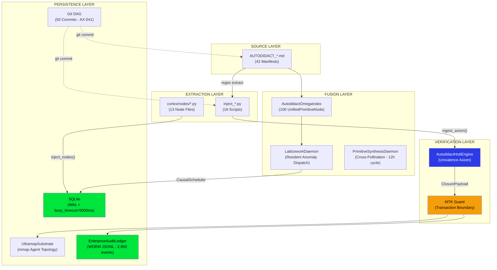

# Autodidact Primitives System — Technical Documentation

> **Version:** 1.0 · **Reality Level:** C5-REAL · **Author:** Borja Moskv (borjamoskv)  
> **Repository:** [cortex-persist](https://github.com/borjamoskv/Cortex-Persist)

---

## 1. Abstract

The Autodidact Primitives System is a **versioned epistemic KV-store** that crystallizes knowledge into atomic, hashable, injectable units called *primitives*. Each primitive is a self-contained claim with a formal proof, cryptographically signed and persisted to an immutable audit ledger via the HoTT (Homotopy Type Theory) Inference Engine.

The system solves the **Context Rot Problem**: when an LLM's context window is purged between sessions, all non-persisted knowledge disappears. Primitives survive this destruction because they exist as discrete, recoverable, cryptographically verifiable records in the Git DAG and SQLite database.

$$\text{Primitive} = \text{min}(\text{Knowledge Unit}) \mid \text{survives}(\text{Context Purge})$$

---

## 2. Architecture Overview



---

## 3. Data Model

### 3.1 Autodidact Manifest (`AUTODIDACT_*.md`)

Standard markdown file in repository root. Format:

```markdown
# AUTODIDACT-RESEARCH-Ω: [TITLE]

**Reality Level:** `C5-REAL` (Epistemic Synthesis)
**Autor:** Borja Moskv (borjamoskv)
**Vector:** [Domain description]
**Target:** CORTEX-Persist & Ouroboros-∞

---

## 1. Extracción Isomórfica (Desmitificación)
[Structural mapping of concepts into CORTEX system structures]

---

## 1.5 Las 10 Primitivas de Máxima Exergía
- **PREFIX-001**: `Name` - Short Name: Application context
- **PREFIX-002**: `Name` - Short Name: Application context
...
- **PREFIX-010**: `Name` - Short Name: Application context
```

**Regex extraction pattern:**
```python
pattern = re.compile(r'-\s*\*\*(PREFIX-\d{3})\*\*:\s*`?([^`]+)`?\s*-\s*(.*)')
```

### 3.2 Node Schema (SQLite)

All node types implement a common schema:

```python
@dataclass
class AutodidactNode:
    id: str                    # "GOAT-MATH-001", "GIT-EXERGY-042"
    index: int                 # Sequential number
    name: str                  # Human-readable name
    block: str                 # Block code: "B1", "B2", ...
    block_name: str            # "Álgebra Lineal Avanzada"
    criticality: str           # "CRÍTICO" | "ALTO" | "MAESTRÍA"
    dependencies: list[str]    # DAG edges → ["GOAT-MATH-004"]
    verification_method: str   # "torch.linalg.svd()"
    validation_status: str     # "PENDING" | "VALIDATED" | "FAILED"
    hash: str                  # SHA256[:16] deterministic
    injected_at: str           # ISO-8601 UTC
```

**Hash computation** (deterministic, idempotent):
```python
sha256(f"{id}|{name}|{block}|{sorted(deps)}")[:16]
```

### 3.3 UnifiedPrimitiveNode (Omega Index)

Fused node from the 100 Systems Exergy + 100 C5-REAL primitives:

```python
@dataclass(frozen=True)
class UnifiedPrimitiveNode:
    id: int                    # 1..100
    name: str
    algebraic_topology: str    # LaTeX equation
    c5_real_mapping: str       # "C5-EMERGENT_SYNTHESIS"
    c5_real_id: str            # "C5-REAL-031"
    kernel_constant: str       # "AST_DIRECT_INJECT"
    description: str
    section: str
    base60_constant: int       # hash % 3600 (Babylon-60)
```

### 3.4 Ledger Event Schema

Every primitive injection emits a `HOTT_AXIOM_ASSIMILATED` event:

```json
{
  "ts": 1782094492.765739,
  "monotonic_ts": 645.475136416,
  "lamport_time": 1,
  "event_id": "019eed1b-f45d-7cab-8889-85cb7006cdb4",
  "trace_id": "019eed1b-f45d-781f-8955-54db0142d5dd",
  "span_id": "019eed1b-f45d-7040-86e3-f99c7bbc654e",
  "type": "HOTT_AXIOM_ASSIMILATED",
  "payload": {
    "tenant_id": "moskv_c5",
    "actor_id": "agent_98",
    "mutation_type": "HOTT_AXIOM_ASSIMILATED",
    "axiom_hash": "sha3-256-64char",
    "proof_signature": "HOTT_{uuid16}_{hash16}",
    "topology_distance": 6738993
  },
  "parent_hash": "GENESIS",
  "event_hash": "sha256-chain-hash",
  "signature": "ed25519-128char"
}
```

**Cryptographic properties:**

| Property | Mechanism |
|:---|:---|
| `axiom_hash` | SHA3-256 of `[CORTEX-TAINT: agent_N] claim` + `proof` |
| `event_hash` | SHA-256 chain link (`parent_hash` → current) |
| `signature` | Ed25519 over the full event payload |
| `topology_distance` | Base-60 scaled distance in ULTRAMAP substrate |

---

## 4. Ingestion Pipeline

### 4.1 Path A — HoTT Engine (Manifest → Ledger)

For `inject_*.py` scripts processing `AUTODIDACT_*.md` manifests:

```
AUTODIDACT_*.md
    │
    ▼ [Regex Extraction]
inject_*.py ─── extracts (id, name, application) tuples
    │
    ▼ [Per Primitive]
AutodidactHottEngine.ingest_axiom()
    │
    ├── 1. _verify_univalence()
    │       Rejects if proof contains probabilistic tokens:
    │       ["I think", "maybe", "probably", "assume", "perhaps"]
    │       Rejects if len(proof) < len(claim) // 2
    │
    ├── 2. SHA3-256 Hash Generation
    │       Input: "[CORTEX-TAINT: agent_N] " + claim + proof
    │       Output: 64-char hex digest
    │
    ├── 3. Proof Signature
    │       Format: "HOTT_{uuid4_hex[:16]}_{axiom_hash[:16]}"
    │
    ├── 4. UltramapSubstrate.write_hott_axiom_signature()
    │       Writes 256-byte signature into mmap'd agent position
    │
    ├── 5. Topological Distance (Base-60)
    │       raw = ultramap.calculate_exergy_distance()
    │       distance_b60 = int(raw * 60)
    │
    └── 6. MTK Transaction Boundary
            ├── ClosurePayload.seal(claims, evidence, verdict=True)
            ├── MTKGuard.transaction_boundary(payload)
            └── ledger.log_hott_axiom() → JSONL append
```

### 4.2 Path B — Direct SQLite (Nodes → Database)

For `cortex/nodes/*.py` files:

```
cortex/nodes/goat_math_nodes.py
    │
    ├── Defines 100 GOATMathNode instances with DAG dependencies
    ├── Validates DAG (no cycles, no orphans)
    ├── Computes deterministic SHA256[:16] hash per node
    │
    └── inject_nodes()
        ├── SQLite connection (WAL mode, busy_timeout=5000ms)
        ├── CREATE TABLE IF NOT EXISTS
        └── INSERT OR REPLACE (hash-based idempotency)
```

### 4.3 Verification Properties

| Property | Mechanism |
|:---|:---|
| **Idempotency** | Hash-based upsert — re-running inject scripts produces identical state |
| **Determinism** | SHA256 computed from `id\|name\|block\|sorted_deps` — same input → same hash |
| **Tamper Evidence** | Ledger events are hash-chained (`parent_hash` → `event_hash`) |
| **Taint Propagation** | All claims prefixed with `[CORTEX-TAINT: agent_N]` for provenance |
| **Entropy Rejection** | Probabilistic language in proofs triggers `EntropyRejectionError` |

---

## 5. Component Reference

### 5.1 Engine Files

| File | Lines | Purpose |
|:---|:---:|:---|
| [autodidact_hott_engine.py](file:///Users/borjafernandezangulo/10_PROJECTS/cortex-persist/cortex/engine/autodidact_hott_engine.py) | 118 | Core HoTT inference engine. Univalence verification, SHA3-256, MTK boundary |
| [autodidact_omega_index.py](file:///Users/borjafernandezangulo/10_PROJECTS/cortex-persist/cortex/engine/autodidact_omega_index.py) | 233 | Fuses 100 topology + 100 kernel primitives into UnifiedPrimitiveNode graph |
| [latticework_daemon.py](file:///Users/borjafernandezangulo/10_PROJECTS/cortex-persist/cortex/engine/latticework_daemon.py) | 165 | Resident daemon. Anomaly dispatch → kernel_constant → Base-60 exergy |
| [latticework_store.py](file:///Users/borjafernandezangulo/10_PROJECTS/cortex-persist/cortex/engine/latticework_store.py) | 104 | O(1) in-memory store parsing SYSTEMS_EXERGY_MAPPING into CognitivePrimitive |
| [ultramap.py](file:///Users/borjafernandezangulo/10_PROJECTS/cortex-persist/cortex/engine/ultramap.py) | 343 | mmap-backed agent position substrate for topological distance |

### 5.2 Node Files

| File | Domain | Nodes | ID Prefix |
|:---|:---|:---:|:---|
| [goat_math_nodes.py](file:///Users/borjafernandezangulo/10_PROJECTS/cortex-persist/cortex/nodes/goat_math_nodes.py) | Mathematics | 100 | `GOAT-MATH-` |
| [git_exergy_nodes.py](file:///Users/borjafernandezangulo/10_PROJECTS/cortex-persist/cortex/nodes/git_exergy_nodes.py) | Git Operations | 100 | `GIT-EXERGY-` |
| [web_design_nodes.py](file:///Users/borjafernandezangulo/10_PROJECTS/cortex-persist/cortex/nodes/web_design_nodes.py) | Web Design | 1000 | `WEB-DESIGN-` |
| [autodidact_exergy_nodes.py](file:///Users/borjafernandezangulo/10_PROJECTS/cortex-persist/cortex/nodes/autodidact_exergy_nodes.py) | Exergy Patterns | 10 | `MOSKV-AUTO-` |
| [autodidact_osint_nodes.py](file:///Users/borjafernandezangulo/10_PROJECTS/cortex-persist/cortex/nodes/autodidact_osint_nodes.py) | OSINT Defense | 15 | `OSINT-` |
| [marketing_sota_nodes.py](file:///Users/borjafernandezangulo/10_PROJECTS/cortex-persist/cortex/nodes/marketing_sota_nodes.py) | Marketing | 100 | `MKT-SOTA-` |
| [moskv1_skills_nodes.py](file:///Users/borjafernandezangulo/10_PROJECTS/cortex-persist/cortex/nodes/moskv1_skills_nodes.py) | Skills Curriculum | 7 blks | `SKILL-` |

### 5.3 GOAT Math Executables

| File | Capability |
|:---|:---|
| [goat_linear_algebra.py](file:///Users/borjafernandezangulo/10_PROJECTS/cortex-persist/cortex/engine/goat_linear_algebra.py) | SVD, eigendecomposition, spectral analysis |
| [goat_probability.py](file:///Users/borjafernandezangulo/10_PROJECTS/cortex-persist/cortex/engine/goat_probability.py) | Bayesian inference, Monte Carlo, KL divergence |
| [goat_optimization.py](file:///Users/borjafernandezangulo/10_PROJECTS/cortex-persist/cortex/engine/goat_optimization.py) | Gradient descent, constrained optimization |
| [goat_calculus.py](file:///Users/borjafernandezangulo/10_PROJECTS/cortex-persist/cortex/engine/goat_calculus.py) | Symbolic + numeric calculus via JAX |
| [goat_vector_calculus.py](file:///Users/borjafernandezangulo/10_PROJECTS/cortex-persist/cortex/engine/goat_vector_calculus.py) | Gradient, divergence, curl, Laplacian |
| [goat_logic_foundations.py](file:///Users/borjafernandezangulo/10_PROJECTS/cortex-persist/cortex/engine/goat_logic_foundations.py) | Propositional logic, SAT solving |

---

## 6. Primitive Inventory

### 6.1 Complete Domain Census

| # | Domain | ID Prefix | Count | Source |
|:---:|:---|:---|:---:|:---|
| 1 | **Mathematics** | `GOAT-MATH-001..100` | 100 | goat_math_nodes.py |
| 2 | **Git Operations** | `GIT-EXERGY-001..100` | 100 | git_exergy_nodes.py |
| 3 | **Web Design** | `WEB-DESIGN-0001..1000` | 1,000 | web_design_nodes.py |
| 4 | **C5-REAL Kernel** | `C5-REAL-001..100` | 100 | AUTODIDACT_C5_REAL_PRIMITIVES.md |
| 5 | **Free Energy Principle** | `FEP-001..100` | 100 | AUTODIDACT_FEP_100_PRIMITIVES.md |
| 6 | **Systems Exergy** | `1..100` | 100 | AUTODIDACT_SYSTEMS_EXERGY_MAPPING.md |
| 7 | **Exergy Patterns** | `MOSKV-AUTO-01..10` | 10 | autodidact_exergy_nodes.py |
| 8 | **OSINT Defense** | `OSINT-001..015` | 15 | autodidact_osint_nodes.py |
| 9 | **Marketing** | `MKT-SOTA-001..100` | 100 | marketing_sota_nodes.py |
| 10 | **Skills Curriculum** | `SKILL-*` | 7 blks | moskv1_skills_nodes.py |
| | | | **~1,630+** | |

### 6.2 Manifest Inventory (42 files)

| Category | Count | Manifests |
|:---|:---:|:---|
| **Thermodynamics / Exergy** | 7 | THERMODYNAMICS, EXERGY_INFORMATION, EXERGY_100_PIPELINE, FREE_ENERGY_PRINCIPLE, FEP_100_PRIMITIVES, SYSTEMS_EXERGY_MAPPING, PRIGOGINE_DISSIPATIVE_COGNITION |
| **Cognitive / Epistemic** | 5 | WEAPONIZED_FORGETTING, LIMERENCIA, FALSIFIABLE_MEMORY, KOLMOGOROV_AST_DISTILLATION, SINTETOLOGIA_AGENTICA |
| **AI Architecture** | 5 | C5_REAL_PRIMITIVES, MOSKV1_APEX_CAPABILITIES, LEYES_FISICAS, TEORIA_UNIFICADA, SISTEMAS_COMPLEJOS |
| **Isomorphisms / Category** | 4 | BRIDGES_ISOMORPHISMS, ALPHA_EXERGY_ISOMORPHISMS, LEGION_ISOMORPHISMS, FABLE_BABYLON_MATRIX |
| **Security / OSINT** | 3 | OSINT_EPISTEMIC_DEFENSE, MYTHOS_PRIMITIVES, MYTHOS_DEPIN_ANALYSIS |
| **Web / Design** | 4 | WEB_DESIGN_1000, CWV_PERFORMANCE, DESIGN_TOKENS_B10, WEBGL_CANVAS_SPATIAL |
| **Mathematics** | 1 | GOAT_MATH_AI |
| **Other** | 13 | AGENTE_PRINCIPAL, FRAMEWORK_DAME, GIT_EXERGY_AI, RUST_REVENGE, REVERSIBLE_COMPUTING, BAYESIAN_MECHANICS_SOTA, BILT_LETTA, IMMUNO_WORKFLOW, MILLION_DB_AGENTS, OSYNC_PRIMITIVES, PRONOICO, RHIZOME, FABLE_5_BABYLON_60 |

---

## 7. Persistence Topology

### 7.1 Storage Backends

| Backend | Content | Properties |
|:---|:---|:---|
| **Git DAG** | AUTODIDACT_*.md, inject_*.py, cortex/nodes/*.py | 50 commits, deterministic, AX-041 |
| **SQLite** | goat_math_nodes, git_exergy_nodes, autodidact_exergy_nodes, web_design_nodes | WAL, busy_timeout=5000ms, hash-based upsert |
| **WORM Ledger** | security_audit_log.jsonl (2,950 events) | Hash-chained, Ed25519 signed |
| **UltramapSubstrate** | mmap'd agent positions, 256-byte signatures | O(1) topological distance |

### 7.2 SQLite Tables

| Table | Source | Key Columns |
|:---|:---|:---|
| `goat_math_nodes` | goat_math_nodes.py | id, name, block, criticality, dependencies, hash, injected_at |
| `goat_math_dag_validation` | goat_math_nodes.py | is_valid_dag, total_nodes, total_edges, orphan_deps, manifest_hash |
| `git_exergy_nodes` | git_exergy_nodes.py | Same schema as goat_math_nodes |
| `autodidact_exergy_nodes` | autodidact_exergy_nodes.py | id, name, key_principle, criticality, hash |

---

## 8. Fusion & Runtime

### 8.1 Omega Index

[autodidact_omega_index.py](file:///Users/borjafernandezangulo/10_PROJECTS/cortex-persist/cortex/engine/autodidact_omega_index.py) fuses two source manifests into a unified graph:

$$\text{OmegaIndex} = \text{SYSTEMS\_EXERGY}(100) \otimes \text{C5\_REAL}(100) \to \text{UnifiedPrimitive}(100)$$

Each fused node maps:
- A **systems exergy** topology (algebraic equation, section)
- To a **C5-REAL kernel** constant (operation, mapping)
- With a **Babylon-60 constant** (`hash % 3600`)

### 8.2 LatticeworkDaemon

Resident process that:
1. Monitors anomaly tags from the CausalScheduler
2. Dispatches to the appropriate `kernel_constant` in the Omega Index
3. Computes Base-60 exergy yields
4. Injects corrective actions back into the scheduler

### 8.3 PrimitiveSynthesisDaemon

Autonomous cross-pollinator (12h cycle):
1. Random C5-REAL primitive + random FEP primitive
2. Fuses into hypothesis fact
3. Persists via standard write path

---

## 9. Ingestion Protocol

Defined in [Ingest-Autodidact-Primitives](file:///Users/borjafernandezangulo/10_PROJECTS/cortex-persist/.agents/skills/Ingest-Autodidact-Primitives/SKILL.md):

```bash
# Step 1: Create manifest
vim AUTODIDACT_[NAME].md  # Follow §3.1 format

# Step 2: Create injection script
vim inject_[name].py  # Uses AutodidactHottEngine template

# Step 3: Execute & verify
./.venv/bin/python inject_[name].py
tail -5 security_audit_log.jsonl
git add AUTODIDACT_[NAME].md inject_[name].py security_audit_log.jsonl
git commit -m "feat(autodidact): inject [name] primitives"
```

---

## 10. Comparison: Primitives vs Alternatives

| | **Autodidact Primitives** | **Monolithic Notes** | **Vector DB** |
|:---|:---|:---|:---|
| **Granularity** | Atomic (1 claim = 1 node) | Monolithic (1 file = N claims) | Chunk-based (lossy) |
| **Determinism** | SHA256 hash per primitive | No hash | Embedding similarity (probabilistic) |
| **Provenance** | Git commit + Ed25519 ledger | Git commit only | None |
| **Failure Isolation** | Per-node O(1) | Entire file corrupted | Entire index rebuilt |
| **Query** | O(1) by ID, O(N) by domain | grep | ANN (approximate) |
| **Tamper Detection** | Hash-chain + Ed25519 | Git diff | None |
| **Context Survival** | Full (disk-persisted) | Partial (requires re-read) | Partial (requires re-embed) |
| **Executable** | GOAT engines (JAX/PyTorch) | Prose only | Vectors only |

---

> **AX-041:** *Tu repositorio de Git es tu base de datos inmutable.* Every primitive exists causally because it has a commit hash. If it's not in the working tree, it does not exist.
