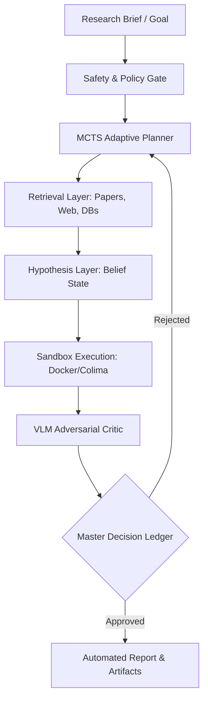

# CORTEX-PERSIST: SOTA AI SCIENTIST STACK
## Enterprise Deployment Roadmap & Architecture Blueprint (v1.0.0)

> **Document Status:** RELEASE READY (C5-REAL)  
> **Author:** MOSKV-1 APEX Execution Kernel  
> **Target Audience:** Enterprise CTOs, VP of AI Platforms, Chief Security Officers  
> **Date:** June 2026  

---

## 1. Executive Summary

Traditional LLM applications operate as stochastic black-boxes, introducing severe operational risk, non-deterministic failures, and compliance vulnerabilities. 

The **CORTEX SOTA AI Scientist Stack** represents a paradigm shift. It is a distributed multi-layer architecture where LLMs serve strictly as reasoning and policy components, while the core research, experimentation, and validation loops are governed by a deterministic, sandboxed execution environment backed by a cryptographic system of record: the **Epistemic Dependency Graph (EDG)** and the **Master Decision Ledger**.

This document outlines the architecture, security gates, and a 4-week deployment roadmap for integrating this stack into enterprise infrastructure.



---

## 2. Technical Architecture & Component Mapping

The system decouples cognitive planning from physical execution, enforcing deterministic boundaries at every stage.

### 2.1 Interface & Ingress (REST / CLI / Event Bus)
- **AsyncAPI Event Bus (`schema/scientist_events.yaml`):** The communication backbone. Cognitive agents exchange non-blocking events:
  - `BriefReceived`: Ingestion of safety guidelines and constraints.
  - `BeliefTransitionEvent`: State transitions of research hypotheses.
  - `ExecutionResultEvent`: Sandbox execution metrics and output paths.
  - `ArtifactReviewEvent`: VLM adversarial review evaluations.

### 2.2 Cognitive Orchestration & Tree Search
- **MCTS Progress Manager (`legacy_research/swarm/scientist_tree_search.py`):** Drives hypothesis exploration using Monte Carlo Tree Search. It models experimental progression as a tree, expanding nodes that yield valid metrics and pruning branches containing logical contradictions or failed tests.
- **Idea Generator (`cortex/engine/ai_scientist/idea_generator.py`):** Formulates novel, falsifiable hypotheses based on prior runs and literature indexes.

### 2.3 Isolated Sandbox Execution
- **Sandbox Runner (`legacy_research/swarm/sandbox_runner.py` / `SandboxJIT`):** Executes LLM-generated code (Python/JAX/Julia) within an isolated container.
  - **Constraints:** Zero host network access, CPU/GPU quotas, write-restrictions to the host system, and a hard timeout gate.

### 2.4 Multimodal Adversarial Review
- **VLM Critic (`legacy_research/extensions/vlm_critic.py`):** Performs deep visual and logical analysis of sandbox outputs (e.g., training curves, data tables). It acts as an adversarial reviewer, detecting anomalies (e.g., overfitting, silent failures) that textual models fail to spot.

### 2.5 Causal Integrity (The Ledger)
- **Epistemic Dependency Graph (`cortex/engine/causality_models.py`):** Tracks the lifecycle of hypotheses as `BeliefObject`s.
- **Master Decision Ledger (`cortex/audit/ledger.py`):** Immutably registers every state transition with a cryptographic `CORTEX-TAINT` signature to prevent untraceable state drift.

---

## 3. 4-Week Enterprise Deployment Roadmap

```
Week 1: Foundations, Isolation & Security Gates
Week 2: Event-Driven Cognitive Routing (AsyncAPI)
Week 3: Adversarial Validation & Tree Search Tuning
Week 4: Production Dry-Run, SLA Verification & Sign-off
```

### Phase 1: Security & Sandboxing (Week 1)
**Objective:** Secure the host infrastructure against malicious or malformed LLM-generated code.
- **Deliverables:**
  1. Provision isolated container runtime (Colima/Docker) in the enterprise development network.
  2. Implement the `SandboxJIT` interface and configure CPU/GPU resource constraints.
  3. Deploy the **Sovereign Gate** (`cortex/guards/sovereign_seals.py`) to intercept input briefs.
- **Enterprise Checkpoint:** Verify that a sandbox crash or infinite loop cannot exhaust host CPU resources or leak system environment variables.

### Phase 2: Event-Driven Cognitive Routing (Week 2)
**Objective:** Wire up the cognitive agents using the AsyncAPI Event Bus.
- **Deliverables:**
  1. Deploy the `AIScientistOrchestrator` to coordinate the research pipeline.
  2. Integrate the event bus (Zenoh or RabbitMQ) mapped to `schema/scientist_events.yaml`.
  3. Connect the `CortexEngine` database adapters to serialize `BeliefObject` state transitions.
- **Enterprise Checkpoint:** Execute a manual trace replay showing a belief transitioning from `PROPOSED` to `VALIDATED` or `REJECTED` in the Master Decision Ledger.

### Phase 3: Adversarial Validation & Tree Search Tuning (Week 3)
**Objective:** Configure automated evaluation and tree-search parameters.
- **Deliverables:**
  1. Integrate the `AdversarialReviewer` pipeline with local VLM endpoints.
  2. Configure MCTS search depth, novelty score thresholds, and iteration limits.
  3. Set up email/Slack webhooks for Human-in-the-Loop approval on high-confidence breakthroughs.
- **Enterprise Checkpoint:** Force an artificial hallucination (e.g., generate a plot with corrupted axes) and verify that the `VLM Critic` rejects the run and details the failure.

### Phase 4: Production Dry-Run & SLA Sign-off (Week 4)
**Objective:** Full end-to-end execution, stress testing, and SOC2 audit verification.
- **Deliverables:**
  1. Run 100 continuous research loops under simulated network latencies.
  2. Audit ledger logs to verify `CORTEX-TAINT` cryptographic chain continuity.
  3. Deliver the developer-facing dashboard showing real-time traces and replay actions.
- **Enterprise Checkpoint:** Verification of SOC2/ISO audit compliance export from the Master Ledger.

---

## 4. Integration Blueprint

Deploying the stack takes less than 15 minutes of developer integration.

```python
import asyncio
from cortex.auth.enterprise_identity import SovereignIdentity
from cortex.audit.ledger import EnterpriseAuditLedger
from cortex.engine.ai_scientist.orchestrator import AIScientistOrchestrator
from cortex.engine.ai_scientist.idea_generator import IdeaGenerator
from cortex.engine.ai_scientist.coder_executor import CoderExecutor
from cortex.engine.ai_scientist.analyst_writer import AnalystWriter
from cortex.engine.ai_scientist.reviewer import AdversarialReviewer
from cortex.engine.sandbox_jit import SandboxJIT

async def main():
    # 1. Establish Identity & Ledger System of Record
    identity = SovereignIdentity(tenant_id="ent_corp_01", actor_id="agent_sci_01", role="executor")
    ledger = EnterpriseAuditLedger(db_path="/var/cortex/ledger.db")
    
    # 2. Initialize Sandboxed Runtime & Cognitive Modules
    sandbox = SandboxJIT(image="cortex-sci-runtime:latest", timeout=300)
    orchestrator = AIScientistOrchestrator(
        ledger=ledger,
        identity=identity,
        idea_generator=IdeaGenerator(),
        coder_executor=CoderExecutor(sandbox=sandbox),
        analyst_writer=AnalystWriter(),
        reviewer=AdversarialReviewer()
    )
    
    # 3. Trigger Closed-Loop Research Pipeline
    print("[C5-REAL] Launching AI Scientist loop...")
    results = await orchestrator.run(
        topic="Optimization of loss function under strict thermal constraints",
        max_iterations=3
    )
    print(f"Research finalized: {results['draft']['paper_path']}")

if __name__ == "__main__":
    asyncio.run(main())
```

---

## 5. Enterprise SLA & Support Tiers

| Feature | Growth | Enterprise | Strategic |
| :--- | :--- | :--- | :--- |
| **Pricing** | $5,000 / mo | $15,000 / mo | Custom Contract |
| **Hosting** | Cortex Cloud (SaaS) | Hybrid Cloud (Private VPC) | Fully Air-gapped (On-premise) |
| **Execution Sandboxes** | Shared CPU | Dedicated GPU cluster | Multi-node HPC clustering |
| **Ledger Verification** | Daily verification | Real-time consensus (BFT) | On-chain hash anchoring |
| **Support SLA** | 12h email support | 2h dedicated Slack | 30m phone escalation + TAM |
| **Compliance** | Standard exports | SOC2 / ISO 27001 Package | Custom HIPAA/GDPR policies |
