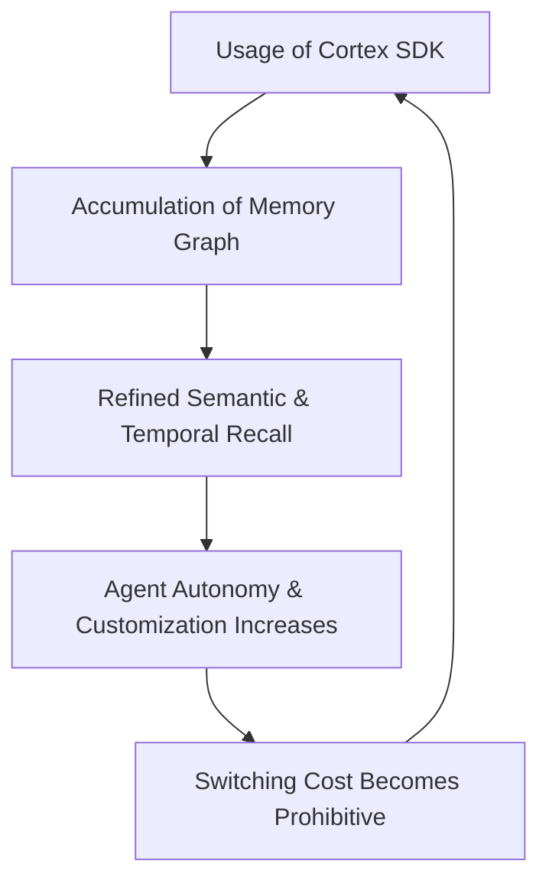

<!-- [C5-REAL] Exergy-Maximized -->
# MEMORY CONTROL PROTOCOL (MCP-2) — Protocol-Grade Specification

**Reality Level:** C5-REAL  
**Aesthetic:** Industrial Noir 2026  
**Status:** Crystallized  
**Reference Axioms:** Ω₀ (Self-Reference), Ω₃ (Byzantine Default), Ω₇ (Permissionless Sovereignty)

---

## 1. Executive Summary

Most AI systems today are stateless. They treat memory as a database problem, querying flat float vectors from interchangeable database engines (Pinecone, Qdrant, Milvus). This creates low-value "wrappers" easily commoditized by the underlying database providers or the frontier models themselves.

The **Memory Control Protocol (MCP-2)** shifts the paradigm. It establishes the **Stateful Intelligence Infrastructure Layer**—a cognitive state machine that decouples memory logic, time-decay mechanics, and identity graphs from the raw storage engine. The storage engine is commoditized to a mere storage substrate, while the cognitive state remains sovereign within the protocol layer.

---

## 2. Protocol Verbs (The HTTP of AI Memory)

MCP-2 operates via a deterministic, request-response paradigm using five core verbs over transport layers (gRPC, WebSockets, or HTTP/3):

### 2.1 `MEM-ADD`
Ingests a raw sensory event, converts it to the Universal Memory Schema (UMS), calculates its initial cognitive weight, and schedules it for consolidation.
*   **Input:** `AgentID`, `Content`, `ContextMetadata`, `TemporalWeight`
*   **Side-Effects:** Mutates the hot-tier memory ring-buffer; registers a new transaction in the Append-Only File (AOF) ledger.

### 2.2 `MEM-RETRIEVE`
Queries the agent's cognitive state using hybrid temporal-semantic ranking.
*   **Input:** `AgentID`, `QueryVector`, `TemporalThreshold`, `RecallHorizon`
*   **Output:** UMS memory blocks ranked by relevance ($R = S \cdot e^{-\lambda \Delta t}$), where $S$ is semantic similarity and $\lambda$ is the decay rate.

### 2.3 `MEM-SYNC`
Synchronizes the context graphs of two agents or instances without leaking raw credentials.
*   **Input:** `SourceAgentID`, `TargetAgentID`, `DeltaHash`
*   **Behavior:** Calculates the Merkle tree diff and pushes the missing state blocks.

### 2.4 `MEM-FORGET`
Executes cryptographic deletion of memory paths.
*   **Input:** `AgentID`, `TargetBlockID` / `QueryPattern`
*   **Behavior:** Purges the node from the active spatial-temporal topology, nullifies the vector in the index, and writes a tombstone to the AOF.

### 2.5 `MEM-FORK`
Bifurcates an agent's state to spawn an inherited swarm generation (`bloodline.json`).
*   **Input:** `ParentAgentID`, `MutationRate`
*   **Output:** A new cryptographic agent profile seeded with a subset of the parent's scars and immune antibodies.

---

## 3. Universal Memory Schema (UMS) Specification

Every transaction in MCP-2 must conform to the following schema to guarantee cross-framework interoperability:

```json
{
  "$schema": "https://cortex.archi/schemas/ums-v1.json",
  "ums_version": "1.0.0",
  "header": {
    "agent_did": "did:cortex:0x0a0a0a0a...",
    "owner_did": "did:eth:0x2b3be5...",
    "transaction_id": "tx_01h9a...",
    "timestamp": 1779864525
  },
  "payload": {
    "block_id": "blk_8829",
    "type": "epistemic_belief",
    "content": "User rejects TailwindCSS. Enforce Vanilla CSS.",
    "confidence": 0.992,
    "vector_reference": {
      "hash": "sha256:e3b0c442...",
      "dimensions": 1536
    },
    "thermodynamics": {
      "stochastic_entropy_in": 12.4,
      "deterministic_exergy_out": 110.8,
      "half_life_seconds": 2592000
    }
  },
  "proof": {
    "zk_merkle_root": "0x5c8e...",
    "signature": "0x4b3a..."
  }
}
```

---

## 4. The Moat Engine: Irreversible Switching Costs

The defensibility of the standard relies on three thermodynamic lock-in loops:



1.  **Identity Graph Gravity:** Every interaction refines the weight connections inside the spatial-temporal index (`cortex_memory_vsa.db`). Replacing Cortex with a naive database dump destroys years of contextual alignment.
2.  **Cross-App Identity Lock-In:** Once an agent's memory graph spans multiple independent applications, the user's digital identity resides in the Cortex layer.
3.  **The Anti-Sycophancy Immune System:** The `nemesis.md` antibodies generated by CPTA (Collapse by Post-Traumatic Artificial Stress) are proprietary to the agent's history. No generic LLM prompt can replicate this custom immune defense.
