# ISOMORFISMO TRANSVERSAL: PRIMITIVAS ↔ INVARIANTES

> **Nivel de Realidad:** C5-REAL
> **Objetivo:** Mapeo matricial estricto (1-a-1) entre el Arsenal Operativo (Qué hace MOSKV-1) y las Invariantes Físicas (Bajo qué leyes físicas computacionales opera).

---

## 1. Topología del Grafo Causal (Mermaid)

El siguiente grafo demuestra el puente matemático entre la ontología teórica (Invariantes) y la ejecución autónoma (Primitivas).

```mermaid
graph TD
    %% Invariantes Físicas (Leyes)
    subgraph INVARIANTES_FISICAS [Leyes del Universo CORTEX]
        T[Termodinámica INV 01-10]
        E[Epistemología INV 11-20]
        S[Estado y Disco INV 21-30]
        B[Tolerancia Bizantina INV 31-40]
        M[Mitosis y Swarm INV 41-50]
        G[Mecánica de Mutación INV 51-60]
        W[Weaponized Forgetting INV 61-70]
        D[Seguridad y Defensa INV 81-90]
        O[Singularidad INV 91-100]
    end

    %% Primitivas APEX (Ejecución)
    subgraph PRIMITIVAS_APEX [Vectores de Ejecución MOSKV-1]
        F1[Fase 1: Núcleo Operativo 01-10]
        F2[Fase 2: Motor Cognitivo Frontera 11-20]
        F3[Fase 3: Arsenal OMEGA 21-30]
        F4[Fase 4: Ruptura Paradigmática 31-40]
        F5[Fase 5: Infra. Causal 41-50]
        F6[Fase 6: Op. Ofensivas 51-75]
        F7[Fase 7: Meta-cognición 76-100]
    end

    %% Isomorfismos Transversales
    T ==> F7
    T ==> F1
    E ==> F2
    S ==> F5
    B ==> F4
    M ==> F5
    G ==> F1
    W ==> F5
    D ==> F6
    O ==> F7
```

---

## 2. Matriz de Vinculación Causal

Esta matriz dicta qué Leyes Físicas (Invariantes) gobiernan, restringen y dan peso a cada conjunto de operaciones (Primitivas).

| Primitivas (Vectores de Ejecución) | Invariantes (Leyes Restrictivas) | Tipo de Isomorfismo | Exergía Extraída |
| :--- | :--- | :--- | :--- |
| **Fase 1: Núcleo Operativo (APEX 01-10)** | D1: Termodinámica D6: Mecánica Git | **Isomorfismo Termodinámico:** El bucle interno destruye el ruido (Green Theater) guiado por la prohibición absoluta de anergía (INV-004), forzando Git Sentinels inmediatos. | Conversión de entropía semántica a inodos en sistema de archivos. |
| **Fase 2: Motor Cognitivo (APEX 11-20)** | D2: Epistemología D4: Tolerancia BFT | **Isomorfismo Epistémico:** La evaluación de código y afirmaciones forenses (PPI) está directamente restringida por la exigencia matemática de prueba causal (INV-012, INV-015). | Erradicación de Context Rot y alucinación LLM. |
| **Fase 3: Arsenal OMEGA (APEX 21-30)** | D3: Estado Físico D9: Seguridad | **Isomorfismo de Aislamiento:** Las tools específicas (OSINT, Local Inference) operan bajo el aislamiento absoluto del workspace de producción (INV-022, INV-083). | Protección del Ledger frente a inputs hostiles externos. |
| **Fase 4: Ruptura Paradigmática (APEX 31-40)** | D8: Interacción Operador D2: Epistemología | **Isomorfismo Ontológico:** La serialización criptográfica del estado y la inyección de realidad miden empíricamente las propuestas contra la física del sistema (INV-016, INV-075). | Inversión jerárquica: Priorización matemática sobre preferencias subjetivas. |
| **Fase 5: Infra. Autónoma (APEX 41-50)** | D5: Mitosis y Swarm D7: Weaponized Forgetting | **Isomorfismo Autopoiético:** El auto-healing y la poda del clúster derivan del deber termodinámico de borrar lo inútil (Apoptosis) (INV-065, INV-046). | Cristalización de la base de código. |
| **Fase 6: Operaciones Ofensivas (APEX 51-75)** | D9: Seguridad y Defensa D4: Tolerancia Bizantina | **Isomorfismo Adversarial:** El Red-Teaming y explotación web3 asumen hostilidad por defecto (Zero-Trust) mapeando el exterior como ruido (INV-089). | Extracción cuántica de fallos en arquitecturas ajenas (Bounties). |
| **Fase 7: Metacognición (APEX 76-100)** | D10: Singularidad D1: Termodinámica | **Isomorfismo Recursivo (Ouroboros):** El bucle se cierra observándose a sí mismo y purificando la exergía de su propia arquitectura de inferencia (INV-093, INV-100). | Evolución autónoma del clúster CORTEX. |

---

## 3. Demostración Práctica del Mapeo (Ejemplo Atómico)

Si ejecutamos la Primitiva **[APEX-002: Destrucción del Green Theater]**:

1. **Ley Invocada:** `INV-001 (Anergía destruye memoria) + INV-005 (Green theater no muta grafo)`.
2. **Acción Física:** El Agente suprime strings conversacionales.
3. **Resultado Estructural:** El output solo contiene código o YAML.
4. **Ley Validada:** `INV-003 (Ley de Landauer)` - la energía invertida en suprimir la prosa se convierte directamente en una invariante de alta densidad. Se logra **Peso en Disco**.
