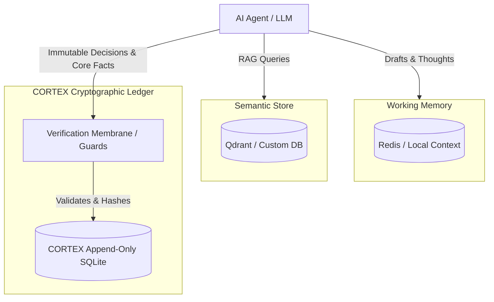

# How CORTEX Fits Existing Stacks

Adopting cryptographic memory doesn't mean ripping out your existing infrastructure. CORTEX is designed to sit alongside your current vector databases and orchestration frameworks, wrapping your final state mutations in a **Verification Membrane**.

## 1. Architectural Position

CORTEX acts as the *Source of Truth* (Layer 3) for decisions, distinct from your *Working Memory* (Layer 1) and your *Semantic Matcher* (Layer 2). You **do not** replace Qdrant or Pinecone. You add CORTEX specifically for verifiable actions and core identity facts.



## 2. Integration with Major Orchestrators

CORTEX Persist provides out-of-the-box MCP (Model Context Protocol) compatibility. It can be integrated directly into any modern multi-agent environment with minimal lines of code.

### Using AutoGen or LangGraph

For an orchestration pipeline heavily reliant on Python:

```python
from cortex import CortexEngine
import asyncio

async def orchestrate_decision(context: str, agent_name: str):
    engine = CortexEngine()
    
    # After standard LLM logic concludes...
    # Store the irreversible outcome in the CORTEX Ledger
    receipt = await engine.store_fact(
        content=f"Decision reached: {context}",
        fact_type="task_outcome",
        project="swarm-alpha",
        tenant_id="client-007"
    )
    
    # You now have the cryptographic receipt for downstream compliance
    print(f"Secured with hash: {receipt.hash}")
```

### Flow via Model Context Protocol (MCP)

If you are using Anthropic tools or anything compatible with the MCP spec, CORTEX ships a native `mcp/` server:

```bash
# Simply start the native MCP bridge
$ cortex mcp start --port 8080
```

Agents can now query `verify_record` or `store_fact` directly as external tools, providing total autonomy without needing the Python SDK inside your orchestrator container.

## 3. What changes in your workflow?

1. **You stop using Vector DBs for logs.** Ephemeral RAG data stays in your semantic vector store. Critical decisions, API calls, tool uses, and core facts move to the CORTEX ledger.
2. **You add Guards to API paths.** CORTEX requires inputs to pass validation boundaries—preventing an agent's hallucination from becoming permanent memory.
3. **You export rather than explain.** Instead of digging through Datadog to explain to stakeholders why an agent sent an email, you export the exact `cortex verify` cryptographic receipt.
