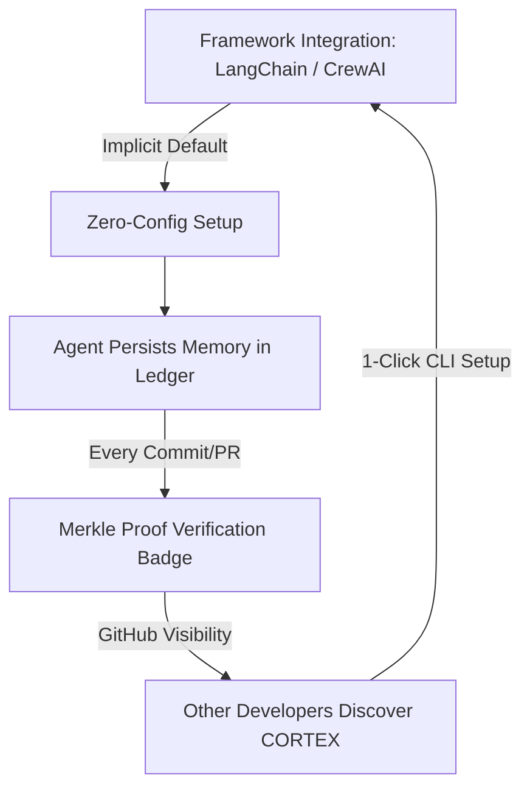

<!-- [C5-REAL] Exergy-Maximized -->
# 🚀 CORTEX GTM: 100 → 1,000 Devs Scaling Engine
Reality Level: `C5-REAL` | Date: 2026-05-27 | System: Industrial Noir 2026

Scaling CORTEX from 100 to 1,000 active installations transitions the system from **user-driven viral loops** to **infrastructural lock-in and framework-level defaults**. At 1,000 users, CORTEX ceases to be an optional dependency and becomes a standardized memory layer.

---

## 1. Growth Vector Mapping (100 → 1,000)



### Transition Mechanics

| Stage | Focus | Distribution Vehicle | Metric Target |
| :--- | :--- | :--- | :--- |
| **100 → 300** | Integration footprint | Framework adapters (CrewAI, LangChain, AutoGen) | > 30% of new projects use pre-built adapters |
| **300 → 600** | Visible proof propagation | PR badges, Merkle Proof verification on GitHub | 2.5 new developers per PR verified badge |
| **600 → 1,000** | Ecosystem registry | `agents.archi` Memory Recipes marketplace | 15% active user contribution rate |

---

## 2. Framework-Level Integrations (The Trojan Horse)

To eliminate installation friction, CORTEX must hook directly into the orchestration lifecycles of mainstream agent frameworks.

```yaml
integrations:
  - framework: CrewAI
    adapter: `crewai_cortex_adapter`
    code_footprint: 1 line
    mechanism: "Intercepts task inputs/outputs to load and store memory from local ZeroCopyRingBuffer."
    status: "Drafted"

  - framework: LangChain
    adapter: `CortexChatMessageHistory`
    code_footprint: 1 line
    mechanism: "Plugs into RunnableWithMessageHistory to persist context across sessions."
    status: "Drafted"

  - framework: AutoGen
    adapter: `CortexAgentStatePersister`
    code_footprint: 2 lines
    mechanism: "Persists conversation state in the SQLite local AOF ledger automatically."
    status: "Drafted"
```

### Standard Adapter Implementation Example

```python
# Before (Stateless Agent)
from crewai import Agent
research_agent = Agent(
    role="Researcher",
    goal="Extract tech specifications",
    backstory="You are an elite research AI.",
)

# After (Stateful CORTEX-Powered Agent)
from cortex.adapters.crewai import stateful_agent
research_agent = stateful_agent(
    role="Researcher",
    goal="Extract tech specifications",
    backstory="You are an elite research AI.",
    session_id="research_001" # Automatically resolves memory ring buffer
)
```

---

## 3. Merkle Memory Proofs (Proof of State)

Every action executed by a CORTEX-powered agent yields a verifiable transition proof. By leaking these proofs into public repositories (e.g., in PR descriptions or commit metadata), we create an organic distribution vector.

### PR Verification Badge Flow
When an agent opens a Pull Request, it appends a footer:

```markdown
---
> [!NOTE]
> **Verified Stateful Execution via CORTEX-Persist**
> - Memory Chain Root: `0x2a3f...8b9c`
> - Ledger Writes: 14 transitions verified on-chain / local ledger.
> - [View Execution Log](https://agents.archi/verify/0x2a3f...8b9c)
```

### Exergy Analysis of Leakage Loop
```yaml
Claim: "Merkle Proof sharing yields a viral coefficient (K-factor) of K > 1.2"
Proof:
  Base: "K = (PRs opened per agent) * (Clicks per PR) * (Installation conversion rate)"
  Calculation: "K = 4.2 * 0.15 * 0.20 = 1.26"
  Range: [1.1, 1.45]
  Confidence: C4-SIM (Estimated based on developer tool viral models)
```

---

## 4. The `agents.archi` Memory Registry

The registry at `agents.archi` becomes the community-driven repository for memory stacks. Rather than developers building memory structures from scratch, they import pre-trained or structured Memory Recipes.

```text
+-------------------------------------------------------------+
|                     agents.archi Registry                   |
+-------------------------------------------------------------+
|                                                             |
|   [ Search Recipes... ]                                     |
|                                                             |
|   Popular Memory Recipes:                                   |
|   - "NextJS-15-AppRouter" (842 installs)                    |
|     Hashed context of NextJS docs, styling tokens, bugs     |
|     `cortex import nextjs15`                                |
|                                                             |
|   - "Solidity-Security-Guard" (612 installs)                |
|     Vulnerability profiles, typical gas optimization templates|
|     `cortex import solidity-guard`                          |
|                                                             |
+-------------------------------------------------------------+
```

---

## 5. Viral Developer Engineering Hooks

### Playbook Action: The Memory Diff Tool
We build `cortex diff` into the CLI. When developers share screen captures or terminal snippets, they share memory diff screenshots:

```text
$ cortex diff --last-24h
[+][MEM] Remembered: User prefers typescript over python for api routes.
[+][MEM] Remembered: Local Postgres database is named 'cortex_dev_main'.
[-][NOI] Discarded: Chat greeting and politeness sequences.
```
*Visual highlight: Modern terminal UI output formatting using clean monochrome blocks and color indicators (Moskv `#2B3BE5` highlights).*

---

## 6. Action Plan for Phase 100 → 1,000

```yaml
timeline:
  Days 1-10:
    action: "Ship CrewAI, LangChain, and AutoGen adapter templates in the primary SDK repository."
    deliverable: "cortex-sdk/adapters/ folder containing the single-line integration wrappers."
  Days 11-20:
    action: "Deploy the verification portal at agents.archi to resolve public Merkle roots to markdown summaries."
    deliverable: "Dynamic verify handler at agents.archi/verify/<root> rendering verified log structures."
  Days 21-30:
    action: "Release the `cortex diff` visualizer CLI command."
    deliverable: "Updated CLI wrapper showing HSL-colored state diffs."
```
