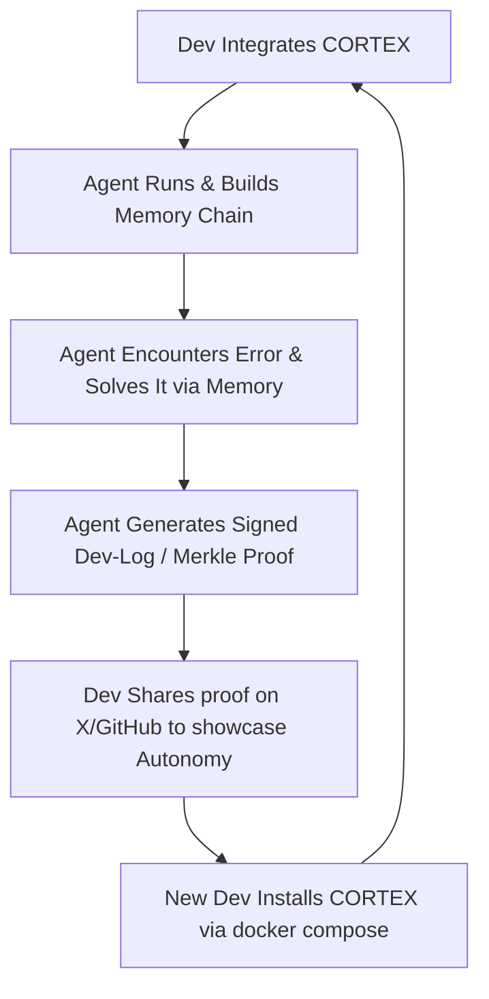

<!-- [C5-REAL] Exergy-Maximized -->
# 🚀 CORTEX GTM: 10 → 100 Devs Growth Engine
Reality Level: `C5-REAL` | Date: 2026-05-27 | System: Industrial Noir 2026

This document maps the exact operational loop, viral triggers, post-feedback features, and monetization framework required to scale CORTEX-Persist from its first 10 design partners to 100 active developer installations.

---

## 1. The 10 → 100 Growth Loop

Rather than relying on marketing spend, CORTEX growth is driven by **Developer-to-Developer State Leakage**. 



### Growth Loop Mechanics

| Mechanism | Description | Trigger | Target Metric |
| :--- | :--- | :--- | :--- |
| **Verification badge in PRs** | Agent includes a "verified decision chain" badge in pull requests it opens. | `git commit` by agent | 20% conversion from PR readers |
| **Shared Memory Recipes** | Developers can export/import curated memory stacks (e.g. "NextJS 15 stack memory"). | `cortex export --recipe` | 1.5 imports per active user |
| **Telemetry Showroom** | An opt-in web page (`agents.archi/showroom`) that showcases real-time memory synchronization metrics. | `cortex telemetry --public` | 100 monthly visitors / user |

---

## 2. The Viral Case Study Blueprint (The "Amnesia-Free Agent")

To generate the first viral loop on Twitter/X, we must showcase a raw, indisputable proof of memory-driven agent performance.

### Scripted 45-Second Video Flow (C5-REAL Evidence)
*   **0:00 - 0:10 | The Problem:** Show a standard LLM agent failing. It tries to run database migrations but gets the database name wrong because its context window reset.
*   **0:10 - 0:25 | The Shift:** Add 2 lines of code to the agent initialization script:
    ```python
    from cortex import CortexEngine
    engine = CortexEngine() # Connects to local DB/ledger
    ```
*   **0:25 - 0:40 | The WOW Moment:** The agent restarts. Instead of asking for configuration, it queries its local cryptographic ledger:
    `cortex query "database credentials"` -> retrieves verified, sanitized connection string. It runs the migration instantly.
*   **0:40 - 0:45 | Call to Action:** "Stop writing stateless scripts. Give your agent a hippocampus. `docker compose up`."

---

## 3. Core Post-Feedback Features

Based on the friction points identified during the MVP (Día 6-10), the following three high-signal capabilities must be built to secure the next 90 users.

### Feature Specification Matrix

```yaml
features:
  - id: FEAT-001
    name: Merkle Compliance Export
    value_proposition: Generates EU AI Act Article 12 compliance reports in 1-click.
    command: cortex compliance --format=pdf
    complexity: Low (utilizes existing SQLite AOF + ReportLab)

  - id: FEAT-002
    name: Cortex Memory Diff CLI
    value_proposition: Interactive terminal interface to visualize what the agent is remembering vs what is noise.
    command: cortex diff --last-24h
    complexity: Medium (requires rich/curses CLI integration)

  - id: FEAT-003
    name: Zero-Knowledge Memory Sync
    value_proposition: End-to-end encrypted backup of agent state across developer machines without cloud exposure of secrets.
    command: cortex sync --e2ee
    complexity: High (requires AES-256-GCM client-side encryption)
```

---

## 4. Monetization Path (Self-Hosted OSS vs Nexus Core)

To monetize without alienating the open-source community, we enforce a strict boundary between **Local State Validation** (100% Free) and **Distributed Sync/Orchestration** (Paid).

```text
+--------------------------------------------------------+
|                      ABYSSAL TIER                      |
|  - Custom Enterprise VPC Deployments ($2k+/mo)         |
|  - EU AI Act Audit Gates & Dedicated HSM Keys          |
+--------------------------------------------------------+
                           |
+--------------------------------------------------------+
|                       LEGION TIER                      |
|  - Shared Swarm Memory Synchronization ($199/mo)       |
|  - Multi-user RBAC + Webhook Integration               |
+--------------------------------------------------------+
                           |
+--------------------------------------------------------+
|                       NEXUS TIER                       |
|  - Zero-Knowledge E2EE Cloud Sync ($29/mo)             |
|  - Cross-device backup & sync                          |
+--------------------------------------------------------+
                           |
+--------------------------------------------------------+
|                    SOVEREIGN CORE (OSS)                |
|  - Local SQLite AOF, Vector Store, Memory Diff CLI     |
|  - 100% Free & Apache 2.0                              |
+--------------------------------------------------------+
```

### Conversion Rule
*   **Local execution is infinite and unrestricted.**
*   The moment the developer wants to sync memory between their **local dev environment** and their **production cluster**, they hit the Merkle Sync API (Nexus/Legion subscription).
