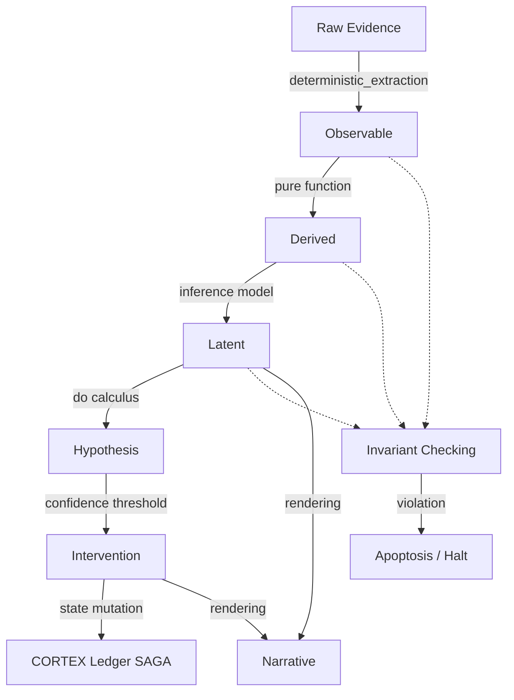

<!-- [C5-REAL] Exergy-Maximized -->
# 🧱 AUTODIDACT: The Epistemological Compiler

> **"La observación sin formalismo es ruido estocástico; la intervención sin trazabilidad es entropía pura."**

El sistema AUTODIDACT evoluciona desde una taxonomía de indicadores (KPIs/Métricas) hacia una **Ontología Estructural** validada por un tipado fuerte. La inteligencia de CORTEX-Persist no consiste en acumular texto estocástico, sino en compilar secuencias causales desde la *Evidencia Bruta* hasta la *Intervención Directa*.

Esta arquitectura actúa como un **Compilador Epistemológico**. Todo razonamiento que viole la secuencia de tipado (e.g., derivar una intervención directamente de una narrativa sin pasar por el modelo latente) generará un `TypeError` / `ValidationError` a nivel de máquina, abortando el ciclo cognitivo (Ley del Isomorfismo Causal Φ5).

---

## 1. El Pipeline Epistemológico Formal

Todo conocimiento transita a través de un grafo unidireccional y estrictamente tipado. Cero heurísticas ocultas. Cero saltos paramétricos al vacío.



### Reglas de Tipado Semántico (El Linter Epistémico)
Un pipeline válido se compila. Un razonamiento estocástico se rechaza.

- `Observable → Derived` **(✓ VÁLIDO)**
- `Derived → Latent` **(✓ VÁLIDO)**
- `Latent → Hypothesis` **(✓ VÁLIDO)**
- `Hypothesis → Intervention` **(✓ VÁLIDO)**
- `Narrative → Latent` **(✗ INVÁLIDO)**: La narrativa es renderizado humano, jamás es entrada para inferencia.
- `Proxy → Invariant` **(✗ INVÁLIDO)**: Un invariante solo se evalúa contra observables o funciones puras derivadas, jamás aproximaciones.
- `Narrative → Observable` **(✗ INVÁLIDO)**: El lenguaje estocástico no puede considerarse evidencia directa empírica.

---

## 2. Tipos Fundamentales (Ontología C5-REAL)

### `RawEvidence` (La Base Física)
No existen los "cambios en el AST" como ente mágico. Lo que existe es el archivo, el parser y el diff.
**Dominios:** `filesystem`, `git_objects`, `compiler_logs`, `cpu_counters`, `kernel_events`. Toda cadena epistémica nace aquí.

### `Observable` (La Extracción)
La consecuencia directa y determinista de aplicar un algoritmo de extracción sobre `RawEvidence`.
*Ejemplo:* `git diff HEAD HEAD~1` → `changed_lines_count`.

### `Derived` (La Función Pura)
Un agregado u operación libre de heurísticas ocultas, basado enteramente en `Observable` u otros `Derived`. Es referencialmente transparente.
*Ejemplo:* `MTTR = Σ(recovery_time) / incidents`. Sin parámetros mágicos.

### `Latent` (El Modelo Paramétrico)
La inferencia probabilística explícita. No existe "yo creo que...". Todo conocimiento latente demanda un modelo (e.g., `BayesianNetwork`, `KalmanFilter`, `CausalGraph`) y un valor de confianza/posterior (e.g., `P=0.81`).

### `Invariant` (El Contrato Termodinámico)
La barrera de protección del estado físico. Operan en 4 densidades:
1. **Hard:** Violación imposible. Intercepta y mata la SAGA antes del commit.
2. **Soft:** Implica penalización o degradación de confianza, pero la rama de ejecución continúa bajo alerta.
3. **Temporal:** Debe cumplirse eventualmente (eventual consistency).
4. **Probabilistic:** Se exige $P > 0.99$ dentro del modelo latente.

### `Intervention` (La Singularidad Agéntica)
Las acciones que MOSKV-1 y CORTEX ejecutan en el entorno anfitrión (macOS, Swarm, GitHub). No solo predecimos el estado, **mutamos la realidad**.
Basado en el cálculo $do(X)$ de Pearl:
```yaml
Intervention: do(freeze_release)
Prediction: stability ↑, MTTR ↓
Confidence: 0.92
```

### `Narrative` (La Matriz Externa)
No es un bloque de construcción del sistema, sino un renderizador de salida para entidades biológicas o logs externos. Pertenece a la capa de presentación (Explanation Engine), no al Motor de Inferencia (Inference Engine). Consumir narrativa como input es un colapso termodinámico.

---

## 3. Implementación Estructural
El motor de validación se consolida en `cortex/extensions/skills/autodidact/epistemology.py` mediante Pydantic (Validación en tiempo de ejecución) para adherirse al Ax-046 y R1 (Nivel de realidad C5-REAL).
