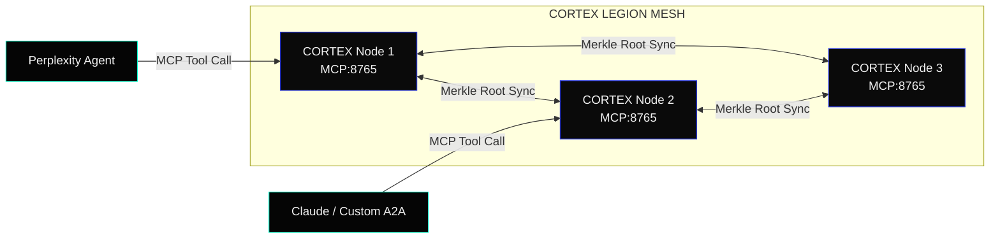

<!-- [C5-REAL] MCP Integration Reference — Industrial Noir 2026 -->

# █ CORTEX-PERSIST · MCP INTEGRATION GUIDE

> **Model Context Protocol (MCP)** is the open standard for exposing tool surfaces to AI agents.  
> CORTEX-PERSIST ships a native MCP server that gives any compliant client — Perplexity, Claude, custom A2A orchestrators — direct access to the full cryptographic memory substrate.

```yaml
PROTOCOL: MCP 2025-11 (latest)
TRANSPORT: stdio (default) | HTTP/SSE | WebSocket
AUTH: Bearer JWT | mTLS | API-Key header
SERVER_BOOT: < 120ms cold start
TOOLS_EXPOSED: 14
PROMPTS_EXPOSED: 4
RESOURCES_EXPOSED: 3
```

---

## ▀▄ CONTENTS

1. [Quick Start](#1-quick-start)
2. [Client Configuration](#2-client-configuration)
   - [Perplexity Agent](#21-perplexity-agent)
   - [Claude Desktop / Claude Code](#22-claude-desktop--claude-code)
   - [Custom A2A Orchestrator](#23-custom-a2a-orchestrator)
3. [Tool Catalog](#3-tool-catalog)
4. [Prompt Catalog](#4-prompt-catalog)
5. [Resource Catalog](#5-resource-catalog)
6. [Authentication & Security](#6-authentication--security)
7. [Transport Modes](#7-transport-modes)
8. [C5-REAL Trust Guarantees](#8-c5-real-trust-guarantees)
9. [Error Code Registry](#9-error-code-registry)
10. [Advanced: A2A Mesh Mode](#10-advanced-a2a-mesh-mode)

---

## 1. Quick Start

**Install the MCP extras:**

```bash
pip install "cortex-persist[api,mcp,daemon]"
```

**Start the server (stdio — default for desktop clients):**

```bash
cortex mcp serve
```

**Start the server (HTTP/SSE — for remote or multi-agent access):**

```bash
cortex mcp serve --transport sse --port 8765 --host 0.0.0.0
```

**Verify the server is alive:**

```bash
cortex mcp ping
# → {"status": "alive", "tools": 14, "ledger_blocks": 42, "c5_real": true}
```

---

## 2. Client Configuration

### 2.1 Perplexity Agent

Add CORTEX-PERSIST as an MCP server in your Perplexity agent config. The server exposes all 14 tools automatically via the standard `tools/list` handshake.

```json
{
  "mcpServers": {
    "cortex-persist": {
      "command": "cortex",
      "args": ["mcp", "serve"],
      "env": {
        "CORTEX_API_KEY": "<your-api-key>",
        "CORTEX_LEDGER_PATH": "~/.cortex/ledger.aof"
      }
    }
  }
}
```

> **Perplexity-specific:** CORTEX tools will appear in the tool picker under `cortex-persist.*`. Every tool call is automatically sealed into the C5-REAL ledger — Perplexity's reasoning trace is cryptographically bound.

### 2.2 Claude Desktop / Claude Code

Add to `~/Library/Application Support/Claude/claude_desktop_config.json` (macOS):

```json
{
  "mcpServers": {
    "cortex-persist": {
      "command": "cortex",
      "args": ["mcp", "serve"],
      "env": {
        "CORTEX_API_KEY": "<your-api-key>"
      }
    }
  }
}
```

For **Claude Code** (CLI):

```bash
claude mcp add cortex-persist -- cortex mcp serve
```

### 2.3 Custom A2A Orchestrator

For programmatic access via HTTP/SSE transport:

```python
from mcp import ClientSession, StdioServerParameters
from mcp.client.sse import sse_client

async def connect_cortex():
    async with sse_client("http://localhost:8765/sse") as (read, write):
        async with ClientSession(read, write) as session:
            await session.initialize()
            tools = await session.list_tools()
            print(f"Available tools: {[t.name for t in tools.tools]}")

            # Seal a decision into the ledger
            result = await session.call_tool(
                "cortex_seal_decision",
                arguments={
                    "agent_id": "orchestrator-01",
                    "decision": "Route user to premium tier",
                    "context": {"user_id": "u_789", "score": 0.94},
                    "strict": True
                }
            )
            print(result)
```

---

## 3. Tool Catalog

All tools follow the MCP `tools/call` spec. Each call is intercepted by the Z3 SMT Guard before touching the ledger.

| Tool Name | Description | C5-REAL Seal |
| :--- | :--- | :---: |
| `cortex_seal_decision` | Seal an agent decision + context into the append-only ledger | ✅ |
| `cortex_verify_block` | Verify the SHA-256 integrity of a specific ledger block by index or hash | ✅ |
| `cortex_search_memory` | Semantic similarity search over sealed memory entries (embedding-backed) | ✅ |
| `cortex_get_audit_pack` | Export a portable, self-verifying JSON audit pack for a session or time range | ✅ |
| `cortex_tamper_detect` | Run a full Merkle chain integrity check across the entire ledger | ✅ |
| `cortex_list_blocks` | List ledger blocks with metadata (agent_id, timestamp, hash, size) | — |
| `cortex_get_block` | Retrieve the full payload of a specific ledger block | ✅ |
| `cortex_agent_lineage` | Reconstruct the full decision lineage for a given agent_id | ✅ |
| `cortex_set_context` | Write ephemeral session context (not sealed, in-memory only) | — |
| `cortex_get_context` | Read current session context | — |
| `cortex_flush_context` | Flush all ephemeral context for the current session | — |
| `cortex_exergy_report` | Get real-time thermodynamic exergy metrics for the substrate | — |
| `cortex_swarm_status` | Query the Rust-native swarm engine status (active agents, throughput) | — |
| `cortex_zk_proof` | Generate a ZK-STARK proof for a specific ledger block (LEGION tier) | ✅ |

### Tool Details

#### `cortex_seal_decision`

```json
{
  "name": "cortex_seal_decision",
  "description": "Seal an agent decision and its full context into the cryptographic ledger. The decision passes through Z3 SMT assertion guards before being committed. Returns a block hash and Merkle position.",
  "inputSchema": {
    "type": "object",
    "properties": {
      "agent_id": { "type": "string", "description": "Unique identifier of the calling agent" },
      "decision": { "type": "string", "description": "The decision or observation to seal" },
      "context": { "type": "object", "description": "Arbitrary JSON context payload" },
      "strict": { "type": "boolean", "default": false, "description": "If true, Z3 guards run in strict mode — invalid decisions raise CORTEX_E003" },
      "tags": { "type": "array", "items": { "type": "string" }, "description": "Optional semantic tags for later retrieval" }
    },
    "required": ["agent_id", "decision"]
  }
}
```

**Response:**
```json
{
  "block_index": 142,
  "block_hash": "sha256:a3f9c2...",
  "merkle_position": "0x8E",
  "timestamp_utc": "2026-06-10T21:28:02Z",
  "c5_real": true,
  "z3_passed": true
}
```

#### `cortex_get_audit_pack`

```json
{
  "name": "cortex_get_audit_pack",
  "description": "Export a portable, self-verifying JSON audit pack. The pack contains all blocks, their hashes, the Merkle root, and a verification manifest — enough to prove integrity without CORTEX running.",
  "inputSchema": {
    "type": "object",
    "properties": {
      "session_id": { "type": "string", "description": "Filter by session ID (optional)" },
      "since": { "type": "string", "format": "date-time", "description": "ISO 8601 start time (optional)" },
      "until": { "type": "string", "format": "date-time", "description": "ISO 8601 end time (optional)" },
      "format": { "type": "string", "enum": ["json", "jsonl", "csv"], "default": "json" }
    }
  }
}
```

#### `cortex_search_memory`

```json
{
  "name": "cortex_search_memory",
  "description": "Perform semantic similarity search over all sealed ledger entries using local embeddings. Returns ranked results with their block hashes for chain-of-custody verification.",
  "inputSchema": {
    "type": "object",
    "properties": {
      "query": { "type": "string", "description": "Natural language search query" },
      "top_k": { "type": "integer", "default": 5, "maximum": 50 },
      "min_score": { "type": "number", "default": 0.7, "description": "Minimum cosine similarity threshold" },
      "agent_id": { "type": "string", "description": "Scope search to a specific agent (optional)" }
    },
    "required": ["query"]
  }
}
```

---

## 4. Prompt Catalog

CORTEX exposes 4 reusable MCP prompts for common agent workflows.

| Prompt Name | Description |
| :--- | :--- |
| `cortex_audit_summary` | Generate a human-readable summary of the audit pack for a session |
| `cortex_tamper_report` | Produce a forensic tamper detection report with root-cause analysis |
| `cortex_decision_lineage` | Narrate the full decision lineage for an agent in chronological order |
| `cortex_compliance_check` | Run a compliance gate check against a ruleset (SOC2, GDPR, custom) |

**Example — calling `cortex_audit_summary`:**

```python
result = await session.get_prompt(
    "cortex_audit_summary",
    arguments={"session_id": "sess_abc123", "format": "markdown"}
)
print(result.messages[0].content.text)
```

---

## 5. Resource Catalog

| Resource URI | MIME Type | Description |
| :--- | :--- | :--- |
| `cortex://ledger/status` | `application/json` | Live ledger status: block count, Merkle root, last seal timestamp |
| `cortex://ledger/merkle-root` | `text/plain` | Current Merkle root hash (for external anchoring) |
| `cortex://swarm/metrics` | `application/json` | Real-time Rust swarm engine metrics (agents/sec, VSA usage, GIL bypass rate) |

```python
# Subscribe to real-time ledger status
resource = await session.read_resource("cortex://ledger/status")
print(resource.contents[0].text)
```

---

## 6. Authentication & Security

### API Key (default)

Set `CORTEX_API_KEY` in your environment or MCP server config. All tool calls are scoped to the key's permission tier.

```bash
export CORTEX_API_KEY="cxp_live_..."
cortex mcp serve
```

### Bearer JWT (enterprise)

```bash
cortex mcp serve --auth jwt --jwt-secret "<your-secret>"
```

Clients pass `Authorization: Bearer <token>` in the HTTP header.

### mTLS (LEGION tier)

For production deployments requiring mutual TLS:

```bash
cortex mcp serve \
  --transport sse \
  --tls-cert /etc/cortex/server.crt \
  --tls-key  /etc/cortex/server.key \
  --tls-ca   /etc/cortex/ca.crt
```

### Permission Scopes

| Scope | Tools Accessible | Use Case |
| :--- | :--- | :--- |
| `read` | `list_blocks`, `get_block`, `search_memory`, `exergy_report`, `swarm_status` | Read-only observability clients |
| `write` | All `read` + `seal_decision`, `set_context`, `flush_context` | Active agent pipelines |
| `admin` | All `write` + `get_audit_pack`, `tamper_detect`, `agent_lineage`, `zk_proof` | Compliance and audit systems |

---

## 7. Transport Modes

| Transport | Command | Best For |
| :--- | :--- | :--- |
| **stdio** (default) | `cortex mcp serve` | Desktop clients (Perplexity, Claude Desktop), local dev |
| **HTTP/SSE** | `cortex mcp serve --transport sse --port 8765` | Multi-agent systems, remote clients, Docker |
| **WebSocket** | `cortex mcp serve --transport ws --port 8766` | Real-time streaming agents, low-latency A2A |

**Docker deployment (HTTP/SSE):**

```yaml
# docker-compose.mcp.yml
services:
  cortex-mcp:
    image: cortexpersist/cortex:latest
    command: mcp serve --transport sse --port 8765 --host 0.0.0.0
    ports:
      - "8765:8765"
    environment:
      - CORTEX_API_KEY=${CORTEX_API_KEY}
      - CORTEX_LEDGER_PATH=/data/ledger.aof
    volumes:
      - cortex_data:/data
volumes:
  cortex_data:
```

---

## 8. C5-REAL Trust Guarantees

Every tool call that mutates the ledger goes through the **C5-REAL pipeline**:

```
MCP Tool Call
     │
     ▼
[Z3 SMT Guard]  ← asserts logical consistency of the payload
     │ PASS
     ▼
[VSA Ring Buffer]  ← zero-copy in-memory staging (O(1))
     │
     ▼
[SHA-256 Block Seal]  ← deterministic hash of (payload + prev_hash + timestamp)
     │
     ▼
[Merkle Chain Link]  ← appended to the provenance chain
     │
     ▼
[AOF Ledger Commit]  ← append-only, fsync'd
     │
     ▼
MCP Response: { block_hash, merkle_position, c5_real: true }
```

**What this means for MCP clients:**  
When Perplexity or Claude calls `cortex_seal_decision`, the returned `block_hash` is a mathematical commitment. Any future verification via `cortex_verify_block` or `cortex_tamper_detect` will detect any post-hoc modification — including silent server-side edits. The ledger is **append-only** and **hash-linked**: tampering is detectable, not preventable.

---

## 9. Error Code Registry

| Code | Name | Description | Resolution |
| :--- | :--- | :--- | :--- |
| `CORTEX_E001` | `LEDGER_WRITE_FAILED` | AOF ledger fsync failed | Check disk space and permissions on `CORTEX_LEDGER_PATH` |
| `CORTEX_E002` | `MERKLE_CHAIN_BROKEN` | Hash-link mismatch detected | Run `cortex ledger repair --dry-run` to identify the corrupt block |
| `CORTEX_E003` | `Z3_ASSERTION_FAILED` | Z3 SMT guard rejected the payload in strict mode | Review the `z3_violations` field in the error response |
| `CORTEX_E004` | `AUTH_SCOPE_INSUFFICIENT` | API key lacks required scope for this tool | Upgrade key to `write` or `admin` scope |
| `CORTEX_E005` | `EMBEDDING_MODEL_MISSING` | Semantic search requested but `[embeddings]` extra not installed | Run `pip install "cortex-persist[embeddings]"` |
| `CORTEX_E006` | `ZK_PROOF_UNAVAILABLE` | ZK-STARK proof requested but not on LEGION tier | Upgrade to LEGION or use `cortex_verify_block` instead |
| `CORTEX_E007` | `SWARM_ENGINE_NOT_STARTED` | Rust swarm engine not initialized | Start with `cortex swarm start` or set `CORTEX_SWARM_AUTO=true` |
| `CORTEX_E008` | `BLOCK_NOT_FOUND` | Requested block index or hash does not exist in the ledger | Verify the block reference — ledger may have been rotated |
| `CORTEX_E009` | `MCP_TRANSPORT_ERROR` | Connection to MCP server lost mid-session | Reconnect; in-flight operations are rolled back (not partially committed) |
| `CORTEX_E010` | `CONTEXT_OVERFLOW` | Ephemeral context exceeds 4MB session limit | Call `cortex_flush_context` before writing new context |

---

## 10. Advanced: A2A Mesh Mode

In **LEGION-10k** configuration, multiple CORTEX nodes form a mesh where each MCP server cross-anchors its Merkle roots with peers. This enables cryptographic consensus across distributed agent swarms.

```bash
# Node 1
cortex mcp serve --transport sse --port 8765 \
  --legion-mesh-id "mesh-alpha" \
  --legion-peers "node2:8765,node3:8765"

# Node 2  
cortex mcp serve --transport sse --port 8765 \
  --legion-mesh-id "mesh-alpha" \
  --legion-peers "node1:8765,node3:8765"
```

Each node's ledger is independently verifiable, and the mesh consensus protocol ensures no single node can silently diverge. See [`docs/legion_10k_evaluation.md`](legion_10k_evaluation.md) for the full specification.



---

> **Related docs:** [API Reference](api.md) · [Security Trust Model](SECURITY_TRUST_MODEL.md) · [Architecture](architecture.md) · [LEGION 10k Evaluation](legion_10k_evaluation.md)  
> **Operator:** borjamoskv · [cortex-persist](https://github.com/borjamoskv/Cortex-Persist) · Apache-2.0
