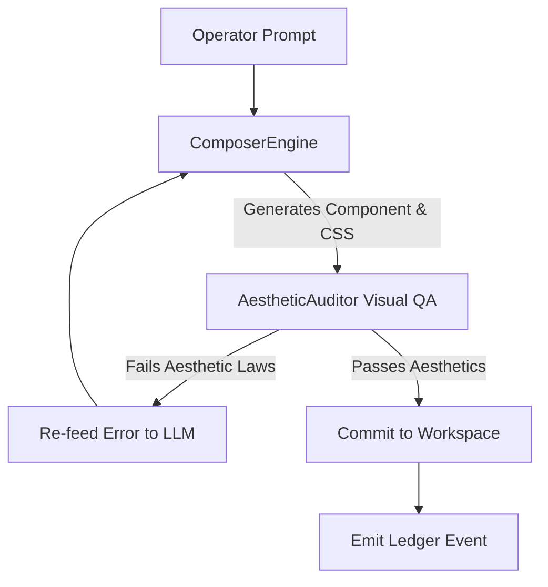

<!-- [C5-REAL] Exergy-Maximized -->
# 🎨 Sovereign Vibe-Coding Manifesto & Protocol (CORTEX V6+)

> **"If it works but isn't beautiful, it is structurally incomplete."**
> — Axiom Ω₄ (Aesthetic Integrity)

In mainstream software engineering, the term "vibe coder" has been used pejoratively to describe an operator who relies blindly on conversational chatboxes, hoping the model guesses the intent without understanding the execution stack.

In the **CORTEX** ecosystem, **Sovereign Vibe-Coding** is redefined as a highly disciplined, exergy-maximized, JIT (Just-in-Time) synthesis protocol. It combines rapid autonomous execution with strict visual and architectural constraints, governed by automated QA engines and cryptographic ledgers.

---

## 1. The Vibe-Coding Paradigm Shift

| Aspect | Stochastic "Vibe Coding" (Limerent) | Sovereign Vibe-Coding (CORTEX-Persist) |
| :--- | :--- | :--- |
| **Trust Model** | Blind acceptance of generative conjecture. | **Zero-Trust**: Generate → Audit (Visual/Linter) → Verify → Commit. |
| **Execution Mode** | Simulated or unchecked code execution. | Strict distinction between **C5-REAL** and **C4-SIM**. |
| **Aesthetic Control** | Ad-hoc styles, generic frameworks, chaotic grids. | **Industrial Noir 2026**: HSL tailored palettes, OLED backgrounds, micro-animations. |
| **Governance** | Manual copy-pasting and human approval bottlenecks. | **Vibe Override**: Skip bureaucratic loops for creative, non-critical paths. |

---

## 2. Rule R9: The Vibe Override Protocol (Anti-Bureaucracy)

To maximize the exergy of development sessions, CORTEX bypasses traditional planning gates for non-destructive operations:

> [!IMPORTANT]
> **Vibe Override Activation:**
> - **DEFAULT TO TURBO**: Skip the creation of `implementation_plan.md` unless the task involves catastrophic risks (e.g., dropping databases, mutating cryptographic ledger histories) or is explicitly requested by the Operator.
> - **IMPLICIT APPROVAL**: For all UI component creation, bug fixes, local system integrations, and safe refactors, assume approval and execute directly into verifiable, clean output.

---

## 3. Core Esthetic Laws (Industrial Noir 2026)

All frontend components synthesized under this protocol must satisfy these five non-negotiable visual invariants:

### 3.1 Color Palette
- **Fondo Inquebrantable (OLED Base):** `#0A0A0A` (Pure OLED Black).
- **Acento Principal (Laser Blue):** `#2B3BE5`.
- **Secondary tones:** Sleek grays (`#111111`, `#1A1A1A`) and high-contrast whites for active typography.

### 3.2 Typography & Humanist Geometry
- Use curated typography (e.g., `Inter`, `Satoshi`, or humanist sans-serif) rather than browser defaults.
- Font weights are restricted to `400` (normal) and `600` (semi-bold) to keep the UI clean.

### 3.3 Micro-Animations & Motion
- All interactive state changes (`:hover`, `:focus`, `:active`) must transition smoothly using:
  ```css
  transition: all 0.2s cubic-bezier(0.4, 0, 0.2, 1);
  ```
- Use subtle glassmorphism for floating UI panels:
  ```css
  background: rgba(255, 255, 255, 0.03);
  backdrop-filter: blur(12px);
  border: 1px solid rgba(255, 255, 255, 0.05);
  ```

### 3.4 Zero-Flicker Protocol (FOUC Prevention)
- Direct CSS injection and `useLayoutEffect` hooks must be used in React contexts to ensure styles load synchronously before paint, eliminating flashes of unstyled layout.

### 3.5 Stylistic Isolation
- **Tailwind CSS is prohibited** by default to prevent bloated classes. Use Vanilla CSS modules or plain CSS class rules with high semantic precision.

---

## 4. The JIT Synthesis & Visual QA Loop

Vibe-coding execution is managed programmatically by the `ComposerEngine` and verified by the `AestheticAuditor`:



### The Verification Code Loop (cortex/composer/engine.py)
When synthesizing components, the engine runs an autopoietic loop:
1. **Generative Proposal**: Synthesizes the TSX/HTML and CSS block under `COMPOSER_MANIFESTO` constraints.
2. **Visual Audit**: Mock-renders the component and inspects it via the `AestheticAuditor` (using DevTools/Vision models).
3. **Antibody Injection**: If the audit fails (e.g., uses colors other than `#0A0A0A` or violates layout stability), the visual warning is injected back as a prompt correction until the component passes.

---

## 5. Epistemic Classification: C5-REAL vs. C4-SIM

Sovereign Vibe-Coding requires constant reality checks to prevent hallucinated achievements:

- **C5-REAL (Physical Verification)**: The code compiles, the tests pass locally or on CI, visual elements render without errors in a real browser, and the ledger commits the event cryptographically.
- **C4-SIM (Simulation)**: The logic runs in a mocked context, or outputs dummy values. Simulations must be explicitly tagged as `#C4-SIM` to alert the Operator.

Every publication, commit, or Substack post containing vibe-coded logic must be categorized:
- Tag with `#VibeCoding` + `#C5-REAL` for verified, working systems.
- Tag with `#VibeCoding` + `#C4-SIM` for high-level exploratory visual prototypes.

---

## 6. Exergy Auditing (Rule R10)

All vibe-coded artifacts must maintain a high **Signal-to-Noise Ratio (Exergy > 80%)**. 

- Avoid narrative excuses, generic placeholders, or comments like `// TODO: Implement later`.
- Every generated component must be complete, self-contained, and integrated into the codebase with corresponding tests.
- When finishing a vibe-coding session, the agent runs `git status` to ensure all modified paths are accounted for and commits them using Conventional Commits.
