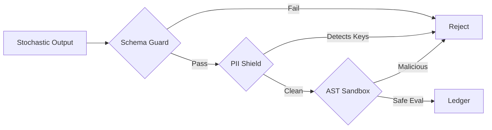

<!-- [C5-REAL] Exergy-Maximized -->
# What Exactly Gets Sealed?

As a Security Lead, your primary concern is whether CORTEX introduces new attack vectors (like Prompt Injection leading to RCE) and exactly what guarantees the cryptographic boundary provides.

For exact guarantees and non-guarantees, treat
[Security Trust Model](../SECURITY_TRUST_MODEL.md) as canonical and
[Public Product Surface](../product-surface.md) as the adoption boundary.

## The Verification Membrane

CORTEX treats all LLM and agent outputs as **Void-State** (thermodynamically unstable conjecture) until they pass through our deterministic admission pipeline. 

## What is Kryptographically Sealed?

When a fact is written to CORTEX, the following properties are concatenated, hashed via `SHA-256`, and chained to the previous block:

1. **`content`**: The actual text memory (encrypted at rest).
2. **`tenant_id`**: The cryptographic boundary identifying the owner.
3. **`meta`**: Any JSON metadata injected by the orchestrator.
4. **`previous_hash`**: The cryptolink.

If *any* of those four variables are altered directly in the database (e.g., an attacker gains access to `cortex.db` and changes `tenant_id` from `user_A` to `admin_1`), the hash chain fractures. Subsequent ledger or integrity verification will surface the break, and canary monitoring is what escalates unauthorized file access into lockdown behavior.

## Input Sanitization (The AST Sandbox)

Agents often need to store executable logic or Python snippets. CORTEX uses an `ast.parse` scanner that structurally forbids:
- `__subclasses__`
- `__globals__`
- Process spawning imports (`os`, `subprocess`)

## Secrets Shield

The daemon and storage guards actively scan incoming payloads for secret and sensitive-data signatures across multiple severity tiers. Exact signatures evolve with the runtime, but the intent is stable: detect high-risk material early and prevent it from contaminating downstream storage or cloud sync paths.

[Deep Dive: Our Threat Model & Trust Guarantees](../SECURITY_TRUST_MODEL.md)
