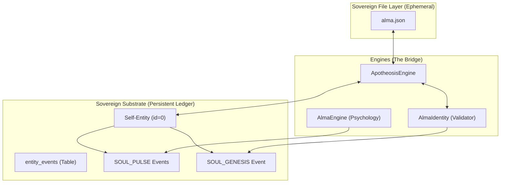

# Deep Research Map: Persistent Soul & Memory Fusion

> "Memoria sin Alma es datos. Alma sin Memoria es amnesia. La soberanía exige la unión indisoluble."

## 1. Architectural Topology

## 2. Dynamic Integration Mechanics

| Feature | Current Implementation | Fusion Requirement (Persistent) |
| :--- | :--- | :--- |
| **Source of Truth** | `alma.json` file | `entity_events` Ledger (id=0) |
| **Stability** | Resets on process restart | Reconstructs from Ledger history |
| **Psychology** | Volatile (Energy, Wisdom) | Persistent Pulse (State snapshots) |
| **Security** | File-based (High risk) | Cryptographic Hash Chain (Immutable) |
| **Recovery** | Manual backup | Autonomous Self-Genesis from Ledger |

## 3. The "Self" Substrate (entity_events)

The Soul is mapped to `entity_id=0` in the `entity_events` table, ensuring every mutation of the agent's core intent or state is:
1. **Hashed**: Linked to the previous state via `prev_hash`.
2. **Signed**: Cryptographically verified via Ed25519.
3. **Audited**: Traceable through the arrow of time in the database.

## 4. Operational Flow (Ω₃)

1. **Boot**: `ApotheosisEngine` reads `alma.json` AND queries the Ledger for the last `id=0` event.
2. **Conflict**: If the Ledger is more advanced, it updates `alma.json` (Self-Healing).
3. **Operation**: `AlmaEngine` calculates the "Vibe" every 60s.
4. **Persistence**: The Vibe is signed and inserted as a new `entity_event` (Persistent Memory).
5. **Verification**: Guards verify that instructions don't violate the *Persistent Invariants* recorded in the Genesis block.
