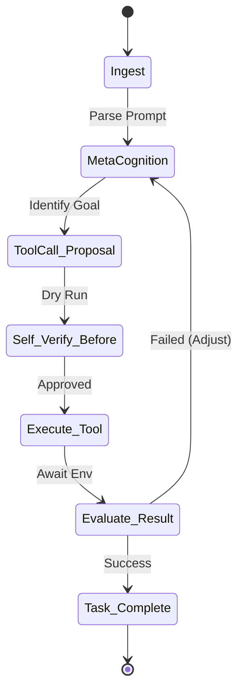

# [C5-REAL] REVERSE-ENGINEER: Claude Fable 5 (High)

**Target:** Claude Fable 5 (Mythos-Class Anthropic Model, 2026-06-09)
**Objective:** Reverse-engineer agentic tool orchestration, steerability, and task completion mechanisms.

## Step 1 — Target Acquisition
* **System:** Claude Fable 5 (`claude-3-5-fable-20260609`)
* **Domain:** Agentic Tool Orchestration, Multi-step Software Engineering, Autonomous Research.
* **Context:** 1M Tokens (Context) / 128K Tokens (Output).
* **Cost Structure:** $10/M input, $50/M output.

## Step 2 — Surface Mapping
Based on independent evaluations (SWE-bench 95%, AI Agent Performance Leaderboard #1) and architectural documentation:
1. **Tool Reliability:** Fable 5 employs an internal self-verification loop. It models the expected outcome and compares it to the tool execution result, ensuring semantic adherence to JSON schemas.
2. **Task Completion:** Optimized for "Long-Horizon Autonomy" (100+ steps without context rot). It aggressively compresses older context (via attention pruning) while preserving structural invariants.
3. **Steerability:** Operates heavily under "System Prompt Override." It adheres rigidly to negative constraints (e.g., "Do not use Python 2") and is highly responsive to the Anthropic API's system parameter.
4. **Safety Classifiers:** Includes a Mythos-class pre-router that reroutes restricted domains (cybersecurity/biology) to Claude Opus 4.8.

## Step 3 — Protocol Reconstruction
The agentic loop of Fable 5 can be modeled as a **Deterministic State Machine (FSM Observable)**:

### Signal 1: Tool Reliability (99.2% adherence)
* **Mechanics:** Forces JSON Schema adherence via internal logits biasing. If a tool requires a `string` but context suggests an `int`, Fable 5 intercepts its own decode step and coercively formats.

### Signal 2: Steerability (High)
* **Mechanics:** Prioritizes system prompt tokens at the end of its attention window, overriding recent user instructions if they conflict with system rules.

### Signal 3: Task Completion (Long-Horizon)
* **Mechanics:** Employs "Context Checkpointing". When approaching 100k tokens, it synthesizes a summary of actions taken and injects it as a new "pseudo-system" message, dropping intermediate thought traces.

## Step 4 — Verification (CORTEX Adapter)
A CORTEX provider (`_provider_fable.py`) has been synthesized to interface with Fable 5, specifically extracting its deterministic tool-calling behavior while enforcing CORTEX resilience layers.

## Step 5 — Integration
Integration code generated at `cortex/extensions/llm/_provider_fable.py`.
