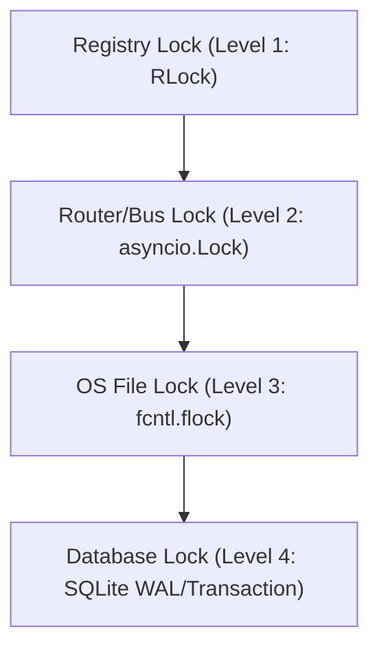

<!-- [C5-REAL] Exergy-Maximized -->
# Prevention of Thermodynamic Debt and State Collisions (Axiom Ω₁₃)

**Reality Level:** `C5-REAL`  
**Scope:** Concurrent Skill Execution & State Vector Serialization

This document defines the strict locking hierarchy and execution rules to prevent overlapping skill mutations from creating thermodynamic debt (deadlock, stale cache state, redundant operations) or destructive database collisions.

---

## 1. The Locking Hierarchy (Bottom-Up Enforcement)

To avoid deadlocks, resources must always be acquired in the following strict order. No component may acquire a lock at level $N$ if it already holds a lock at level $M > N$.



| Hierarchy Level | Lock Mechanism | Scope | Acquisition Order | Recovery/Fallback |
| :--- | :--- | :--- | :--- | :--- |
| **Level 1: Registry** | `threading.RLock()` | Memory (Registry catalog mutation) | First | Raises `RegistryLockError` if frozen |
| **Level 2: Engine** | `asyncio.Lock()` | Memory (Causal Scheduler & Router state) | Second | Queue/Await |
| **Level 3: Filesystem** | `AsyncFileLock` (`fcntl.flock`) | OS File descriptor (`/tmp/cortex_audit_ledger.lock`) | Third | Non-blocking retry with backoff |
| **Level 4: Database** | SQLite Writer / Transaction | Disk (`cortex.db`, WAL journal) | Fourth | DB Lock Timeout -> 503 Service Unavailable |

---

## 2. Execution Bus Isolation & Timeouts (Axiom AX-047)

Concurrency is controlled at the runtime worker level via strict thread-pool encapsulation:

1. **Worker Isolation**: Each skill executes inside a dedicated single-threaded executor (`max_workers=1`).
2. **Hard Timeout Gate**: Execution is monitored by an exergy-maximizing timeout. If `CORTEX_SKILL_TIMEOUT_SEC` is exceeded, the worker is immediately aborted, emitting a `TimeoutError` signature to the Ledger without persisting state.

---

## 3. The Write-Path Contract (Saga Pipeline)

State-vector mutations must follow this unidirectional validation pipeline. No step may be bypassed:

```yaml
Pipeline:
  - SAGA-1: "Generative Proposal -> Guard Admission (Sanity Check)"
  - SAGA-2: "Attribution Traceability -> CORTEX-TAINT Signature Verification"
  - SAGA-3: "Type Safety -> Schema Validation"
  - SAGA-4: "Rest-Security -> Payload Encryption"
  - SAGA-5: "Cryptographic Evidence -> Ledger & Audit Emission"
  - SAGA-6: "Data Store -> SQLite Transaction Commit"
  - SAGA-7: "Side Effects -> Index updates (Vector/KV)"
```

If a collision or validation failure occurs at step $N$, the pipeline immediately halts and executes compensating actions in reverse order ($N-1$ down to $1$).

---

## 4. Verification & Health Monitoring

The health status of the state vector is continuously verified through the **Immune Metastability** engine:

- **Metastability Metrics**: Computes `risk_score` and `monoculture_ratio` under the `cortex.immune.metastability` module.
- **Enforcement Rules**:
  - Appending recent transaction failures must monotonically increase `risk_score`.
  - If `risk_score` exceeds $0.85$, write access is degraded to read-only until the WAL is compacted and the ledger integrity verified.
