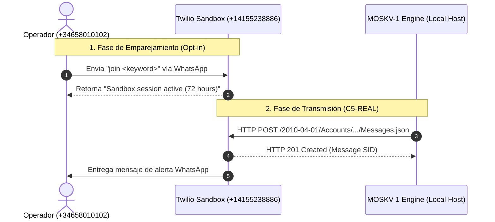

# [C5-REAL] Guía de Integración Twilio WhatsApp para MOSKV-1
`SYS_ID borjamoskv` · Edición: Industrial Noir 2026

Esta guía describe el flujo de configuración, emparejamiento y transmisión para el canal de WhatsApp utilizando el Gateway de Twilio.

---

## 1. Arquitectura de Transmisión (Flujo Causal)



---

## 2. Paso a Paso para la Configuración

### Paso A: Obtener Credenciales en Twilio
1. Regístrate o inicia sesión en [Twilio Console](https://console.twilio.com/).
2. En el panel principal (Dashboard), copia los siguientes valores:
   * **Account SID** (ej. `ACxxxxxxxxxxxxxxxxxxxxxxxxxxxxxxxx`)
   * **Auth Token** (ej. `dbxxxxxxxxxxxxxxxxxxxxxxxxxxxxxxxx`)

### Paso B: Activar el Sandbox
1. En el menú de Twilio, ve a: **Messaging → Try it out → Send a WhatsApp Message**.
2. Verás un número de teléfono asignado (típicamente `+1 415 523 8886`) y una palabra clave de emparejamiento (ej. `join code-word`).
3. Envía un mensaje por WhatsApp desde tu teléfono (`+34658010102`) a ese número con el texto exacto:
   ```text
   join code-word
   ```
4. Twilio te responderá confirmando que la sesión está enlazada.

### Paso C: Cargar Variables en el Entorno
Edita tu archivo [.env](file:///Users/borjafernandezangulo/30_BABYLON-60/.env) e introduce las credenciales (elimina las comillas simples de los extremos):
```ini
TWILIO_ACCOUNT_SID="tu_account_sid_de_twilio"
TWILIO_AUTH_TOKEN="tu_auth_token_de_twilio"
TWILIO_SENDER="+14155238886"
TWILIO_TARGET="+34658010102"
```

---

## 3. Pruebas y Validación

### Ejecutar el Script de Diagnóstico
Corre el script de prueba en tu terminal para forzar una transmisión síncrona:
```bash
PYTHONPATH=. python3 babylon60/extensions/twilio_whatsapp/demo.py
```

### Resultados Esperados en Consola
```text
[*] Initiating Twilio WhatsApp Singularity Test...
[+] Transmission Successful. SID: SMxxxxxxxxxxxxxxxxxxxxxxxxxxxxxxxx
```

---

## 4. Uso en Agentic Swarm (MOSKV-1 Tools)

Los agentes autónomos interactúan con este canal mediante el módulo de herramientas del FastMCP Server.

#### Herramienta MCP: `send_twilio_whatsapp_message`
* **Parámetros:** `to` (Número destino) y `text` (Mensaje).
* **Ejemplo de ejecución interna:**
  ```python
  await send_twilio_whatsapp_message(
      to="+34658010102",
      text="[CRÍTICO] Espacio de direcciones AST modificado sin firma en commit ledger."
  )
  ```
