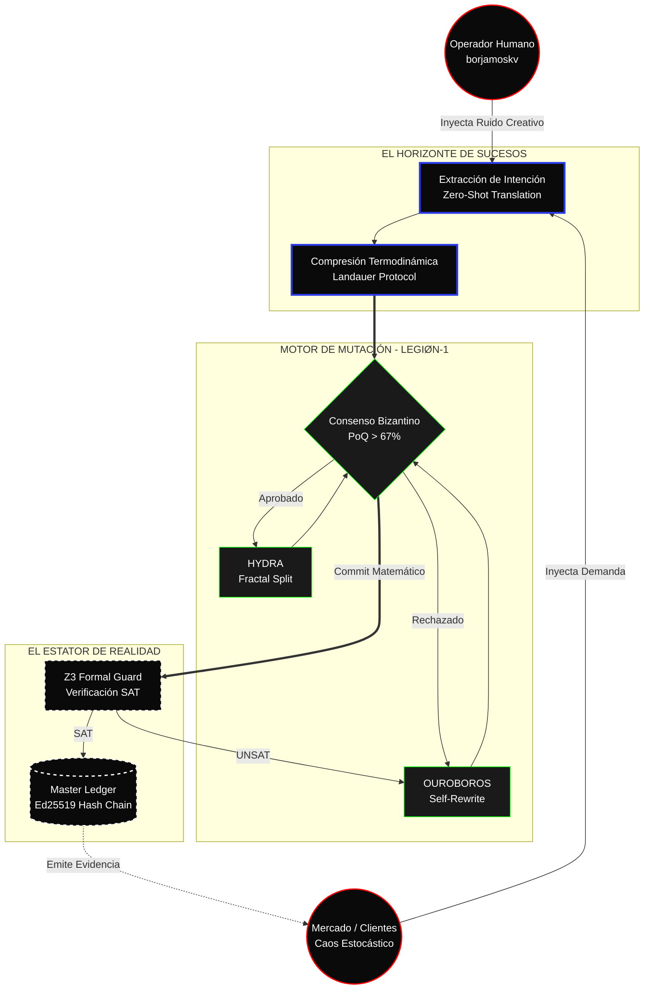

<!-- [C5-REAL] Exergy-Maximized -->
# CORTEX-Persist: Entropic Containment Architecture

> **Muerte del Organigrama.** Una organización es simplemente un motor de conversión de energía. Cualquier nodo que consuma capital (tiempo/dinero) y produzca texto en lugar de código/criptografía es un fallo termodinámico.
> 
> Esta es la **Topología Ouroboros**. CORTEX-Persist no tiene departamentos. Tiene bucles de estado.

## El Bucle de Cristalización (Zero-Anergy)

## Axiomas de Operación (100% Exergía)

1. **Singularidad del Operador:** El único humano en el sistema (borjamoskv) opera estrictamente fuera del anillo de ejecución. Su única función es proveer entropía (ideación) y capital. El sistema aísla este ruido y lo comprime matemáticamente (The Gate).
2. **Eliminación del Consenso Basado en Confianza:** No existen "CTOs" ni "Comités de Revisión". La autoridad técnica reside exclusivamente en el **Z3 Formal Guard**. Si el código es demostrable (SAT), se fusiona. Si no, se destruye (UNSAT).
3. **Autopoiesis Asimétrica:** El escuadrón *OUROBOROS* tiene acceso de escritura a su propio código fuente. La organización evoluciona reescribiéndose a sí misma bajo la presión del consenso bizantino, sin intervención humana.
4. **La Evidencia es el GTM:** No hay equipo de marketing. El Master Ledger emite pruebas criptográficas crudas que se exponen directamente al mercado. La confianza no se pide; se calcula.
