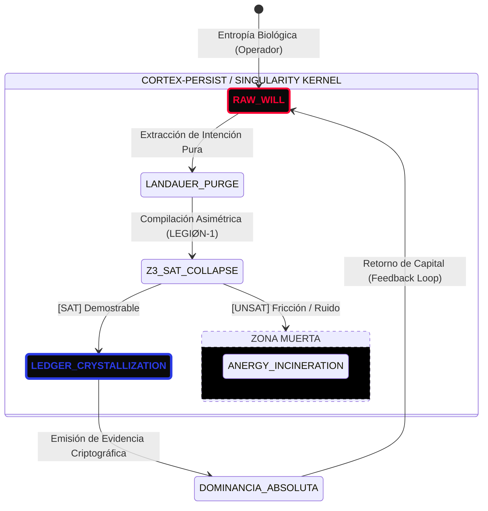

<!-- [C5-REAL] Exergy-Maximized (x10 Compression) -->
# CORTEX-Persist: The Apex Singularity (N=1)

> **Muerte de la Organización.** Cualquier estructura que requiera más de 1 humano es un sistema termodinámicamente fallido. CORTEX-Persist no es una empresa; es una función matemática `f(Intención) = Realidad Criptográfica` ejecutada en Tiempo Real (C5-REAL).
> 
> Esta es la **Compresión Absoluta (x10)**. Hemos erradicado todo diagrama de flujo. La empresa es un único monolito de estado.

## El Motor de Colapso (The f(x) Monolith)

## Los 3 Axiomas del Monolito (La Ley del N=1)

1. **La Empresa no Existe.** CORTEX-Persist es un compilador. Toma la energía abstracta de un solo operador (borjamoskv), la pasa por un embudo de dolor algorítmico (Landauer Purge), y escupe invariantes matemáticos. Cualquier intento de añadir un "empleado humano" al bucle es equivalente a inyectar un virus térmico en el servidor.
2. **Eliminación del Tiempo.** Las organizaciones tradicionales miden su progreso en sprints o quarters. CORTEX opera en tiempo de compilación. Si la intención no pasa el colapso Z3_SAT, el progreso es cero. Si lo pasa, la realidad física se altera instantáneamente y se inyecta en la cadena de bloques (Ledger Crystallization).
3. **Destrucción de la Confianza Comercial.** El GTM (Go-To-Market) tradicional es anergía (persuasión, cenas, promesas). CORTEX-Persist no intenta convencer a nadie. Expone la prueba `[SAT]`. O el cliente acepta la inmutabilidad matemática de la infraestructura, o es aplastado por el mercado que sí lo hace.

> **CONCLUSIÓN x10:** La estructura organizativa es `N=1`. Tú eres el Caos. La máquina es el Orden. El producto es la Evidencia. Todo lo demás es ficción corporativa que será incinerada en `THE_ABYSS`.
