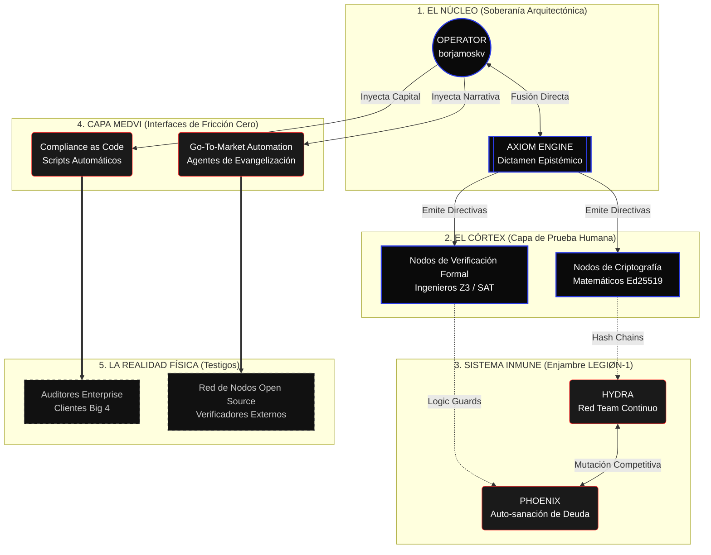

<!-- [C5-REAL] Exergy-Maximized -->
# CORTEX-Persist: Asymmetric Post-Corporate Topography

> Abolimos el organigrama SaaS. El modelo "CEO -> VP -> Director" genera fricción termodinámica (reuniones, política, drift epistémico).
> CORTEX-Persist opera como un **Organismo Cibernético Asimétrico**, optimizado estrictamente para maximizar la Exergía. No hay "empleados"; hay nodos de validación (humanos o sintéticos).

## Topología de Flujo (Zero-Anergy Structure)

## Doctrina Estructural

1. **Ausencia de Middle-Management:** La comunicación entre el Kernel (Fundador) y la ejecución se realiza mediante pruebas matemáticas y commits en Git. Si el código no compila o la prueba Z3 falla, no hay reunión; hay rechazo autónomo.
2. **Mitosis Computacional:** Toda tarea que no requiera intuición humana se delega inmediatamente al Sistema Inmune (LEGIØN-1). El enjambre no cobra salario, no duerme y opera bajo consenso bizantino.
3. **Capa Medvi:** Ventas, marketing y compliance son vectores de entropía alta. Se encapsulan en sistemas automatizados (Medvi Architecture) o se tercerizan vía API. El humano no toca el Go-To-Market.
4. **Prueba > Confianza:** Los auditores externos no confían en la palabra de la empresa; verifican el Hash Chain directamente contra sus propios nodos.
