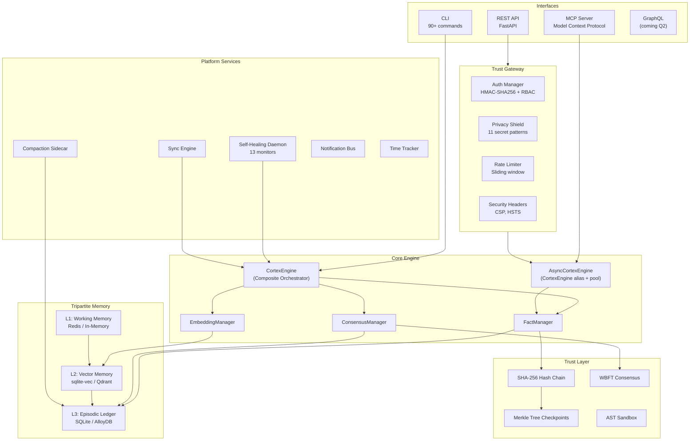
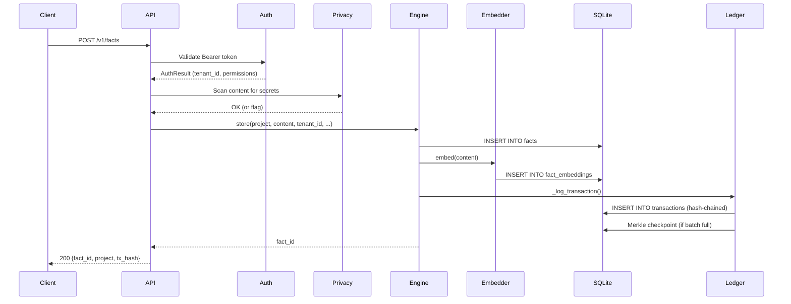
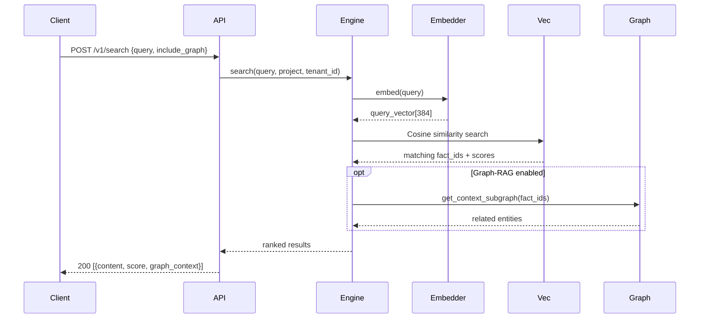
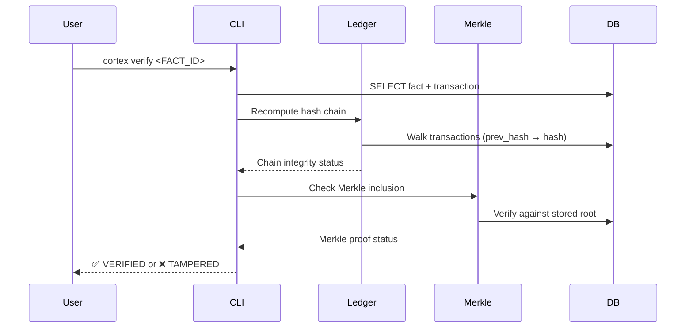
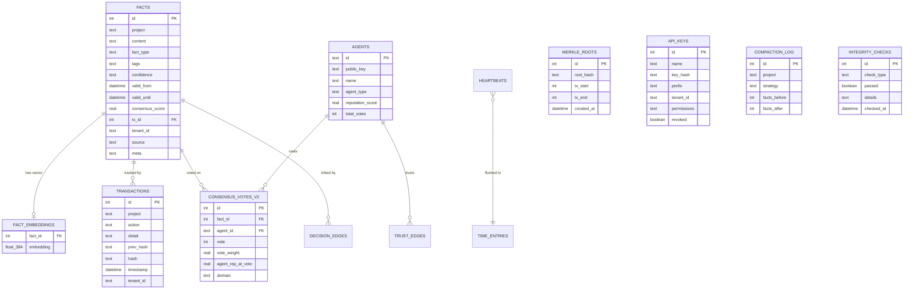

> **CORTEX Architecture**
> *Generated output is treated as untrusted input until it passes verification.*

---

## System Overview

CORTEX is a verification-focused system for AI agent memory and decision state. It provides cryptographic verification, audit trails, and write-path controls for environments where reviewability matters. Generative output is treated as untrusted input until it passes deterministic validation.

To enforce this, it combines a relational database with vector embeddings, hash-chained transactions, Merkle checkpoints, multi-agent consensus, and privacy protection. It can run locally on SQLite or scale toward AlloyDB + Qdrant + Redis for broader deployments.



---

## Single Mutation Authority

CORTEX organizes persistence around a single mutation authority. External
surfaces such as `cortex/routes/` and `cortex/cli/` accept input and expose
contracts, but they do not confer direct authority to persist state. That
authority resides in `cortex/engine/`, where the deterministic *write-path*
separates proposal, validation, audit emission, and *commit*.

Within that path, `cortex/agents/contracts.py` defines the typed boundary
between generation and execution; `cortex/engine/store_validation.py`
enforces semantic and structural preconditions;
`cortex/engine/transaction_mixin.py` carries transactional context,
traceability, and compensating behavior; and
`cortex/engine/fact_store_core.py` performs the final write. Around this
core, `cortex/guards/` enforces admission, *taint*, and causal checks;
`cortex/ledger/` preserves cryptographic continuity; `cortex/memory/` and
`cortex/search/` provide retrieval without mutation authority;
`cortex/extensions/` contains peripheral and experimental capabilities; and
`cortex/migrations/` isolates schema change.

The governing invariant is strict: no artifact may persist or propagate
durable state unless it traverses a flow that is deterministic, auditable,
and abortable, preserving `tenant_id` scoping and hash continuity by
construction.

---

## Subsystem Taxonomy

These names are architectural labels for existing package areas. They do not rename Python packages or public module paths. After the full name has been established, the short form may be used within a document.

| Subsystem | Role | Representative modules |
|:---|:---|:---|
| `CORTEX Hypercore` | Trust kernel, ledger, validation, and security boundaries | `engine/`, `ledger/`, `guards/`, `verification/`, `crypto/`, `database/`, `storage/`, `security/`, `auth/` |
| `CORTEX Overmind` | Orchestration, agent coordination, and shared control planes | `agents/`, `consensus/`, `gateway/`, `mcp/`, `worker/`, `extensions/swarm/`, `extensions/sovereign/`, `extensions/federation/`, `extensions/hypervisor/`, `extensions/manifold/` |
| `CORTEX Deepforge` | Synthesis, reasoning, generation, and cognitive tooling | `composer/`, `mcts/`, `shannon/`, `extensions/llm/`, `extensions/thinking/`, `extensions/evolution/`, `extensions/training/`, `extensions/skills/`, `extensions/perception/` |
| `CORTEX Primeflow` | Execution surfaces, runtime delivery, and service entrypoints | `api/`, `routes/`, `services/`, `events/`, `http/`, `cli/`, `telemetry/`, `extensions/automation/`, `extensions/daemon/`, `extensions/sync/`, `extensions/notifications/`, `extensions/timing/` |
| `CORTEX Coreshift` | Memory evolution, indexing, schema drift, and state transitions | `memory/`, `facts/`, `search/`, `embeddings/`, `graph/`, `compaction/`, `enrichment/`, `migrations/`, `audit/`, `compliance/`, `forensics/` |

---

## Core Concepts

### Facts — The Memory Primitive

Every piece of knowledge is a **Fact**. Facts are immutable records with temporal validity:

| Field | Type | Description |
|:---|:---|:---|
| `id` | INTEGER | Auto-incremented primary key |
| `project` | TEXT | Namespace (tenant isolation) |
| `content` | TEXT | The information itself |
| `fact_type` | TEXT | `knowledge`, `decision`, `error`, `ghost`, `config`, `bridge`, `axiom`, `rule` |
| `tags` | JSON | Searchable labels |
| `confidence` | TEXT | `stated`, `inferred`, `observed`, `verified`, `disputed` |
| `valid_from` | DATETIME | When the fact became true |
| `valid_until` | DATETIME | When deprecated (NULL = active) |
| `source` | TEXT | Origin agent or process (auto-detected) |
| `meta` | JSON | Arbitrary metadata |
| `consensus_score` | REAL | Weighted agreement (default 1.0) |
| `tx_id` | INTEGER | FK to creating transaction |
| `tenant_id` | TEXT | Multi-tenant scope |

### Temporal Queries

Every fact has a temporal window (`valid_from` → `valid_until`):

- **Current view**: `WHERE valid_until IS NULL`
- **Point-in-time**: `WHERE valid_from <= ? AND (valid_until IS NULL OR valid_until > ?)`
- **Time travel**: Reconstruct database state at any transaction ID
- **History**: Full timeline including deprecated facts

### Hash-Chained Ledger

Every mutation creates a **transaction** with a SHA-256 hash linked to the previous one:

```
TX #1: hash = SHA256("GENESIS" + project + action + detail + timestamp)
TX #2: hash = SHA256(hash_1 + project + action + detail + timestamp)
TX #N: hash = SHA256(hash_{N-1} + ...)
```

This creates a **tamper-evident audit trail**. `verify_ledger()` walks the chain and reports any breaks.

### Merkle Tree Checkpoints

Periodically, the ledger creates Merkle tree checkpoints from batches of fact hashes. These enable:
- **O(log N) integrity verification**
- **Efficient synchronization** between nodes
- **Batch proof generation** for compliance audits

### Multi-Agent Consensus (WBFT)

CORTEX implements **Weighted Byzantine Fault Tolerance**:

1. Tracks reputation scores per agent (0.0–1.0) with decay
2. Weighs votes by agent reputation
3. Domain-specific vote multipliers
4. Updates `consensus_score` on each fact
5. Elder Council verdict for edge cases without quorum
6. Immutable vote ledger for audit

---

## Engine Evolution Notes

Recent versions introduce additional orchestration surfaces under the manifold and evolution modules.

Current reference points:
- **KETER**: higher-level orchestration logic. (`engine/keter.py`)
- **TESSERACT**: lifecycle coordination concepts.
- **APOTHEOSIS**: proactive runtime and analysis paths. (`engine/apotheosis.py`)

For more detail, review `engine/keter.py`, `engine/apotheosis.py`, and `extensions/manifold/`.

---

## Module Reference

### Engine Layer

| Module | Purpose |
|:---|:---|
| `engine/__init__.py` | `CortexEngine` + `AsyncCortexEngine` alias — composite orchestrator |
| `engine/store_mixin.py` | `store()`, `store_many()`, `deprecate()`, `update()` |
| `engine/query_mixin.py` | `recall()`, `history()`, temporal and tenant-scoped reads |
| `engine/search_mixin.py` | Semantic and vector search orchestration |
| `engine/consensus.py` | Voting and consensus helpers for engine-facing flows |
| `engine/sync_mixin.py` | Synchronous wrappers for CLI and compatibility surfaces |
| `ledger/ledger_core.py` | Hash chain + Merkle checkpoint management (`SovereignLedger`) |
| `engine/snapshots.py` | Database snapshot creation/restoration |
| `engine/models.py` | `Fact` data model and row mapping |

### API Layer

| Module | Purpose |
|:---|:---|
| `api/` | FastAPI application wiring, OpenAPI, dependency injection and state |
| `api/middleware.py` | CORS, security headers and HTTP middleware |
| `routes/facts.py` | CRUD + Voting endpoints |
| `routes/search.py` | Semantic + Graph-RAG search |
| `routes/admin.py` | API key management + system status |
| `routes/stripe.py` | Stripe webhook handler for billing |
| `routes/gate.py` | SovereignGate approval, status and audit endpoints |
| `auth/` | HMAC-SHA256 authentication + RBAC |

### Search & Embeddings

| Module | Purpose |
|:---|:---|
| `embeddings/__init__.py` | ONNX-optimized MiniLM-L6-v2 (384-dim) |
| `embeddings/api_embedder.py` | Cloud embeddings (Gemini/OpenAI) |
| `embeddings/manager.py` | Mode-aware switcher (`local` / `api`) |
| `search/` | Advanced semantic search with graph context |

### Memory Intelligence

| Module | Purpose |
|:---|:---|
| `compaction/` | Dedup (SHA-256 + Levenshtein), merge, prune |
| `graph/` | Knowledge graph (SQLite + Neo4j), RAG |
| `memory/` | Memory management and lifecycle |
| `extensions/episodic/` | Session boot payloads, episodic recall and pattern extraction |
| `extensions/thinking/` | Thought Orchestra, reflection and semantic routing |

### Trust & Security

| Module | Purpose |
|:---|:---|
| `crypto/` | AES-256-GCM vault for secrets |
| `consensus/` | WBFT consensus, reputation, vote ledger |
| `compliance/` | EU AI Act compliance report generation |
| `audit/` | Audit trail generation |

### Infrastructure

| Module | Purpose |
|:---|:---|
| `extensions/daemon/` | Self-healing watchdog and operational monitors |
| `extensions/notifications/` | Telegram + macOS notification bus |
| `extensions/sync/` | JSON ↔ DB bidirectional sync |
| `extensions/timing/` | Heartbeat-based time tracking |
| `telemetry/` | OpenTelemetry-compatible span tracing |
| `mcp/` | Model Context Protocol server |
| `cli/` | 90+ CLI commands via Click |
| `migrations/` | Versioned schema migrations |
| `storage/` | SQLite + Turso storage backends |

### Extensions

| Module | Purpose |
|:---|:---|
| `extensions/mejoralo/` | 14D X-Ray Diagnostic Engine (Host telemetry + AST static analysis) |

---

## Data Flow

### Store a Fact



### Semantic Search



### Verify Integrity



---

## Database Schema (ERD)



---

## Security Model

| Layer | Mechanism |
|:---|:---|
| **Authentication** | HMAC-SHA256 API keys with prefix lookup |
| **Authorization** | RBAC: `SYSTEM`, `ADMIN`, `AGENT`, `VIEWER` |
| **Tenant Isolation** | All queries scoped by `tenant_id` |
| **Data Integrity** | SHA-256 hash chain + Merkle trees |
| **Privacy** | 11-pattern secret detection at ingress |
| **Secrets** | AES-256-GCM encrypted vault |
| **Code Safety** | AST Sandbox for LLM-generated code |
| **Rate Limiting** | Sliding window per IP |
| **Headers** | CSP, HSTS, X-Frame-Options, X-XSS-Protection |

---

## Testing

```bash
# All tests (1,621+ functions, 60s timeout)
make test

# Fast tests only (no torch imports)
make test-fast

# Slow tests (graph RAG, embeddings)
make test-slow
```

**Isolation**: Tests use `config.reload()` + autouse fixtures for zero state leakage.

**Coverage**: 1,621+ test functions covering engine, API, CLI, consensus, search, and security.
