# PROJECT CANON

## Stack Detected
- python: True
- node: False
- react: False
- markdown_docs: False

## Architecture
- modules_detected: ['agents', 'core']
- total_classes: 8
- total_functions: 12
- files_analyzed: 11
- high_coupling_files: {}
- possible_orphans: ['core/__init__.py', 'agents/planner.py', 'agents/__init__.py', 'agents/architect.py']

## Recommended Architecture
- pattern: Functional / Script-based

## Features Detected
- agent_system (source: conductor.py)
- agent_system (source: agents/planner.py)
- agent_system (source: agents/scout.py)
- agent_system (source: agents/architect.py)
- authentication (source: agents/analyst.py)
- payments (source: agents/analyst.py)
- agent_system (source: agents/analyst.py)
- agent_system (source: agents/structure.py)

## Tasks
- Resolve TODO in agents/planner.py [medium]
- Resolve TODO in agents/analyst.py [medium]
- Generate clean canonical README [high]

## Dependency Graph (Mermaid)

```mermaid
graph TD;
    conductor_py --> agents_scout;
    conductor_py --> agents_structure;
    conductor_py --> agents_analyst;
    conductor_py --> agents_architect;
    conductor_py --> agents_planner;
    main_py --> sys;
    main_py --> json;
    main_py --> pathlib;
    main_py --> core_state;
    main_py --> conductor;
    __init___py;
    parser_py --> ast;
    parser_py --> re;
    state_py --> dataclasses;
    state_py --> typing;
    planner_py;
    __init___py;
    scout_py --> pathlib;
    architect_py;
    analyst_py --> pathlib;
    structure_py --> pathlib;
    structure_py --> core_parser;
```
